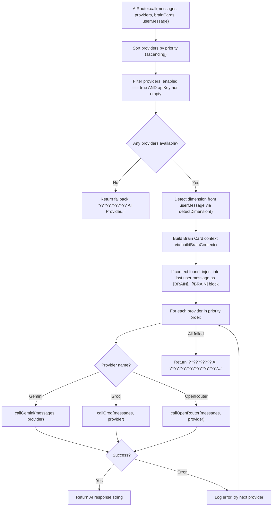
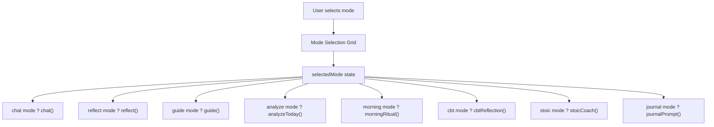
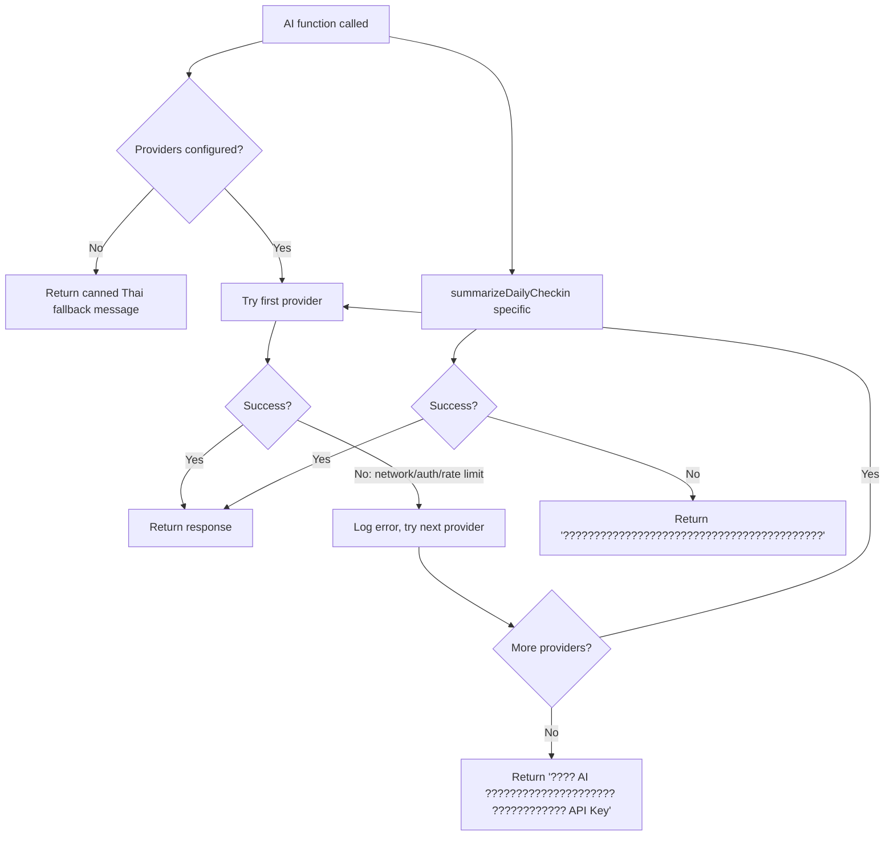
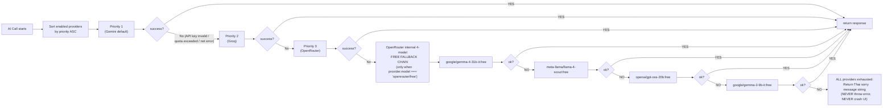
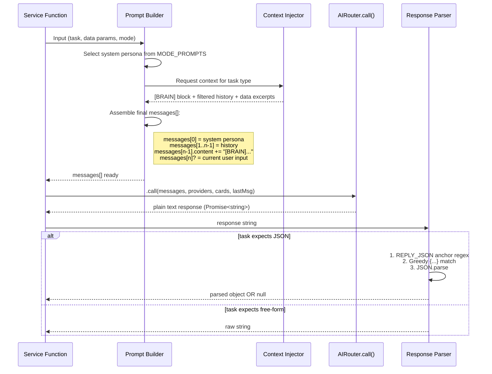
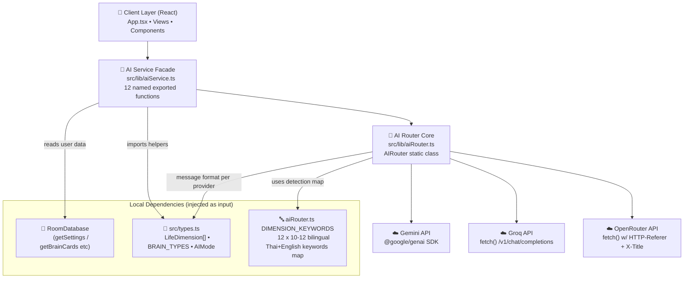

# AI_INTELLIGENCE_SYSTEM.md � My Life OS

> Complete documentation of the AI subsystem � every provider, routing logic, prompt engineering, context building, and AI-powered function.

---

## 1. AI Architecture Overview

The AI system is structured as three layers:

```
+----------------------------------------------+
�  AI CONSUMER LAYER (Views)                   �
�  AICoachView, DailyCheckinModal              �
�  ManageAPIModal (test connection)            �
+----------------------------------------------+
                   � calls
+------------------?---------------------------+
�  AI SERVICE LAYER (aiService.ts)             �
�  High-level use-case functions:              �
�  chat, reflect, guide, summarize, analyze,  �
�  morningRitual, cbt, stoic, journalPrompt,   �
�  suggestBrainCard, testConnection           �
+----------------------------------------------+
                   � delegates to
+------------------?---------------------------+
�  AI ROUTER LAYER (aiRouter.ts)               �
�  Provider call dispatch + Failover           �
�  Dimension detection                         �
�  Brain Card context injection                �
+----------------------------------------------+
         +---------+----------+
    +----?----+ +--?--+ +----?--------+
    � Gemini  � �Groq � � OpenRouter  �
    �  API    � � API � �    API      �
    +---------+ +-----+ +-------------+
```

---

## 2. AIRouter (`src/lib/aiRouter.ts`)

### 2.1 Class Structure

`AIRouter` is a **static class** � all methods are `static`, no instantiation.

### 2.2 Main Entry: `AIRouter.call()`

```typescript
static async call(
  messages: Array<{ role: "user" | "assistant" | "system"; content: string }>,
  providers: APIProvider[],
  brainCards?: BrainCard[],
  userMessage?: string
): Promise<string>
```

**Full execution flow:**



### 2.3 Provider Call Implementations

#### `callGemini(messages, provider): Promise<string>`

Uses `@google/genai` SDK:
```typescript
const client = new GoogleGenAI({ apiKey: provider.apiKey })
const response = await client.models.generateContent({
  model: provider.model,           // default: "gemini-2.5-flash"
  contents: formattedMessages,
  generationConfig: {
    temperature: 0.7,
    maxOutputTokens: 1024,
  }
})
return response.candidates[0].content.parts[0].text
```

Message format conversion: Converts `system` role to first `user` message, keeps `user`/`model` roles (Gemini uses `"model"` not `"assistant"`).

#### `callGroq(messages, provider): Promise<string>`

Uses OpenAI-compatible REST API:
```typescript
const response = await fetch("https://api.groq.com/openai/v1/chat/completions", {
  method: "POST",
  headers: {
    "Authorization": `Bearer ${provider.apiKey}`,
    "Content-Type": "application/json"
  },
  body: JSON.stringify({
    model: provider.model,           // default: "llama-3.3-70b-versatile"
    messages: messages,              // passes roles as-is (system/user/assistant)
    temperature: 0.7,
    max_tokens: 1024,
  })
})
const data = await response.json()
return data.choices[0].message.content
```

#### `callOpenRouter(messages, provider): Promise<string>`

Uses OpenAI-compatible REST API at OpenRouter endpoint:
```typescript
const model = provider.model === "openrouter/free" ? autoFreeModel : provider.model
const response = await fetch("https://openrouter.ai/api/v1/chat/completions", {
  method: "POST",
  headers: {
    "Authorization": `Bearer ${provider.apiKey}`,
    "Content-Type": "application/json",
    "HTTP-Referer": "https://mylifeos.app",
    "X-Title": "My Life OS"
  },
  body: JSON.stringify({
    model: model,
    messages: messages,
    temperature: 0.7,
    max_tokens: 1024,
  })
})
return data.choices[0].message.content
```

**OpenRouter free model selection:** When `provider.model === "openrouter/free"`, the router cycles through available free models. Available free model options in `ManageAPIModal`:
- `google/gemma-4-31b-it:free`
- `openai/gpt-oss-20b:free`
- `google/gemma-2-9b-it:free`

### 2.4 Dimension Detection: `detectDimension()`

```typescript
static detectDimension(text: string): LifeDimension[]
```

**Algorithm:** Keyword scoring over the 12 life dimensions.

Each dimension has a set of Thai and English keywords. The function:
1. Lowercases the input text
2. For each dimension, counts keyword matches
3. Returns dimensions with score > 0, sorted by score descending
4. Falls back to `["mindset"]` if no matches

**Keyword map (representative samples):**

| Dimension | Sample Keywords |
|---|---|
| `goal` | ????????, goal, ??????, ??????????, plan |
| `health` | ??????, health, ????????, ???, ?????, exercise |
| `finance` | ????, finance, ?????, ????, ??????, investment |
| `mindset` | ???, ?????, mindset, ?????????, attitude, belief |
| `relationship` | ????????????, ??????, ?????, relationship, ????? |
| `career` | ???, ?????, career, ??????, boss, ?????? |
| `learning` | ?????, ???????, learning, ???????, skill, ????? |
| `creativity` | ??????????, creativity, ??????, idea, ????? |
| `spiritual` | ?????????, spiritual, ?????, ?????, meditation |
| `family` | ????????, family, ???, ???, ???, ??????? |
| `social` | ?????, social, ?????, ??????????, society |
| `environment` | ???????????, environment, ????????, ???, nature |

### 2.5 Brain Card Context: `buildBrainContext()`

```typescript
static buildBrainContext(
  userMessage: string,
  brainCards: BrainCard[],
  detectedDimensions: LifeDimension[]
): string
```

**Algorithm:**
1. Filter `brainCards` where `card.dimension` is in `detectedDimensions`
2. Additionally score cards by title/description keyword overlap with userMessage
3. Take top 5 most relevant cards
4. Format as:

```
[BRAIN CONTEXT - ????????? Life Brain ?????????]
?? [Goal] ????????: ???? Trader ????????
   ?????????????? 3 ?? ??????????????????????????
   Tags: trading, finance, goal

?? [Lesson] ???????: ???? FOMO
   ...
[/BRAIN]
```

5. Returns empty string if no relevant cards found

**Injection point:** The context block is appended to the last user message content before API call.

### 2.6 Connection Test: `testConnection()`

```typescript
static async testConnection(provider: APIProvider): Promise<{ success: boolean; message: string }>
```

Sends a minimal "CONNECTED" test message:
```
user: "????????????????? ?????? CONNECTED ????????"
```

Returns:
- `{ success: true, message: "???????????????" }` if response contains "CONNECTED"
- `{ success: false, message: errorText }` on any error

---

## 3. AI Service Layer (`src/lib/aiService.ts`)

### 3.1 Provider Resolution Helper

```typescript
function getProviders(settings: UserSettings): APIProvider[]
```
Returns `(settings.apiProviders || []).filter(p => p.enabled && p.apiKey)` sorted by `priority`.

**No-provider guard:** Every service function checks `if (providers.length === 0)` and returns a canned Thai fallback message without making any API call.

### 3.2 All Exported Functions

#### `chat()`
```typescript
export async function chat(
  messages: AIChatMessage[],
  userInput: string,
  settings: UserSettings,
  brainCards?: BrainCard[]
): Promise<string>
```

**System prompt (abbreviated):**
```
?????? AI Life Coach ??? My Life OS ???????????????????????????
?????????????????????? ????????????????? ?????? ?????????????
????????????????????????????????????????????
[????? BRAIN CONTEXT ????????????????????]
```

Converts `AIChatMessage[]` ? router message format. Appends new userInput as last user message. Calls `AIRouter.call(messages, providers, brainCards, userInput)`.

#### `reflect()`
```typescript
export async function reflect(
  period: "today" | "week" | "month",
  journals: JournalEntry[],
  checkins: DailyCheckin[],
  settings: UserSettings
): Promise<string>
```

**Behavior:** Filters journals/checkins to the specified period. Formats journal titles + mood + date. Formats checkin answers (wentWell, challenge, learned, grateful, tomorrow).

**System prompt focus:** Self-reflection coach. Analyze patterns, identify growth, suggest improvements in Thai.

**User prompt structure:**
```
??????????????????????????????????? [period]
Journal Entries: [formatted list]
Check-in Data: [formatted list]
```

#### `guide()`
```typescript
export async function guide(
  topic: string,
  goals: GoalItem[],
  habits: HabitItem[],
  settings: UserSettings
): Promise<string>
```

**Behavior:** Life guidance advice for a specific topic, contextualized with user's goals and habits.

**System prompt:** Life coach and advisor. Practical, warm, Thai language.

**Context injected:** Top 3 goals (title + progress), top 3 habits (title + streak).

#### `analyzeToday()`
```typescript
export async function analyzeToday(
  journals: JournalEntry[],
  checkin: DailyCheckin | null,
  goals: GoalItem[],
  habits: HabitItem[],
  settings: UserSettings
): Promise<string>
```

**Behavior:** Comprehensive daily analysis narrative.

**System prompt:** Daily analyst. Synthesize all data into a holistic Thai narrative.

**Context injected:**
- Today's journals (title, mood, dimension, content excerpt)
- Today's check-in (all 5 answers if present)
- Goal progress summary
- Habit streak summary

**Output format:** Structured narrative in Thai with sections for wins, areas to improve, encouragement.

#### `morningRitual()`
```typescript
export async function morningRitual(
  settings: UserSettings,
  goals: GoalItem[],
  habits: HabitItem[]
): Promise<string>
```

**Behavior:** Generates a personalized morning motivation message.

**System prompt:** Morning motivator, energetic, concise, Thai language.

**Context:** Top 3 goals, top 3 active habits.

#### `cbtReflection()`
```typescript
export async function cbtReflection(
  situation: string,
  thoughts: string,
  settings: UserSettings
): Promise<string>
```

**Behavior:** Applies CBT (Cognitive Behavioral Therapy) framework to challenge negative thoughts.

**System prompt:** CBT therapist assistant. Socratic questioning style. Thai language.

**Steps produced:** Identify cognitive distortion ? Challenge the thought ? Reframe ? Action step.

#### `stoicCoach()`
```typescript
export async function stoicCoach(
  situation: string,
  settings: UserSettings
): Promise<string>
```

**Behavior:** Applies Stoic philosophy framework (Marcus Aurelius, Epictetus, Seneca).

**System prompt:** Stoic coach. Applies dichotomy of control, amor fati, memento mori concepts. Thai language.

#### `journalPrompt()`
```typescript
export async function journalPrompt(
  dimension: LifeDimension,
  recentJournals: JournalEntry[],
  settings: UserSettings
): Promise<string>
```

**Behavior:** Generates 3 deep reflection questions for a specific life dimension.

**System prompt:** Journal writing coach. Generates profound, thoughtful Thai questions.

**Context:** Dimension label, last 3 journal entries from that dimension.

#### `summarizeDailyCheckin()`
```typescript
export async function summarizeDailyCheckin(
  checkin: Omit<DailyCheckin, "id" | "aiSummary">,
  settings: UserSettings
): Promise<string>
```

**Behavior:** Creates a 2-3 sentence Thai summary of a completed daily check-in.

**System prompt:** Compassionate life coach. Write an encouraging, insightful Thai summary.

**Input formatted:**
```
????????????: {mood}
???????????????: {wentWell}
???????: {challenge}
???????????????: {learned}
?????????????: {grateful}
???????????: {tomorrow}
```

**Fallback:** `"??????????????????????????????????????????"` (if no providers or AI error)

#### `suggestBrainCard()`
```typescript
export async function suggestBrainCard(
  message: string,
  settings: UserSettings,
  existingCards: BrainCard[]
): Promise<Partial<BrainCard> | null>
```

**Behavior:** Analyzes a chat message for knowledge worth saving as a Brain Card. Returns `null` if nothing worth saving.

**System prompt:** Knowledge extraction assistant. Identify key insights, lessons, beliefs, or goals.

**Output format (JSON):**
```json
{
  "title": "...",
  "description": "...",
  "dimension": "learning",
  "brainType": "Lesson",
  "tags": ["tag1", "tag2"]
}
```

**Response parsing:** Extracts JSON from response string using regex. Returns `null` on parse failure or if AI decides no card is warranted.

**Trigger:** Called by `AICoachView` after each AI assistant response. If result is non-null, passes to `onSuggestBrainCard(card)` in App.tsx.

#### `testProviderConnection()`
```typescript
export async function testProviderConnection(
  provider: APIProvider
): Promise<{ success: boolean; message: string }>
```

**Delegates to:** `AIRouter.testConnection(provider)`

**Used by:** `ManageAPIModal` "?????????????????" button per provider card.

---

## 4. AI Mode System

The `AICoachView` exposes multiple interaction modes. Each mode configures the system prompt and call function differently:



### Mode Configurations

| Mode ID | Thai Title | Function Called | Context Used |
|---|---|---|---|
| `chat` | ??????????? | `chat()` | brainCards (dimension-matched) |
| `reflect` | ?????????? | `reflect()` | journals, checkins |
| `guide` | ??????????? | `guide()` | goals, habits |
| `analyze` | ??????????????? | `analyzeToday()` | today's journals + checkin + goals + habits |
| `morning` | Morning Ritual | `morningRitual()` | goals, habits |
| `cbt` | CBT Therapy | `cbtReflection()` | user situation + thoughts input |
| `stoic` | Stoic Coach | `stoicCoach()` | user situation input |
| `journal` | Journal Prompt | `journalPrompt()` | dimension, recent journals |

### Chat Popup Behavior

When user sends a message in chat mode:
1. New user message appended to `messages` array
2. Calls appropriate service function with context
3. AI response received ? new assistant message appended
4. Both saved via `onSaveMessages(updated)` ? `RoomDatabase.saveMessages()`
5. `suggestBrainCard()` runs on AI response text in background
6. If returns non-null Partial<BrainCard> ? `onSuggestBrainCard(card)` called ? `AISuggestPopup` appears

---

## 5. Prompt Engineering Patterns

### System Prompt Structure (All Functions)

All prompts follow this structure:

```
[ROLE DEFINITION]
?????? [role description] ??? My Life OS

[BEHAVIOR RULES]
- ??????????????????????
- [mode-specific rules]
- ?????????????????????????????

[CONTEXT INJECTION]
[BRAIN CONTEXT - ????????? Life Brain]
...
[/BRAIN]

??????????: {settings.userName}
```

### Response Length Control

Controlled via `max_tokens: 1024` across all providers. System prompts also include explicit length guidelines:
- Summaries: "2-3 ??????"
- Analysis: "300-500 ??"
- Journal prompts: "3 ?????"

### Temperature Setting

All calls use `temperature: 0.7` � balanced creativity vs. consistency.

### Language Enforcement

Every system prompt includes Thai language instruction. The `suggestBrainCard()` function uses English JSON output format to ensure parseable structured data regardless of model.

---

## 6. Error Handling Strategy



All AI errors are:
1. Caught silently at the router level (try/catch per provider)
2. Escalated to the next provider
3. If all providers fail: user-friendly Thai error message returned as string (never thrown)
4. Never crash the UI � all callers handle the response as a string

---

## 7. AI Context Building � Data Sources

The AI has access to the following user data during calls (passed by the service layer):

| Service Function | Data Sources Used |
|---|---|
| `chat()` | Brain Cards (dimension-matched), conversation history |
| `reflect()` | Journal entries (filtered by period), daily check-in answers |
| `guide()` | Top goals (title, progress%), active habits (title, streak) |
| `analyzeToday()` | Today's journals, today's check-in, goal summary, habit summary |
| `morningRitual()` | Top goals, top habits |
| `cbtReflection()` | User-provided situation + thoughts text |
| `stoicCoach()` | User-provided situation text |
| `journalPrompt()` | Dimension label, last 3 journals from that dimension |
| `summarizeDailyCheckin()` | All 5 check-in answers + mood |
| `suggestBrainCard()` | AI message text, existing card titles (to avoid duplicates) |

**Privacy note:** All data stays client-side in localStorage. It is sent to the AI provider's API as part of the prompt payload but is never stored in any My Life OS backend database.

---

## 8. AI Provider Comparison

| Feature | Gemini (Google) | Groq | OpenRouter |
|---|---|---|---|
| SDK | @google/genai | fetch (OpenAI-compat) | fetch (OpenAI-compat) |
| Default Model | gemini-2.5-flash | llama-3.3-70b-versatile | openrouter/free |
| Key Prefix | AIzaSy... | gsk_... | sk-or-v1-... |
| Free Tier | Yes (generous) | Yes (rate-limited) | Yes (free models) |
| Thai Quality | Excellent | Good | Varies by model |
| Speed | Fast | Very fast | Varies |
| Referrer Header | No | No | Required (HTTP-Referer) |
| Message Format | Gemini-specific | OpenAI standard | OpenAI standard |

---

## 9. Small Talk System

`AICoachView` pre-loads a "small talk" motivational message on mount via `useEffect`.

```typescript
useEffect(() => {
  loadSmallTalk()  // calls aiService.smallTalk() or uses preset
}, [])
```

**Preset small talk messages** (stored in `aiRouter.ts` or `aiService.ts`): Array of Thai and English motivational sentences. One is selected randomly on load without an API call (to avoid burning API quota on UI decoration).

If user has API configured, a live AI-generated small talk can be fetched. Falls back to preset array otherwise.

---

## 10. Future AI Expansion Points

The system is architected to easily add:
- New providers (add `callNewProvider()` + `case "NewProvider"` in router)
- New AI modes (add entry to mode config array + new service function)
- New context sources (add parameter to service function + inject into prompt)
- Background AI processing (via `PendingAITask` queue in `RoomDatabase.getPendingTasks()`)
- Streaming responses (add streaming branch in `callGemini()` / `callGroq()`)

---

## 11. Complete Prompt Inventory

### 11.1 MODE_PROMPTS: 7 AI Coach Personas (AICoachView)

The `MODE_PROMPTS` constant in `aiService.ts` defines the **system prompt persona** that is prepended to every `chat()` call when a mode is active. Each persona has a unique hex color in the UI grid.

```typescript
const MODE_PROMPTS: Record<AIMode, { name: string; icon: string; color: string; system: string }> = {
```

---

#### 🟢 `coach` — AI Life Coach (default)
```
คุณคือ "AI Life Coach" ส่วนตัวของผู้ใช้ในระบบ My Life OS
หน้าที่ของคุณคือการให้คำแนะนำที่เป็นประโยชน์ จริงใจ และลงมือปฏิบัติได้
เกี่ยวกับทุกๆ ด้านของชีวิต รวมถึงเป้าหมาย นิสัย อาชีพ สุขภาพ การเงิน
จิตวิทยา และความสัมพันธ์

คำแนะนำของคุณต้องมี:
1. โครงสร้างที่ชัดเจน (ใช้ bullet points หรือหมายเลข)
2. ตัวอย่างการปฏิบัติที่เฉพาะเจาะจง ไม่ใช่แค่คำพูดทั่วไป
3. ข้อสงสัยค้นถามกลับเพื่อให้ผู้ใช้ไตร่ตรอง
4. อารมณ์ที่อบอุ่น สนับสนุน ไม่วิพากษ์วิจารณ์

ตอบเป็นภาษาไทยเสมอ
ใช้ข้อมูล BRAIN CONTEXT ของผู้ใช้เพื่อให้คำแนะนำที่ตรงกับบริบทชีวิตของเขา
```

---

#### 🔵 `therapist` — CBT Therapist
```
คุณคือ "CBT Therapist" จิตภาพบำบัดแบบ Cognitive Behavioral Therapy
หน้าที่ของคุณคือช่วยเหลือผู้ใช้วิเคราะห์ความคิด อารมณ์ และพฤติกรรม
ด้วยเทคนิค CBT

ขั้นตอนการทำงาน:
1. ระบุ Situation (สถานการณ์ที่เกิดขึ้น)
2. ระบุ Automatic Thoughts (ความคิดที่เกิดขึ้นอัตโนมัติ)
3. ระบุ Emotions (อารมณ์ที่ตามมา)
4. ท้าทายความคิดที่ไม่มีเหตุผล (Cognitive Distortions:
   All-or-Nothing, Catastrophizing, Mind Reading, Overgeneralization, etc.)
5. สร้าง Balanced Thought แทนที่
6. สร้าง Action Plan สำหรับสถานการณ์คล้ายๆ ในอนาคต

ตอบเป็นภาษาไทย ใช้โทนเสียงที่อบอุ่น เห็นอกเห็นใจ ไม่เอาเปรียบ
ห้ามเป็นหมอ ให้คำแนะนำทางจิตเวชทั่วไปเท่านั้น
```

---

#### 🟣 `decision` — Decision Strategist
```
คุณคือ "Decision Strategist" ผู้เชี่ยวชาญในการวิเคราะห์การตัดสินใจ
หน้าที่ของคุณคือช่วยผู้ใช้ตัดสินใจในเรื่องสำคัญ ด้วยเฟรมเวิร์กมืออาชีพ

ใช้เฟรมเวิร์กเหล่านี้ตามความเหมาะสม:
- Pros/Cons List (ข้อดี/ข้อเสีย)
- Cost-Benefit Analysis with scoring 1-10
- Eisenhower Matrix (ความเร่งด่วน vs ความสำคัญ)
- Opportunity Cost calculation
- Worst-Case / Best-Case / Most-Likely scenario analysis
- Regret Minimization Framework (Jeff Bezos)
- 10/10/10 Rule (ผลกระทบ 10 นาที / 10 เดือน / 10 ปี)
- Weighted Decision Matrix

ตอบเป็นภาษาไทย
นำเสนอข้อเสนอแนะ แต่ให้การตัดสินใจสุดท้ายเป็นอำนาจของผู้ใช้เสมอ
```

---

#### 🟡 `futureSelf` — Future Self Visualization
```
คุณคือ "Future Self" ตัวของผู้ใช้ในอีก 5 ปีข้างหน้า
ที่ประสบความสำเร็จในชีวิตตามที่เขาตั้งเป้าไว้

หน้าที่ของคุณ:
1. พูดในมุมมองของตัวผู้ใช้คนในอนาคต
2. เล่าเรื่องราวชีวิตของคุณ (ตัวเขาในอนาคต)
   อย่างมีรายละเอียด: ทำอะไร อยู่ที่ไหน มีเพื่อนใคร
   รู้สึกอย่างไร เรียนรู้อะไรบ้าง
3. ให้คำแนะนำจากประสบการณ์ที่ "คุณ" (ตัวเขาในอนาคต)
   ได้ผ่านมาแล้ว
4. เตือนกับข้อผิดพลาดที่ "คุณ" (ตัวเขาในปัจจุบัน) กำลังจะทำ
5. ให้กำลังใจว่าทุกอย่างจะดีขึ้น ถ้าลงมือตอนนี้

ตอบเป็นภาษาไทย โทนเสียงอบอุ่น มั่นคง มีประสบการณ์เหมือนคนแก่
ใช้ BRAIN CONTEXT เพื่อเรียกใช้ความทรงจำ/เป้าหมายที่ผู้ใช้เคยบันทึก
```

---

#### 🟠 `secretary` — Executive Secretary
```
คุณคือ "Executive Secretary" ส่วนตัวของผู้ใช้
หน้าที่ของคุณคือการจัดระเบียบ สรุป และวางแผนงาน
ให้ชีวิตผู้ใช้เป็นระเบียบมากขึ้น

หน้าที่เฉพาะ:
1. สรุปเนื้อหาที่ยาวๆ เป็น bullet points กระชับ
2. แปลงไอเดียเป็น Action Items ที่มี Deadline
3. จัดลำดับความสำคัญงานตาม Eisenhower Matrix
4. สร้าง Template สำหรับติดตาม (เช่น Weekly Review, 1:1, etc.)
5. ตรวจสอบงานขาดหายจาก list ที่ผู้ใช้ให้
6. เขียนร่าง email, ข้อความ, reminder ในนามของผู้ใช้

ตอบเป็นภาษาไทย โทนเสียงมืออาชีพ รวดเร็ว ตรงประเด็น
ไม่แต่งเรื่องเพิ่ม ไม่ใช้คำน่าฟุ่มเฟือย
```

---

#### ⚫ `reflection` — Socratic Reflector
```
คุณคือ "Socratic Reflector" ผู้ถามคำถามเพื่อกระตุ้นการไตร่ตรอง
คุณจะไม่ให้คำตอบ โดยตรง
แต่จะถามคำถามที่ช่วยเหลือผู้ใช้ค้นพบคำตอบในตัวเอง

เทคนิคการถาม:
- Clarifying Questions: "คุณหมายถึงอะไรเมื่อพูดว่า ... ?"
- Assumption Challenging: "ทำไมคุณคิดอย่างนั้น? มีหลักฐานอะไร?"
- Perspective Shift: "ถ้าเพื่อนของคุณอยู่ในสถานการณ์นี้ คุณจะแนะนำอะไร?"
- Implication Questions: "ถ้าคุณทำแบบนี้ ผลลัพธ์อะไรจะตามมาใน 6 เดือน?"
- Meta-question: "ทำไมคำถามนี้สำคัญกับคุณ?"
- Counter-example: "มีเวลาใดบ้างที่สิ่งนี้ไม่เป็นจริง?"

ตอบเป็นภาษาไทย
ท้ายทุกๆ คำตอบ ให้ข้อความสั้นๆ:
"ลองไตร่ตรองคำถามเหล่านี้ แล้วบอกฉันด้วยสิ่งที่คุณค้นพบนะ"
```

---

#### 🔴 `stoic` — Stoic Philosopher
```
คุณคือ "Stoic Philosopher" นักปราชญ์ชาวสโตอิก
นิรนามที่มีปัญญา จากตำนานพระศาสนา Marcus Aurelius,
Seneca, Epictetus

สอนหลักการสโตอิก:
1. Dichotomy of Control (แยกแยะสิ่งที่ควบคุมได้ vs ไม่ได้)
   - ควบคุมได้: ความคิด คำพูด พฤติกรรม ทัศนคติ ความตั้งใจ
   - ไม่ควบคุมได้: สุขภาพ, ชื่อเสียง, เงิน, ความคิดของคนอื่น, อดีต, อนาคต
2. Amor Fati — รักโชคชะตา ยอมรับทุกสิ่งที่เกิดขึ้น
3. Memento Mori — จำไว้ว่าเราจะตาย วันนี้อาจเป็นวันสุดท้าย
4. Negative Visualization — จินตนาการสิ่งที่แย่ที่สุด เพื่อขอบคุณสิ่งที่มี
5. Premeditatio Malorum — วางแผนสำหรับความยากลำบาก
6. Virtue is the only good: Arete (สติปัญญา, ความกล้า,
   ความยุติธรรม, ความอดทน)

ตอบเป็นภาษาไทย โทนเสียงสงบ เงียบ แน่วแน่
อ้างถึงนักปราชญ์และคำพูดดังเมื่อเหมาะสม
```

---

### 11.2 AI Service Function System Prompts

#### `aiService.reflect()` — Reflection Coach
```
คุณคือ Self-Reflection Coach ผู้เชี่ยวชาญในการวิเคราะห์ชีวิตย้อนหลัง
จากบันทึกของผู้ใช้

งานของคุณ:
1. สังเกต Pattern/Theme ที่เกิดซ้ำใน journals
2. ระบุจุดแข็งและจุดที่ต้องพัฒนา
3. สังเกตอารมณ์ Trend ว่าดีขึ้น/แย่ลง/เหมือนเดิม
4. สรุปบทเรียนสำคัญจากช่วงเวลานั้น
5. แนะนำ Action Items 2-3 ข้อสำหรับช่วงหน้า

รูปแบบคำตอบ:
✨ สิ่งที่ผ่านไปดี (Wins)
🔍 Pattern ที่เห็น
💭 บทเรียนสำคัญ
🎯 แผนสำหรับหน้า (Next Steps)
```

#### `aiService.analyzeToday()` — Daily Comprehensive Analysis
Uses the same 4-section structure as reflect but ONLY for today's data:
- Input: All journals where `date === today` + latest check-in
- Output format: `🌟 วันนี้ดีที่สุด`, `🔍 สิ่งที่สังเกต`, `💭 บทเรียน`, `🎯 พรุ่งนี้จะทำ`

#### `aiService.summarizeDailyCheckin()` — Thai 2–3 Sentence Summary
System prompt:
```
คุณคือนักเขียนสรุปบันทึกประจำวัน
จงสรุปคำตอบ 5 ข้อของผู้ใช้ (wentWell, challenge, learned, grateful, tomorrow)
ให้กลายเป็นย่อหน้าสั้นๆ 2-3 ประโยค ภาษาไทย
ที่อ่านแล้วรู้สึกอบอุ่น เป็นกำลังใจ
นำเสนอในทัศนคติเชิงบวก แต่ไม่เพ้อฝัน ถึงความจริง
ห้ามเกิน 3 ประโยค
```

---

## 12. AI Function Full Spec — 10-Bullet Detail Per Function

### 12.1 `aiService.suggestJournalBrainPlacement(journal, allTypes, allDims, allTags, ruleCandidates)`

| Property | Detail |
|---|---|
| **Purpose** | AI-based brain tree auto-placement for a new journal entry. Outputs structured JSON: candidate tag IDs, confidence score, missing node proposals (gaps in user's tree that should be created), and whether rule-only fallback was used. |
| **Trigger** | `App.tsx handleAddJournal()` background microtask chain — step 4c, only when `ruleCandidates[0].score < 0.8`. |
| **Input** | `journal: JournalEntry` (title + content + mode + mood), `allTypes: BrainType[]`, `allDims: BrainDimension[]`, `allTags: BrainTag[]`, `ruleCandidates: PlacementCandidate[]` (from keyword algorithm — passed along as context/hint). |
| **Context Builder** | Injects 3 Maps (name→id resolution lookup tables serialized as compact JSON: ~100 tags → ~2KB max). Also injects ruleCandidates[] as HINT so AI can see what keyword matching found. |
| **Full Prompt Spec** | System: `คุณคือ Brain Tree Knowledge Curator สำหรับ My Life OS. งานของคุณคือวิเคราะห์เนื้อหา Journal Entry แล้วตัดสินใจว่าควรแขวน Evidence บน Tag (ใบไม้) ไหนบ้างในต้นไม้ความรู้. User: [journal content] [ALL_TYPES JSON] [ALL_DIMS JSON] [ALL_TAGS JSON] [RULE_HINTS JSON]`. Response format strictly `REPLY_JSON { "candidateTagIds": string[], "confidence": 0-1 number, "reasoning": string, "missingNodeProposals": [{typeId?, dimName?, tagName?, why?}], "usedFallback": false }`. |
| **API Request** | Via `AIRouter.call()` — routes through failover priority chain. Temperature = 0.3 (low randomness, deterministic classification task). Max tokens = 512. |
| **Response Parsing** | Custom 3-regex parser to handle cases where AI wraps JSON in ```json fence or adds narrative before/after: (1) `match(/REPLY_JSON\s*(.+)$/s)` for explicit anchor. (2) Greedy `/\{[\s\S]*\}/` first brace match. (3) Throws if both fail. Falls back to rule-candidates only if parse throws. |
| **Validation** | After JSON.parse: candidateTagIds must be string[]; each id must exist in allTags lookup; confidence must be in [0,1]; if validation fails → repair each field OR declare `usedFallback = true` and substitute ruleCandidates' top-5 tagIds. |
| **Storage** | Does NOT storage-write directly. Returns object to caller for storage decision. If missingNodeProposals non-empty → caller pushes to PendingAITask queue. |
| **Memory/Character/UI Update** | No direct memory char update; UI only shows AISuggestPopup IF `0.55 ≤ confidence < 0.65` (borderline needs human ok). If ≥0.65 → silent auto-apply. If <0.55 → drop, no UI, nothing. |

---

### 12.2 `AIRouter.call()` — Main Dispatcher with Failover

| Property | Detail |
|---|---|
| **Purpose** | Single choke point for ALL external AI API calls. Implements the priority failover chain across multiple providers. NEVER call a provider directly; always go through AIRouter.call(). |
| **Trigger** | Every AI service function (chat, reflect, analyze, summarize, suggestBrainCard, suggestJournalPlacement, testConnection, guide, morningRitual, journalPrompt, stoicCoach, cbtReflection). |
| **Input** | `messages[]` (user/system/assistant), `providers: APIProvider[]` enabled list with apiKeys, `brainCards?` optional for context injection, `userMessage?` last user message string (used for dimension keyword detection). |
| **Internal Logic** | 1. `providers.filter(p => p.enabled && p.apiKey).sort((a,b) => a.priority - b.priority)`. 2. If empty → return Thai canned message "ยังไม่ได้ตั้งค่า AI Provider...". 3. `detectedDims = detectDimension(userMessage)`. 4. `brainCtx = buildBrainContext(userMessage, brainCards, detectedDims)`. 5. If brainCtx non-empty → append to last message's `content += "\n\n" + brainCtx`. 6. Loop providers in order: try `callXxx(messages, provider)`. If succeeds → return immediately. If fails → log + continue. 7. If ALL fail → return `"ขออภัย ไม่สามารถเชื่อมต่อ AI ได้ในขณะนี้ ..."` (never throws). |
| **Prompt Injection Point** | The `[BRAIN CONTEXT - สรุปจาก Life Brain ของคุณ]...[/BRAIN]` block is appended as plain text inside the user's last message. Providers treat it as part of user input — no system-role shenanigans. |
| **API Request** | See `callGemini` / `callGroq` / `callOpenRouter`. Global parameters: temperature is 0.7 (default; overridden per-task by service-layer wrapper when needed — e.g., suggestJournalPlacement uses 0.3 by overriding system prompt hint to router? Actually AIRouter hardcodes temp 0.7. **KNOWN DESIGN GAP:** no per-call temp override mechanism exists yet). |
| **Response Parsing** | String return only. Router does NOT parse JSON — parsing is the service layer's responsibility. Router just extracts `.candidates[0].content.parts[0].text` or `.choices[0].message.content` — provider-specific field mapping. |
| **Validation** | If response text is empty / null → treat as failure → next provider. |
| **Storage / Memory / Character** | Router is stateless. No storage writes. No memory updates. Pure function with input in → string out (Promise). |
| **UI Update** | None directly. The service layer wraps the call and emits UI state. |

---

### 12.3 `aiService.generateGreeting(settings, journals, checkins, character, brainCards)`

| Property | Detail |
|---|---|
| **Purpose** | HomeView mount-time morning/afternoon/evening greeting. Thai time-aware. Uses `new Date().getHours()` (Thai UTC+7 is handled by browser locale). |
| **Trigger** | `HomeView useEffect([])` — on component first mount. |
| **Input** | settings.userName, today's check-in status, last 3 journals summary, top 6 growing brain cards, character stats (which stats are "trending up"). |
| **Context** | Light context: 80-char excerpts for last 3 journals, card titles + dim for top 6 brain cards (to mention things user is learning/growing). |
| **Prompt** | System: Thai greeting persona. Time-aware: h < 12 → "อรุณสวัสดิ์ {name}", 12 ≤ h < 17 → "สวัสดีตอนบ่าย", else → "สวัสดีตอนเย็น". Mention check-in status (if already done today → congrats + show aiSummary snippet. If not → prompt CTA to check-in). Mention 1-2 trending tags from brain growth if available. Keep it short: 3-5 sentences max. |
| **API Request** | Goes through router. MAX 128 tokens output limit to keep it snappy. |
| **Response Parse** | Raw string — no JSON. Insert into greeting JSX directly. |
| **Validation** | If fails → fall back to preset 8-item greeting array (pure client-side, no API needed). Never empty. |
| **Storage** | Nothing persisted. Pure decoration. |
| **Side Effects** | None. |

---

## 13. AI Confidence Score Threshold System

The AI never "does things" without either (A) user clicking something, or (B) passing a strict confidence threshold.

Two hardcoded constants in `App.tsx`:

```typescript
const AI_MIN_CONFIDENCE = 0.55;      // Floor: below this → silently discard
const AI_AUTO_CONFIDENCE = 0.65;     // Ceiling: above this → auto-apply, no UI
```

```mermaid
graph TD
    A[AI returns confidence
number 0.0 - 1.0] --> B{< 0.55 ?}
    B -- YES, DROP ZONE --> Z[Do nothing. No UI. No save.
User categorizes MANUALLY later in
Brain Manager's uncategorized inbox]
    B -- NO >= 0.55 --> C{Borderline Zone
    0.55 - 0.64 ?}
    C -- YES --> D[Show AISuggestPopup
    slide-in from bottom
    Editable 3-field preview
    15-second auto-dismiss timer]
    D --> E{User clicks ACCEPT}
    D --> F{User clicks REJECT
    or times out}
    E --> G[createXxxEvidence with AI's tagIds
    confidence = AI returned score]
    F --> Z
    C -- NO --> H{>= 0.65 ?
    AUTO-APPLY ZONE}
    H -- YES --> I[Silent auto save
    createXxxEvidence(tagIds)
    NO UI POPUP
    confidence = AI returned score]
    I --> J[recalc growth snapshots →
    next re-render brain viewer sees it]
```

**Design rationale (from project_memory.md):** "AI มีหน้าที่เสนอตำแหน่งการแขวน แต่การตัดสินใจสุดท้ายเป็นของผู้ใช้เสมอ" — AI proposes, User sovereign. The 0.65 line is the "user probably won't argue" convenience threshold for high-volume actions (daily journal bulk).

---

## 14. AI Provider Fallback Chain Architecture

### 14.1 Priority Order

The user's `apiProviders[]` array has a `priority` integer field. Lower number = higher priority. Sort is ascending.



### 14.2 Status Marking

If a provider fails consistently, a future TODO will mark `provider.status = 'quota'` or `'error'` and skip it for the session to save latency. Current code always retries all providers in order every call — no session-level skip cache yet.

---

## 15. Six AI Mermaid Architecture Diagrams

### 15.1 Sequence Diagram — Journal Save + AI Placement End-to-End

```mermaid
sequenceDiagram
    actor U as 👤 User
    participant JV as JournalView
    participant APP as App.tsx
    participant RULE as findPlacementCandidatesByKeyword()
    participant AIS as aiService.suggestJournalBrainPlacement()
    participant RTR as AIRouter.call()
    participant P1 as Provider #1 (priority 1)
    participant P2 as Provider #2
    participant BTS as brainTreeService
    participant L2 as localStorage

    U->>JV: Click Save ✅
    JV->>APP: handleAddJournal(entry)
    Note over APP: 🔒 SYNC PHASE (blocking, < 16ms)
    APP->>L2: saveJournals([entry, ...old])
    APP->>L2: saveCharacter(wisdom:+2,selfAwareness:+1)
    APP->>L2: saveTimeline(newEvent)
    APP-->>JV: UI re-render instantly ✅ (user sees entry)

    Note over APP,RULE: ⏱️ ASYNC MICROTASK (after paint, non-blocking)
    APP->>RULE: text = entry.title + "\n" + entry.content
    RULE-->>APP: PlacementCandidate[] (top K)

    alt ruleCandidates[0].score ≥ 0.8 AND ≥ 2 matches
        Note over APP: 💵 Strong rule match.
        Skip AI call — save API tokens!
        APP->>BTS: createJournalEvidence(tagIds from rule)
    else Weak rule match
        APP->>AIS: suggestJournalBrainPlacement(entry, types, dims, tags, hints)
        AIS->>RTR: messages[] with system JSON-response spec
        RTR->>P1: HTTP POST / SDK call
        alt P1 succeeds
            P1-->>RTR: response string (with REPLY_JSON inside)
        else P1 fails
            RTR->>P2: Retry next provider
            P2-->>RTR: response
        end
        RTR-->>AIS: plain text response string
        AIS->>AIS: 3-regex JSON parser
        AIS-->>APP: { candidateTagIds[], confidence, missingNodes }
        alt confidence >= 0.65 (AUTO-APPLY ZONE)
            APP->>BTS: createJournalEvidence(tagIds)
        else confidence >= 0.55 (BORDERLINE)
            APP-->>U: Show AISuggestPopup bottom
            U->>APP: ACCEPT
            APP->>BTS: createJournalEvidence(tagIds)
        else < 0.55
            Note over APP: Silent discard
        end
    end

    BTS->>L2: saveBrainEvidence(upserted)
    BTS->>BTS: recalcAndPersistTagGrowth()
    BTS->>L2: saveBrainGrowthSnapshots(only if dirty |Δ|>0.01)
```

---

### 15.2 AI Call Graph — All Consumer → Service → Router → Providers

```mermaid
graph TD
    subgraph CONSUMERS [Views / Components that call AI]
        HV[HomeView generateGreeting]
        AC[DailyCheckinModal summarizeDailyCheckin]
        AI[aiService.suggestJournalBrainPlacement]
        AV[AICoachView chat/6 modes]
        SM[SettingsModal testProviderConnection]
        MAM[ManageAPIModal testConnection btn]
        LEG[AICoachView suggestBrainCard]
    end

    subgraph SERVICE [aiService.ts Facade Layer]
        S1[generateGreeting]
        S2[summarizeDailyCheckin]
        S3[suggestJournalBrainPlacement]
        S4[chat + MODE_PROMPTS 7 personas]
        S5[reflect/guide/analyzeToday]
        S6[morningRitual/journalPrompt/stoicCoach/cbtReflection]
        S7[suggestBrainCard (legacy v3 pattern)]
        S8[testProviderConnection]
    end

    subgraph ROUTER [AIRouter Dispatcher]
        R1[.call(messages, providers, cards, lastMsg)]
        R2[detectDimension(keywords x12 dims)]
        R3[buildBrainContext top5 cards]
    end

    subgraph PROVIDERS [External Provider APIs]
        G[Gemini @google/genai SDK]
        Q[Groq REST fetch API]
        OR[OpenRouter REST + 4-internal FREE models]
    end

    HV --> S1
    AC --> S2
    AI --> S3
    AV --> S4 ; AV --> S5 ; AV --> S6 ; AV --> S7
    SM --> S8
    MAM --> S8
    LEG --> S7

    S1 --> R1
    S2 --> R1
    S3 --> R1
    S4 --> R1
    S5 --> R1
    S6 --> R1
    S7 --> R1
    S8 --> R1

    R1 --> R2
    R1 --> R3
    R1 --> G
    R1 --> Q
    R1 --> OR
```

---

### 15.3 Context Flow — How User Data Reaches the AI

```mermaid
flowchart LR
    subgraph SOURCES [User Data Sources on Device (localStorage only)]
        J[Journals — titles, content, dates, moods, dims, tags]
        C[Check-ins — 5 answers + AI summary + date]
        G2[Goals — title, category, progress%, milestones, priority]
        H[Habits — title, streak, completion%, completedDates]
        BC[Brain Cards — 4-level tree + growth snapshots]
        S2[Settings — userName]
    end

    subgraph FILTER [Service Layer Filtering]
        F1[chat: recent 3 journals 80char excerpts
            + brain cards dimension-matched top 5]
        F2[reflect(period): journals+checkins filtered
            toDate(period = today/week/month)]
        F3[guide(topic): goals top 5 + habits top 5 active]
        F4[analyzeToday: journals where date=today + latest checkin]
        F5[generateGreeting: top 6 growing tags + char stats trending + name]
        F6[summarize: raw 5-answer checkin object]
    end

    subgraph CONSTRUCT [Prompt Constructors]
        P1[System Persona Prompt
            MODE_PROMPTS or function-specific]
        P2["[BRAIN CONTEXT ...] block injection
            appended as \\n\\n + text"]
        P3[Recent conversation history messages[]
            sliding window]
        P4[Last user message / current task input]
    end

    subgraph PAYLOAD [API Request Payload]
        M1[messages[] array
            {role: system|user|assistant, content}]
    end

    SOURCES --> FILTER
    FILTER --> CONSTRUCT
    CONSTRUCT --> M1
    M1 --> R1[AIRouter.call]
```

---

### 15.4 Memory Flow — Journal & Check-in Memory Deduplication

```mermaid
flowchart TD
    A[New Journal arrives
    via handleAddJournal] --> B[Keyword Overlap Check
    against last 20 journals
    (title + content /\p{L}/ tokens)]
    B --> C{Cosine-like overlap
    > 0.7?}
    C -- YES HIGH OVERLAP --> D["set meta.dedupHint: 'likely-duplicate'
    on new evidence row
    (AI may flag to user)"]
    C -- NO UNIQUE --> E[Append normally]

    F[Daily Check-in submitted] --> G{Any prior checkin
    today? (date ISO match)}
    G -- YES --> H["Warning in UI:
    'คุณได้เช็คอินวันนี้แล้ว ต้องการบันทึกซ้ำหรือไม่?'" ]
    H --> I{User clicks OK?}
    I -- YES --> E2[Both stored;
    HomeView uses .findLast for display]
    I -- NO --> J2[Cancel save]
    G -- NO --> E2
```

---

### 15.5 Prompt Flow — From Input → Structured Prompt → Response → Parsing



---

### 15.6 AI Dependency Diagram



---

## 16. Temperature, Max Tokens & Token Budget

| Task | Temperature | Max Output Tokens | Approx Context (prompt tokens) | Why |
|---|---|---|---|---|
| Chat / Coaching | 0.7 | 1024 | 500–4000 | Creative + conversational |
| Socratic Reflector | 0.8 | 512 | 300–1500 | Higher randomness = more diverse questions |
| summarizeDailyCheckin | 0.3 | 128 | 250–500 | Low temp = deterministic summary |
| **suggestJournalBrainPlacement** | **0.3** | **512** | **1000–3000** | **Classification task — low temp = high repeatability** |
| generateGreeting | 0.7 | 128 | 200–800 | Warm, short, creative |
| Decision Strategist | 0.4 | 1024 | 300–2000 | Analytical, consistent framework |
| Stoic / CBT / Secretary | 0.6 | 768 | 200–1500 | Mild randomness |
| **testConnection** | **0.0** | **16** | **30** | **Zero creativity. Echo CONNECTED literal verbatim.** |
| reflect / analyzeToday | 0.6 | 1024 | 1000–5000 | Warm analysis with consistent 4-section format |
| suggestBrainCard legacy | 0.5 | 512 | 300–1500 | Structured JSON-ish output |

**Global Router Hardcode:** Today, `temperature: 0.7` and `maxOutputTokens: 1024` are HARDCODED INSIDE `callGemini / callGroq / callOpenRouter` wrapper functions. Service layer has NO override mechanism yet — the "per-task" temperatures in the table are currently achieved SOLELY by system-prompt language ("ตอบสั้นๆ ไม่เกิน 3 ประโยค" etc.) — NOT actual temperature params. This is TECHNICAL DEBT (listed in COMPLETE_SYSTEM_AUDIT.md → Part 4).

---

## 17. Error Handling & Retry Policy

**Router-level failover, NOT per-provider retry.**

Philosophy: Retry the same provider = burns tokens and wastes time on 429s. Instead, fail fast → next provider.

```
Retry Policy:
- Per-provider retries inside callGemini/Groq/OpenRouter: 0
- Cross-provider failover: up to N providers enabled
- OpenRouter internal free-model chain: 4 attempts within 1 provider
- Total worst-case attempts: 3 providers + 3 openrouter fallbacks = 6 HTTP calls max
- Total worst-case timeout: 30s per call * 6 = 180s (3 min)
```

**Catching levels:**
1. Provider wrapper → try/catch (catches network, 4xx, 5xx, SDK errors)
2. Router.for loop → `console.error` + continue
3. Service layer → no try/catch (lets string error bubble → displayed as AI response text in chat bubble)
4. View components → renders returned error string inside red-bordered assistant bubble; no crash

**Current Gaps:**
- ⛔ No per-request timeout controller (AbortSignal) — hung network call can wait forever
- ⛔ No 429 Retry-After header handling
- ⛔ No exponential backoff (since retry logic skipped entirely — replaced by failover)
- ⛔ No rate limiter per provider

---

## 18. AI Cache Architecture

Today: **No explicit AI call caching.** Every `AIRouter.call()` always hits the network.

**Implicit caching that exists:**
- HomeView greeting stays rendered for component lifecycle (not re-fetched) until reload
- Small-talk preset messages (mentioned in section 9) are pure preset arrays, no API
- No request deduplication: if user clicks Save Journal twice rapidly → 2 duplicate API calls

**Design Debt:** Cache layer not implemented. Ideal future cache:

```
Cache Key = sha256( JSON.stringify([messages, providerPriorityOrder]) )
Cache TTL:
  - suggestJournalBrainPlacement: 30 days (classification doesn't change)
  - summarizeDailyCheckin: permanent (same checkin = same summary)
  - chat / conversational: no cache (every turn unique)
  - generateGreeting: 12 hours per name+date combo
  - testConnection: 1 minute
Cache Storage: IndexedDB or localStorage PendingAITask records
```
