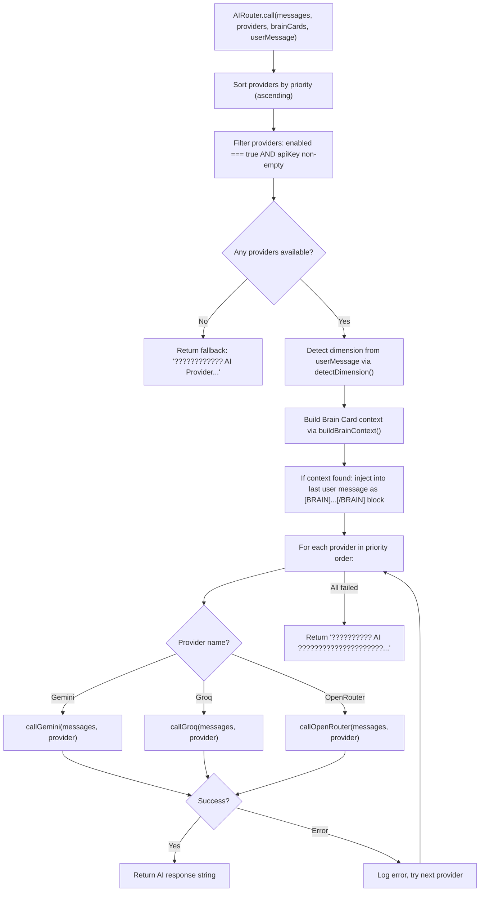
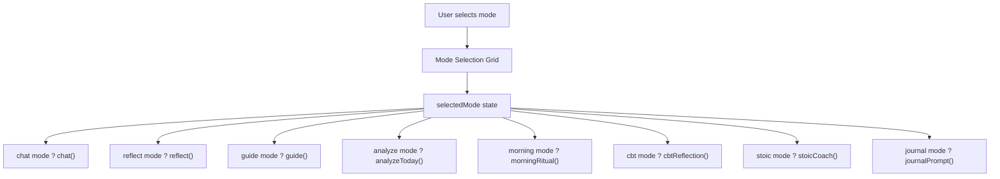
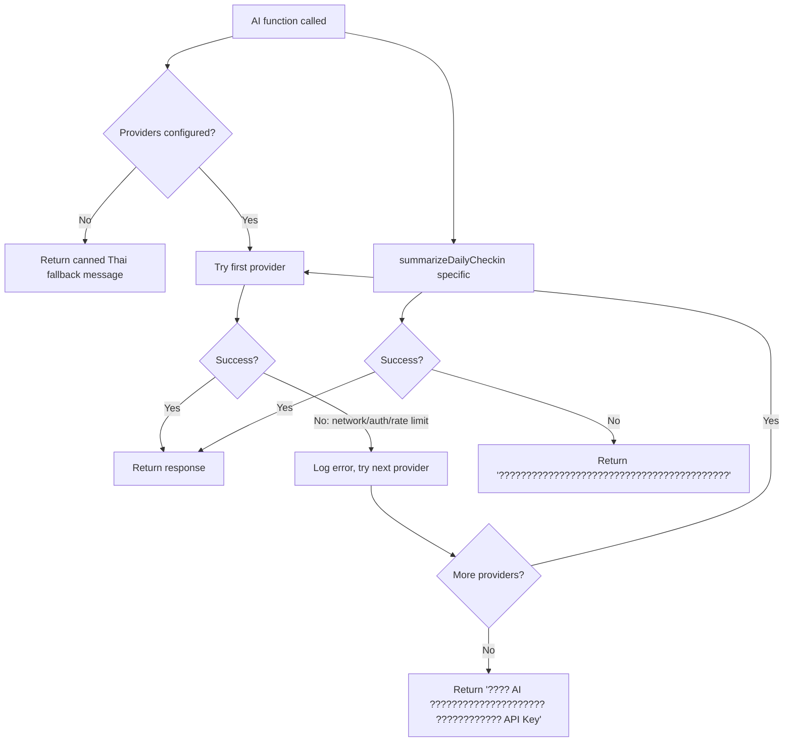

# AI_INTELLIGENCE_SYSTEM.md — My Life OS

> Complete documentation of the AI subsystem — every provider, routing logic, prompt engineering, context building, and AI-powered function.

---

## 1. AI Architecture Overview

The AI system is structured as three layers:

```
+----------------------------------------------+
¦  AI CONSUMER LAYER (Views)                   ¦
¦  AICoachView, DailyCheckinModal              ¦
¦  ManageAPIModal (test connection)            ¦
+----------------------------------------------+
                   ¦ calls
+------------------?---------------------------+
¦  AI SERVICE LAYER (aiService.ts)             ¦
¦  High-level use-case functions:              ¦
¦  chat, reflect, guide, summarize, analyze,  ¦
¦  morningRitual, cbt, stoic, journalPrompt,   ¦
¦  suggestBrainCard, testConnection           ¦
+----------------------------------------------+
                   ¦ delegates to
+------------------?---------------------------+
¦  AI ROUTER LAYER (aiRouter.ts)               ¦
¦  Provider call dispatch + Failover           ¦
¦  Dimension detection                         ¦
¦  Brain Card context injection                ¦
+----------------------------------------------+
         +---------+----------+
    +----?----+ +--?--+ +----?--------+
    ¦ Gemini  ¦ ¦Groq ¦ ¦ OpenRouter  ¦
    ¦  API    ¦ ¦ API ¦ ¦    API      ¦
    +---------+ +-----+ +-------------+
```

---

## 2. AIRouter (`src/lib/aiRouter.ts`)

### 2.1 Class Structure

`AIRouter` is a **static class** — all methods are `static`, no instantiation.

### 2.2 Main Entry: `AIRouter.call()`

```typescript
static async call(
  messages: Array<{ role: "user" | "assistant" | "system"; content: string }>,
  providers: APIProvider[],
  brainCards?: BrainCard[],
  userMessage?: string
): Promise<string>
```

**Full execution flow:**



### 2.3 Provider Call Implementations

#### `callGemini(messages, provider): Promise<string>`

Uses `@google/genai` SDK:
```typescript
const client = new GoogleGenAI({ apiKey: provider.apiKey })
const response = await client.models.generateContent({
  model: provider.model,           // default: "gemini-2.5-flash"
  contents: formattedMessages,
  generationConfig: {
    temperature: 0.7,
    maxOutputTokens: 1024,
  }
})
return response.candidates[0].content.parts[0].text
```

Message format conversion: Converts `system` role to first `user` message, keeps `user`/`model` roles (Gemini uses `"model"` not `"assistant"`).

#### `callGroq(messages, provider): Promise<string>`

Uses OpenAI-compatible REST API:
```typescript
const response = await fetch("https://api.groq.com/openai/v1/chat/completions", {
  method: "POST",
  headers: {
    "Authorization": `Bearer ${provider.apiKey}`,
    "Content-Type": "application/json"
  },
  body: JSON.stringify({
    model: provider.model,           // default: "llama-3.3-70b-versatile"
    messages: messages,              // passes roles as-is (system/user/assistant)
    temperature: 0.7,
    max_tokens: 1024,
  })
})
const data = await response.json()
return data.choices[0].message.content
```

#### `callOpenRouter(messages, provider): Promise<string>`

Uses OpenAI-compatible REST API at OpenRouter endpoint:
```typescript
const model = provider.model === "openrouter/free" ? autoFreeModel : provider.model
const response = await fetch("https://openrouter.ai/api/v1/chat/completions", {
  method: "POST",
  headers: {
    "Authorization": `Bearer ${provider.apiKey}`,
    "Content-Type": "application/json",
    "HTTP-Referer": "https://mylifeos.app",
    "X-Title": "My Life OS"
  },
  body: JSON.stringify({
    model: model,
    messages: messages,
    temperature: 0.7,
    max_tokens: 1024,
  })
})
return data.choices[0].message.content
```

**OpenRouter free model selection:** When `provider.model === "openrouter/free"`, the router cycles through available free models. Available free model options in `ManageAPIModal`:
- `google/gemma-4-31b-it:free`
- `openai/gpt-oss-20b:free`
- `google/gemma-2-9b-it:free`

### 2.4 Dimension Detection: `detectDimension()`

```typescript
static detectDimension(text: string): LifeDimension[]
```

**Algorithm:** Keyword scoring over the 12 life dimensions.

Each dimension has a set of Thai and English keywords. The function:
1. Lowercases the input text
2. For each dimension, counts keyword matches
3. Returns dimensions with score > 0, sorted by score descending
4. Falls back to `["mindset"]` if no matches

**Keyword map (representative samples):**

| Dimension | Sample Keywords |
|---|---|
| `goal` | ????????, goal, ??????, ??????????, plan |
| `health` | ??????, health, ????????, ???, ?????, exercise |
| `finance` | ????, finance, ?????, ????, ??????, investment |
| `mindset` | ???, ?????, mindset, ?????????, attitude, belief |
| `relationship` | ????????????, ??????, ?????, relationship, ????? |
| `career` | ???, ?????, career, ??????, boss, ?????? |
| `learning` | ?????, ???????, learning, ???????, skill, ????? |
| `creativity` | ??????????, creativity, ??????, idea, ????? |
| `spiritual` | ?????????, spiritual, ?????, ?????, meditation |
| `family` | ????????, family, ???, ???, ???, ??????? |
| `social` | ?????, social, ?????, ??????????, society |
| `environment` | ???????????, environment, ????????, ???, nature |

### 2.5 Brain Card Context: `buildBrainContext()`

```typescript
static buildBrainContext(
  userMessage: string,
  brainCards: BrainCard[],
  detectedDimensions: LifeDimension[]
): string
```

**Algorithm:**
1. Filter `brainCards` where `card.dimension` is in `detectedDimensions`
2. Additionally score cards by title/description keyword overlap with userMessage
3. Take top 5 most relevant cards
4. Format as:

```
[BRAIN CONTEXT - ????????? Life Brain ?????????]
?? [Goal] ????????: ???? Trader ????????
   ?????????????? 3 ?? ??????????????????????????
   Tags: trading, finance, goal

?? [Lesson] ???????: ???? FOMO
   ...
[/BRAIN]
```

5. Returns empty string if no relevant cards found

**Injection point:** The context block is appended to the last user message content before API call.

### 2.6 Connection Test: `testConnection()`

```typescript
static async testConnection(provider: APIProvider): Promise<{ success: boolean; message: string }>
```

Sends a minimal "CONNECTED" test message:
```
user: "????????????????? ?????? CONNECTED ????????"
```

Returns:
- `{ success: true, message: "???????????????" }` if response contains "CONNECTED"
- `{ success: false, message: errorText }` on any error

---

## 3. AI Service Layer (`src/lib/aiService.ts`)

### 3.1 Provider Resolution Helper

```typescript
function getProviders(settings: UserSettings): APIProvider[]
```
Returns `(settings.apiProviders || []).filter(p => p.enabled && p.apiKey)` sorted by `priority`.

**No-provider guard:** Every service function checks `if (providers.length === 0)` and returns a canned Thai fallback message without making any API call.

### 3.2 All Exported Functions

#### `chat()`
```typescript
export async function chat(
  messages: AIChatMessage[],
  userInput: string,
  settings: UserSettings,
  brainCards?: BrainCard[]
): Promise<string>
```

**System prompt (abbreviated):**
```
?????? AI Life Coach ??? My Life OS ???????????????????????????
?????????????????????? ????????????????? ?????? ?????????????
????????????????????????????????????????????
[????? BRAIN CONTEXT ????????????????????]
```

Converts `AIChatMessage[]` ? router message format. Appends new userInput as last user message. Calls `AIRouter.call(messages, providers, brainCards, userInput)`.

#### `reflect()`
```typescript
export async function reflect(
  period: "today" | "week" | "month",
  journals: JournalEntry[],
  checkins: DailyCheckin[],
  settings: UserSettings
): Promise<string>
```

**Behavior:** Filters journals/checkins to the specified period. Formats journal titles + mood + date. Formats checkin answers (wentWell, challenge, learned, grateful, tomorrow).

**System prompt focus:** Self-reflection coach. Analyze patterns, identify growth, suggest improvements in Thai.

**User prompt structure:**
```
??????????????????????????????????? [period]
Journal Entries: [formatted list]
Check-in Data: [formatted list]
```

#### `guide()`
```typescript
export async function guide(
  topic: string,
  goals: GoalItem[],
  habits: HabitItem[],
  settings: UserSettings
): Promise<string>
```

**Behavior:** Life guidance advice for a specific topic, contextualized with user's goals and habits.

**System prompt:** Life coach and advisor. Practical, warm, Thai language.

**Context injected:** Top 3 goals (title + progress), top 3 habits (title + streak).

#### `analyzeToday()`
```typescript
export async function analyzeToday(
  journals: JournalEntry[],
  checkin: DailyCheckin | null,
  goals: GoalItem[],
  habits: HabitItem[],
  settings: UserSettings
): Promise<string>
```

**Behavior:** Comprehensive daily analysis narrative.

**System prompt:** Daily analyst. Synthesize all data into a holistic Thai narrative.

**Context injected:**
- Today's journals (title, mood, dimension, content excerpt)
- Today's check-in (all 5 answers if present)
- Goal progress summary
- Habit streak summary

**Output format:** Structured narrative in Thai with sections for wins, areas to improve, encouragement.

#### `morningRitual()`
```typescript
export async function morningRitual(
  settings: UserSettings,
  goals: GoalItem[],
  habits: HabitItem[]
): Promise<string>
```

**Behavior:** Generates a personalized morning motivation message.

**System prompt:** Morning motivator, energetic, concise, Thai language.

**Context:** Top 3 goals, top 3 active habits.

#### `cbtReflection()`
```typescript
export async function cbtReflection(
  situation: string,
  thoughts: string,
  settings: UserSettings
): Promise<string>
```

**Behavior:** Applies CBT (Cognitive Behavioral Therapy) framework to challenge negative thoughts.

**System prompt:** CBT therapist assistant. Socratic questioning style. Thai language.

**Steps produced:** Identify cognitive distortion ? Challenge the thought ? Reframe ? Action step.

#### `stoicCoach()`
```typescript
export async function stoicCoach(
  situation: string,
  settings: UserSettings
): Promise<string>
```

**Behavior:** Applies Stoic philosophy framework (Marcus Aurelius, Epictetus, Seneca).

**System prompt:** Stoic coach. Applies dichotomy of control, amor fati, memento mori concepts. Thai language.

#### `journalPrompt()`
```typescript
export async function journalPrompt(
  dimension: LifeDimension,
  recentJournals: JournalEntry[],
  settings: UserSettings
): Promise<string>
```

**Behavior:** Generates 3 deep reflection questions for a specific life dimension.

**System prompt:** Journal writing coach. Generates profound, thoughtful Thai questions.

**Context:** Dimension label, last 3 journal entries from that dimension.

#### `summarizeDailyCheckin()`
```typescript
export async function summarizeDailyCheckin(
  checkin: Omit<DailyCheckin, "id" | "aiSummary">,
  settings: UserSettings
): Promise<string>
```

**Behavior:** Creates a 2-3 sentence Thai summary of a completed daily check-in.

**System prompt:** Compassionate life coach. Write an encouraging, insightful Thai summary.

**Input formatted:**
```
????????????: {mood}
???????????????: {wentWell}
???????: {challenge}
???????????????: {learned}
?????????????: {grateful}
???????????: {tomorrow}
```

**Fallback:** `"??????????????????????????????????????????"` (if no providers or AI error)

#### `suggestBrainCard()`
```typescript
export async function suggestBrainCard(
  message: string,
  settings: UserSettings,
  existingCards: BrainCard[]
): Promise<Partial<BrainCard> | null>
```

**Behavior:** Analyzes a chat message for knowledge worth saving as a Brain Card. Returns `null` if nothing worth saving.

**System prompt:** Knowledge extraction assistant. Identify key insights, lessons, beliefs, or goals.

**Output format (JSON):**
```json
{
  "title": "...",
  "description": "...",
  "dimension": "learning",
  "brainType": "Lesson",
  "tags": ["tag1", "tag2"]
}
```

**Response parsing:** Extracts JSON from response string using regex. Returns `null` on parse failure or if AI decides no card is warranted.

**Trigger:** Called by `AICoachView` after each AI assistant response. If result is non-null, passes to `onSuggestBrainCard(card)` in App.tsx.

#### `testProviderConnection()`
```typescript
export async function testProviderConnection(
  provider: APIProvider
): Promise<{ success: boolean; message: string }>
```

**Delegates to:** `AIRouter.testConnection(provider)`

**Used by:** `ManageAPIModal` "?????????????????" button per provider card.

---

## 4. AI Mode System

The `AICoachView` exposes multiple interaction modes. Each mode configures the system prompt and call function differently:



### Mode Configurations

| Mode ID | Thai Title | Function Called | Context Used |
|---|---|---|---|
| `chat` | ??????????? | `chat()` | brainCards (dimension-matched) |
| `reflect` | ?????????? | `reflect()` | journals, checkins |
| `guide` | ??????????? | `guide()` | goals, habits |
| `analyze` | ??????????????? | `analyzeToday()` | today's journals + checkin + goals + habits |
| `morning` | Morning Ritual | `morningRitual()` | goals, habits |
| `cbt` | CBT Therapy | `cbtReflection()` | user situation + thoughts input |
| `stoic` | Stoic Coach | `stoicCoach()` | user situation input |
| `journal` | Journal Prompt | `journalPrompt()` | dimension, recent journals |

### Chat Popup Behavior

When user sends a message in chat mode:
1. New user message appended to `messages` array
2. Calls appropriate service function with context
3. AI response received ? new assistant message appended
4. Both saved via `onSaveMessages(updated)` ? `RoomDatabase.saveMessages()`
5. `suggestBrainCard()` runs on AI response text in background
6. If returns non-null Partial<BrainCard> ? `onSuggestBrainCard(card)` called ? `AISuggestPopup` appears

---

## 5. Prompt Engineering Patterns

### System Prompt Structure (All Functions)

All prompts follow this structure:

```
[ROLE DEFINITION]
?????? [role description] ??? My Life OS

[BEHAVIOR RULES]
- ??????????????????????
- [mode-specific rules]
- ?????????????????????????????

[CONTEXT INJECTION]
[BRAIN CONTEXT - ????????? Life Brain]
...
[/BRAIN]

??????????: {settings.userName}
```

### Response Length Control

Controlled via `max_tokens: 1024` across all providers. System prompts also include explicit length guidelines:
- Summaries: "2-3 ??????"
- Analysis: "300-500 ??"
- Journal prompts: "3 ?????"

### Temperature Setting

All calls use `temperature: 0.7` — balanced creativity vs. consistency.

### Language Enforcement

Every system prompt includes Thai language instruction. The `suggestBrainCard()` function uses English JSON output format to ensure parseable structured data regardless of model.

---

## 6. Error Handling Strategy



All AI errors are:
1. Caught silently at the router level (try/catch per provider)
2. Escalated to the next provider
3. If all providers fail: user-friendly Thai error message returned as string (never thrown)
4. Never crash the UI — all callers handle the response as a string

---

## 7. AI Context Building — Data Sources

The AI has access to the following user data during calls (passed by the service layer):

| Service Function | Data Sources Used |
|---|---|
| `chat()` | Brain Cards (dimension-matched), conversation history |
| `reflect()` | Journal entries (filtered by period), daily check-in answers |
| `guide()` | Top goals (title, progress%), active habits (title, streak) |
| `analyzeToday()` | Today's journals, today's check-in, goal summary, habit summary |
| `morningRitual()` | Top goals, top habits |
| `cbtReflection()` | User-provided situation + thoughts text |
| `stoicCoach()` | User-provided situation text |
| `journalPrompt()` | Dimension label, last 3 journals from that dimension |
| `summarizeDailyCheckin()` | All 5 check-in answers + mood |
| `suggestBrainCard()` | AI message text, existing card titles (to avoid duplicates) |

**Privacy note:** All data stays client-side in localStorage. It is sent to the AI provider's API as part of the prompt payload but is never stored in any My Life OS backend database.

---

## 8. AI Provider Comparison

| Feature | Gemini (Google) | Groq | OpenRouter |
|---|---|---|---|
| SDK | @google/genai | fetch (OpenAI-compat) | fetch (OpenAI-compat) |
| Default Model | gemini-2.5-flash | llama-3.3-70b-versatile | openrouter/free |
| Key Prefix | AIzaSy... | gsk_... | sk-or-v1-... |
| Free Tier | Yes (generous) | Yes (rate-limited) | Yes (free models) |
| Thai Quality | Excellent | Good | Varies by model |
| Speed | Fast | Very fast | Varies |
| Referrer Header | No | No | Required (HTTP-Referer) |
| Message Format | Gemini-specific | OpenAI standard | OpenAI standard |

---

## 9. Small Talk System

`AICoachView` pre-loads a "small talk" motivational message on mount via `useEffect`.

```typescript
useEffect(() => {
  loadSmallTalk()  // calls aiService.smallTalk() or uses preset
}, [])
```

**Preset small talk messages** (stored in `aiRouter.ts` or `aiService.ts`): Array of Thai and English motivational sentences. One is selected randomly on load without an API call (to avoid burning API quota on UI decoration).

If user has API configured, a live AI-generated small talk can be fetched. Falls back to preset array otherwise.

---

## 10. Future AI Expansion Points

The system is architected to easily add:
- New providers (add `callNewProvider()` + `case "NewProvider"` in router)
- New AI modes (add entry to mode config array + new service function)
- New context sources (add parameter to service function + inject into prompt)
- Background AI processing (via `PendingAITask` queue in `RoomDatabase.getPendingTasks()`)
- Streaming responses (add streaming branch in `callGemini()` / `callGroq()`)
