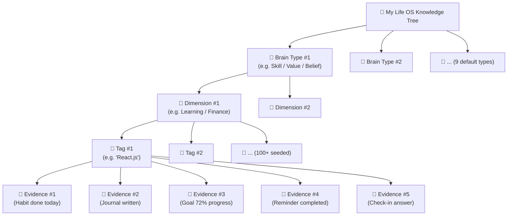
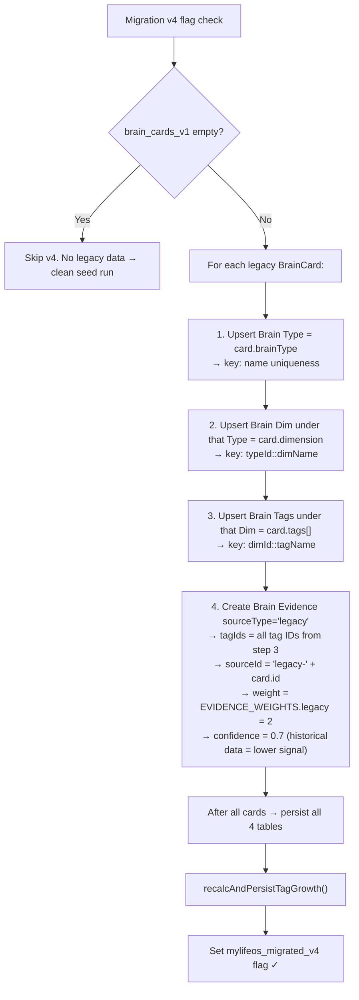
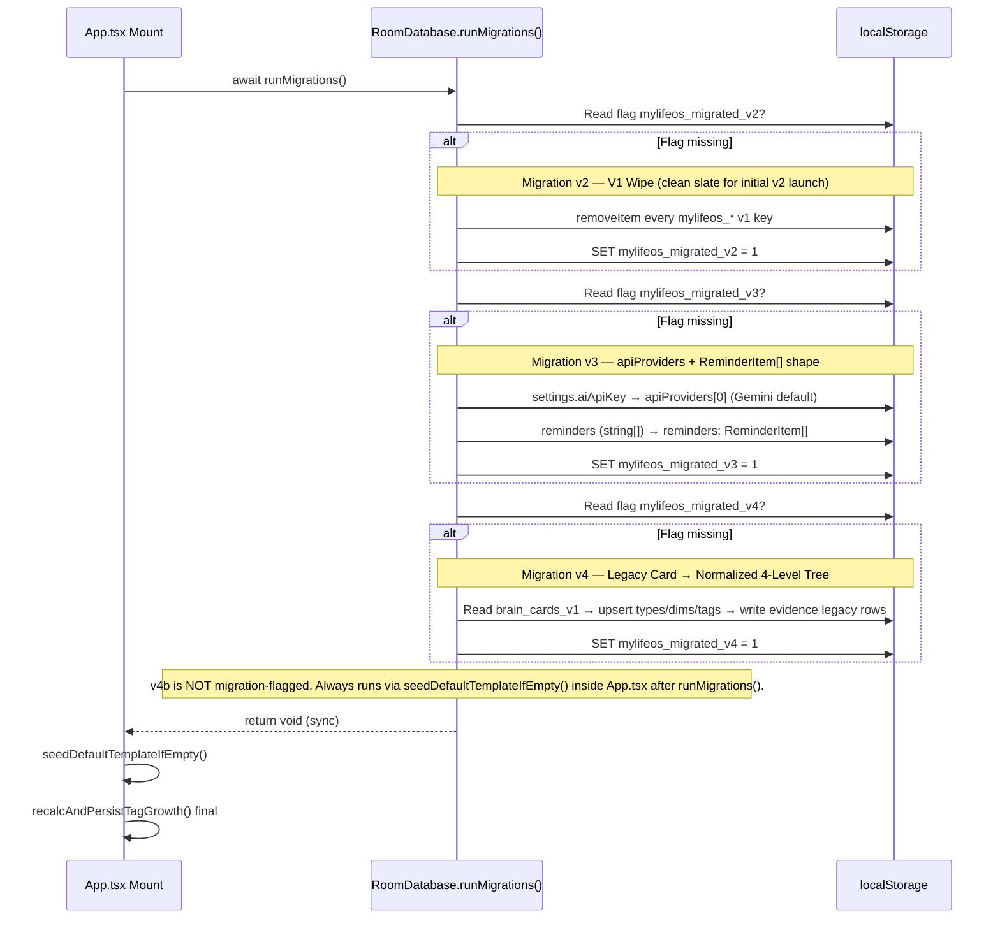
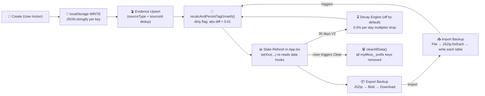
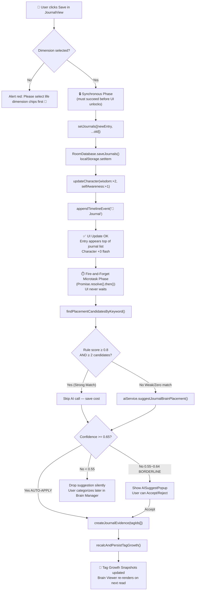
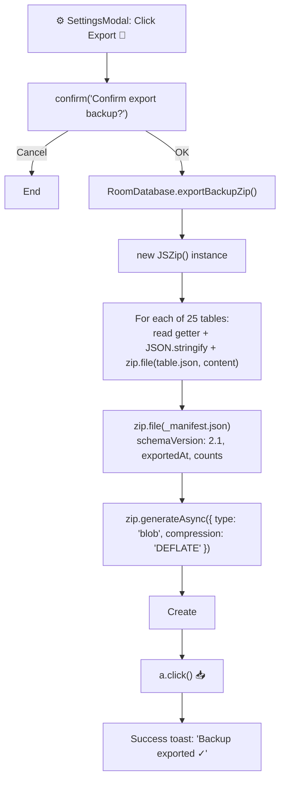

# CORE_LOGIC_SYSTEM.md � My Life OS

> Complete documentation of every business logic function, data model, type definition, database operation, and domain rule in the system.

---

## 1. Type System (`src/types.ts`)

`types.ts` is the **single source of truth** for all data shapes in the application. Every interface, union type, and constant used across the app originates here.

---

### 1.1 Core Domain Types

#### `UserSettings`
Central configuration object for the application user.

```typescript
interface UserSettings {
  userName: string                    // User's display name (shown in greeting)
  aiProvider: string                  // Legacy field (kept for migration)
  aiApiKey: string                    // Legacy field (migrated to apiProviders[0])
  preferredLanguage: "th" | "en"     // UI language preference
  apiProviders: APIProvider[]         // Multi-provider AI config list
  theme?: string                      // Reserved for future theme switching
}
```

Default (`DEFAULT_SETTINGS`):
```typescript
{
  userName: "??????????",
  aiProvider: "gemini",
  aiApiKey: "",
  preferredLanguage: "th",
  apiProviders: []
}
```

#### `APIProvider`
Represents one AI provider configuration, enabling the failover system.

```typescript
interface APIProvider {
  id: string                          // Unique ID (provider-{timestamp})
  name: "Gemini" | "Groq" | "OpenRouter"
  apiKey: string                      // Secret key (stored in localStorage)
  model: string                       // Model identifier string
  enabled: boolean                    // Toggle on/off without deleting
  priority: number                    // Call order (1 = highest priority)
}
```

#### `CharacterStatus`
The RPG stat system � 10 life dimensions as percentage values (0�100).

```typescript
interface CharacterStatus {
  // Physical & Action
  discipline: number                  // Mission completion rate
  health: number                      // Habits & exercise
  finance: number                     // Financial goal progress
  confidence: number                  // Streaks & achievements
  energy: number                      // Daily vitality
  // Mind & Spirit
  wisdom: number                      // Reflection & AI lessons
  creativity: number                  // Vision Board & ideas
  courage: number                     // High-priority goals & challenges
  social: number                      // Relationship journals & goals
  selfAwareness: number               // Check-in streak & CBT
}
```

Default: all fields = `0`.

#### `LifeJourneyPhase`
One of 5 life development phases shown in the Journey roadmap.

```typescript
interface LifeJourneyPhase {
  id: string
  phaseNumber: number                 // 1�5
  title: string                       // English title (e.g., "Foundation")
  titleTh: string                     // Thai title (e.g., "?????????")
  subtitle: string                    // Description paragraph
  status: "completed" | "current" | "upcoming" | "locked"
  progressPercent: number             // 0�100
  estimatedCompletion: string         // e.g., "2024�2025"
  nextMilestone?: string              // Next goal description
  stats?: { name: string; valuePercent: number }[]  // Phase-specific KPIs
}
```

Default journey (5 phases):
| Phase | Title | TitleTh |
|---|---|---|
| 1 | Foundation | ????????? |
| 2 | Growth | ?????? |
| 3 | Mastery | ????????? |
| 4 | Impact | ???????????? |
| 5 | Freedom | ??????? |

---

### 1.2 Journal & Content Types

#### `JournalEntry`

```typescript
interface JournalEntry {
  id: string                          // "j-{timestamp}"
  date: string                        // Thai formatted date string
  timestamp: number                   // Unix ms (for sorting)
  title: string
  content: string                     // Main journal text
  mode: JournalMode                   // Writing mode label
  mood: MoodType                      // Emoji string
  emotion: string                     // Mood label text
  tags: string[]                      // Array of tag strings
  favorite: boolean
  pinned: boolean
  dimension: LifeDimension            // Life category
  linkedBrainCardIds: string[]        // Cross-linked Brain Card IDs
}
```

`JournalMode` (union):
```typescript
type JournalMode =
  | "Normal Diary"
  | "Morning Pages"
  | "Gratitude"
  | "CBT Thought Record"
  | "Dream Journal"
  | "Stoic Reflection"
```

`MoodType` = `string` (any emoji � driven by `presetMoods`)

#### `DailyCheckin`
Result of a completed 5-step check-in session.

```typescript
interface DailyCheckin {
  id: string                          // "chk-{timestamp}"
  date: string                        // ISO date "YYYY-MM-DD"
  timestamp: number
  mood: MoodType
  answers: {
    wentWell: string                  // Step 1 wins answer
    challenge: string                 // Step 2 challenge answer
    learned: string                   // Step 3 lesson answer
    grateful: string                  // Step 4 gratitude answer
    tomorrow: string                  // Step 5 focus answer
  }
  aiSummary: string                   // AI-generated Thai summary
}
```

---

### 1.3 Goal & Habit Types

#### `GoalItem`

```typescript
interface GoalItem {
  id: string                          // "g-{timestamp}"
  title: string
  category: string                    // e.g., "Languages", "Health", "Finance"
  priority: "High" | "Medium" | "Low"
  progressPercent: number             // 0�100 (auto-calculated from milestones)
  deadline: string                    // ISO date string
  milestones: MilestoneItem[]
  vision: string                      // Why this goal matters
  aiSuggestions: string[]             // AI coaching tips for this goal
  completed: boolean                  // true when progressPercent === 100
  archived: boolean
  createdAt: string                   // ISO date string
  dimension?: LifeDimension
}

interface MilestoneItem {
  id: string                          // "m{n}"
  title: string
  completed: boolean
}
```

**Milestone ? Progress Calculation:**
```
progressPercent = Math.round((completedMilestones.length / totalMilestones.length) * 100)
completed = (progressPercent === 100)
```

#### `HabitItem`

```typescript
interface HabitItem {
  id: string                          // "h-{timestamp}"
  title: string
  category: string                    // "Health", "Learning", etc.
  repeatSchedule: string              // "??????", "?????????-?????", etc.
  reminderTime: string                // "HH:MM" string
  currentStreak: number               // Days in a row
  bestStreak: number                  // All-time best streak
  completedDates: string[]            // ISO date strings ["2024-01-01", ...]
  completionRate: number              // completedDates.length / 30 * 100
  dimension?: LifeDimension
}
```

**Daily Toggle Logic** (in `HabitsModal`):
```
isDone = completedDates.includes(todayStr)
if toggle:
  newDates = isDone ? filter out today : [...completedDates, today]
  newStreak = isDone ? max(0, streak-1) : streak+1
  bestStreak = max(bestStreak, newStreak)
  completionRate = min(100, round(newDates.length / 30 * 100))
```

---

### 1.4 Task & Organization Types

#### `ChecklistItem`

```typescript
interface ChecklistItem {
  id: string                          // "c-{timestamp}"
  title: string
  priority: "High" | "Medium" | "Low"
  deadline: string                    // Display string (e.g., "??????")
  completed: boolean
  category: string
}
```

#### `TodayMission`
Used on the Home view for daily featured missions.

```typescript
interface TodayMission {
  id: string
  title: string
  icon: string                        // Emoji icon
  priority: "High" | "Medium" | "Low"
  completed: boolean
  category: string
}
```

#### `ReminderItem`
In-memory quick notes with optional journal conversion.

```typescript
interface ReminderItem {
  id: string                          // "rem-{timestamp}"
  text: string
  createdAt: number
  dimension?: LifeDimension           // Used when converting to journal entry
}
```

---

### 1.5 Knowledge Types

#### `BrainCard`
The core unit of the Life Brain knowledge system.

```typescript
interface BrainCard {
  id: string                          // "brain-{timestamp}-{random5}"
  title: string
  description: string
  dimension: LifeDimension
  brainType: BrainType
  tags: string[]
  linkedJournalIds: string[]          // IDs of linked JournalEntry
  createdAt: number
  updatedAt: number
}
```

`BrainType` constant array (`BRAIN_TYPES`):
```typescript
const BRAIN_TYPES = [
  "Goal", "Belief", "Lesson", "Idea", "Fear",
  "Value", "Habit", "Memory", "Vision", "Principle"
]
```

`LifeDimension` union type:
```typescript
type LifeDimension =
  | "goal" | "health" | "finance" | "mindset"
  | "relationship" | "career" | "learning" | "creativity"
  | "spiritual" | "family" | "social" | "environment"
```

`LIFE_DIMENSIONS` constant array (12 items) � each has `{ id, label, emoji }`:
| id | label | emoji |
|---|---|---|
| goal | ???????? | ?? |
| health | ?????? | ?? |
| finance | ??????? | ?? |
| mindset | ????? & ??????? | ?? |
| relationship | ???????????? | ?? |
| career | ????? & ??? | ?? |
| learning | ??????????? | ?? |
| creativity | ????????????????? | ? |
| spiritual | ????????? | ?? |
| family | ???????? | ?? |
| social | ????? | ?? |
| environment | ??????????? | ?? |

---

### 1.6 Lifestyle Types

#### `VisionCategoryItem`

```typescript
interface VisionCategoryItem {
  id: string                          // "v-{timestamp}"
  category: "Dream House" | "Travel" | "Health" | "Career" | "Family" | "Finance" | string
  title: string
  imageUrl: string                    // External image URL (Unsplash default)
  notes: string
  progressPercent: number
}
```

#### `AffirmationItem`

```typescript
interface AffirmationItem {
  id: string                          // "a-{timestamp}"
  text: string                        // The affirmation statement
  category: "Morning" | "Evening" | "Power" | string
  favorite: boolean
}
```

#### `TimelineEvent`
Historical life events shown in the Timeline modal.

```typescript
interface TimelineEvent {
  id: string
  dateStr: string                     // Display date (e.g., "??.?. 2024")
  title: string
  description: string
  badge: string                       // Short label (e.g., "?? Achievement")
  imageUrl?: string                   // Optional image
  type: "journal" | "goal" | "habit" | "checkin" | "milestone" | "custom"
}
```

#### `AIChatMessage`

```typescript
interface AIChatMessage {
  id: string
  role: "user" | "assistant"
  content: string
  timestamp: number
  mode?: string                       // AI mode that generated this message
}
```

#### `PendingAITask`
Queued AI operations (for background processing pattern).

```typescript
interface PendingAITask {
  id: string
  type: "summarize_checkin" | "reflect_journal" | "suggest_card" | string
  payload: any
  createdAt: number
  status: "pending" | "processing" | "done" | "failed"
}
```

---

## 2. Database Layer (`src/lib/db.ts`)

### 2.1 Class: `RoomDatabase`

All methods are `static`. No instantiation required.

### 2.2 Storage Key Constants

```typescript
const SETTINGS_KEY = "mylifeos_settings_v2"
const CHARACTER_KEY = "mylifeos_character_v2"
const JOURNEY_KEY = "mylifeos_journey_v2"
const MISSIONS_KEY = "mylifeos_missions_v2"
const JOURNALS_KEY = "mylifeos_journals_v2"
const GOALS_KEY = "mylifeos_goals_v2"
const HABITS_KEY = "mylifeos_habits_v2"
const CHECKLIST_KEY = "mylifeos_checklist_v2"
const VISION_KEY = "mylifeos_vision_v2"
const AFFIRMATIONS_KEY = "mylifeos_affirmations_v2"
const MESSAGES_KEY = "mylifeos_messages_v2"
const TIMELINE_KEY = "mylifeos_timeline_v2"
const CHECKINS_KEY = "mylifeos_checkins_v2"
const PRESET_TAGS_KEY = "mylifeos_preset_tags_v2"
const PRESET_MOODS_KEY = "mylifeos_preset_moods_v2"
const BRAIN_CARDS_KEY = "mylifeos_brain_cards_v1"
const REMINDERS_KEY = "mylifeos_reminders_v1"
const PENDING_TASKS_KEY = "mylifeos_pending_tasks_v1"
```

### 2.3 Generic Read/Write Helpers (private)

```typescript
private static get<T>(key: string, fallback: T): T
// localStorage.getItem(key) ? JSON.parse ? return || fallback
// try/catch: any parse error returns fallback

private static set<T>(key: string, value: T): void
// localStorage.setItem(key, JSON.stringify(value))
// try/catch: silently swallows write errors (localStorage full)
```

### 2.4 Default Data Structures

#### `DEFAULT_SETTINGS`
```typescript
{
  userName: "??????????",
  aiProvider: "gemini",
  aiApiKey: "",
  preferredLanguage: "th",
  apiProviders: []
}
```

#### `DEFAULT_CHARACTER`
```typescript
{
  discipline: 0, health: 0, finance: 0, confidence: 0, energy: 0,
  wisdom: 0, creativity: 0, courage: 0, social: 0, selfAwareness: 0
}
```

#### `DEFAULT_JOURNEY` (5 phases)
Pre-populated with Thai-language journey phases from "?????????" to "???????". Phase 1 has status `"current"`, phases 2�5 have `"upcoming"`.

#### `DEFAULT_PRESET_TAGS` (exported constant)
```typescript
export const DEFAULT_PRESET_TAGS = [
  "??????????", "???????????", "??????", "????????????",
  "???????", "??????", "???", "????????", "?????????"
]
```

#### `PresetMood` type and defaults
```typescript
interface PresetMood {
  id: string
  emoji: string
  label: string
}
```
Default 8 moods: from ?? (??????????) to ?? (?????????)

### 2.5 All Public CRUD Methods

#### Settings

| Method | Signature | Description |
|---|---|---|
| `getSettings()` | `(): UserSettings` | Read settings or DEFAULT_SETTINGS |
| `saveSettings()` | `(s: UserSettings): void` | Write settings to localStorage |

#### Character / Stats

| Method | Signature | Description |
|---|---|---|
| `getCharacter()` | `(): CharacterStatus` | Read char or DEFAULT_CHARACTER |
| `saveCharacter()` | `(c: CharacterStatus): void` | Write char |

#### Journey

| Method | Signature | Description |
|---|---|---|
| `getJourney()` | `(): LifeJourneyPhase[]` | Read journey or DEFAULT_JOURNEY |
| `saveJourney()` | `(j: LifeJourneyPhase[]): void` | Write journey |

#### Missions (Today's featured tasks)

| Method | Description |
|---|---|
| `getMissions(): TodayMission[]` | Read missions or `[]` |
| `saveMissions(m: TodayMission[]): void` | Write missions |

#### Journals

| Method | Description |
|---|---|
| `getJournals(): JournalEntry[]` | Read journals or `[]` |
| `saveJournals(j: JournalEntry[]): void` | Write journals |

#### Goals

| Method | Description |
|---|---|
| `getGoals(): GoalItem[]` | Read goals or `[]` |
| `saveGoals(g: GoalItem[]): void` | Write goals |

#### Habits

| Method | Description |
|---|---|
| `getHabits(): HabitItem[]` | Read habits or `[]` |
| `saveHabits(h: HabitItem[]): void` | Write habits |

#### Checklist

| Method | Description |
|---|---|
| `getChecklist(): ChecklistItem[]` | Read checklist or `[]` |
| `saveChecklist(c: ChecklistItem[]): void` | Write checklist |

#### Vision Board

| Method | Description |
|---|---|
| `getVision(): VisionCategoryItem[]` | Read vision or `[]` |
| `saveVision(v: VisionCategoryItem[]): void` | Write vision |

#### Affirmations

| Method | Description |
|---|---|
| `getAffirmations(): AffirmationItem[]` | Read affirmations or `[]` |
| `saveAffirmations(a: AffirmationItem[]): void` | Write affirmations |

#### AI Chat Messages

| Method | Description |
|---|---|
| `getMessages(): AIChatMessage[]` | Read messages or `[]` |
| `saveMessages(m: AIChatMessage[]): void` | Write messages |

#### Timeline

| Method | Description |
|---|---|
| `getTimeline(): TimelineEvent[]` | Read timeline or `[]` |
| `saveTimeline(t: TimelineEvent[]): void` | Write timeline |

#### Daily Check-ins

| Method | Description |
|---|---|
| `getCheckins(): DailyCheckin[]` | Read checkins or `[]` |
| `saveCheckins(c: DailyCheckin[]): void` | Write checkins |

#### Preset Tags and Moods

| Method | Description |
|---|---|
| `getPresetTags(): string[]` | Read tags or DEFAULT_PRESET_TAGS |
| `savePresetTags(t: string[]): void` | Write tags |
| `getPresetMoods(): PresetMood[]` | Read moods or default 8 moods |
| `savePresetMoods(m: PresetMood[]): void` | Write moods |

#### Brain Cards

| Method | Description |
|---|---|
| `getBrainCards(): BrainCard[]` | Read cards or `[]` |
| `saveBrainCards(c: BrainCard[]): void` | Write cards |

#### Reminders

| Method | Description |
|---|---|
| `getReminders(): ReminderItem[]` | Read reminders or `[]` |
| `saveReminders(r: ReminderItem[]): void` | Write reminders |

#### Pending AI Tasks

| Method | Description |
|---|---|
| `getPendingTasks(): PendingAITask[]` | Read pending tasks or `[]` |
| `savePendingTasks(t: PendingAITask[]): void` | Write pending tasks |

### 2.6 Utility Methods

#### `getStorageSize(): string`
```
Calculates total localStorage usage in KB.
Formula: sum of (key.length + value.length) * 2 for all entries
Returns: formatted string like "142.3 KB"
```

#### `clearAllData(): void`
```
Removes all mylifeos_* keys from localStorage.
Iterates localStorage keys, filters by prefix "mylifeos_", removes each.
Used by: SettingsModal Danger Zone button
```

#### `exportBackupZip(): Promise<Blob>`
```
Creates a JSZip archive containing one JSON file per data domain.
Files: settings.json, character.json, journey.json, missions.json,
       journals.json, goals.json, habits.json, checklist.json,
       vision.json, affirmations.json, messages.json, timeline.json,
       checkins.json, preset_tags.json, preset_moods.json,
       brain_cards.json, reminders.json
Returns: Blob for browser download trigger
Used by: SettingsModal Export button
```

#### `importBackupZip(file: File): Promise<boolean>`
```
Reads a ZIP file using JSZip, parses each JSON file,
writes each dataset back to localStorage.
Returns: true on success, false on parse/read error
Used by: SettingsModal Import button
```

### 2.7 Migration System

#### `runMigrations(): void`
Called once in `App.tsx` `useEffect` on mount.

```
Migration v2 (flag: mylifeos_migrated_v2):
  - Removes all v1 storage keys
  - Sets flag ? never runs again

Migration v3 (flag: mylifeos_migrated_v3):
  - Reads legacy settings.aiApiKey
  - If non-empty, creates APIProvider object with Gemini + that key
  - Saves to settings.apiProviders
  - Reads legacy reminders (may have been stored as string[])
  - Converts to ReminderItem[] format if needed
  - Sets flag ? never runs again
```

---

## 3. Business Logic in App.tsx

`App.tsx` is where all the cross-domain business rules live � actions that touch multiple data domains simultaneously.

### 3.1 Character Stat Update Logic

Character stats are updated as side effects of user actions. Each action has defined stat increments:

| User Action | Stat Changes |
|---|---|
| Add journal entry | `wisdom += 2`, `selfAwareness += 1` |
| Complete daily check-in | `selfAwareness += 3`, `wisdom += 2` |
| Add goal | `courage += 2` |
| Complete goal milestone | `discipline += 3`, `confidence += 2` |
| Toggle habit (done) | `health += 2`, `discipline += 1` |
| Add brain card | `wisdom += 3`, `creativity += 2` |
| Add vision item | `creativity += 3` |
| Add affirmation | `confidence += 2` |
| Add checklist item | `discipline += 1` |
| Complete checklist item | `discipline += 2`, `energy += 1` |

**Stat cap:** All stats are capped at `Math.min(100, currentValue + increment)`.

### 3.2 Timeline Event Generation

When certain actions occur, `App.tsx` auto-generates a `TimelineEvent` and prepends it to the timeline:

| Trigger | Event Badge | Event Type |
|---|---|---|
| Add journal entry | `"?? Journal"` | `"journal"` |
| Complete daily check-in | `"? Check-in"` | `"checkin"` |
| Complete goal (100%) | `"?? Goal Achieved"` | `"goal"` |
| Add brain card | `"?? Brain Card"` | custom |

Timeline events are prepended (`[newEvent, ...existingTimeline]`).

### 3.3 Reminder ? Journal Conversion

When a user completes (checks off) a reminder in `NotificationBell` or `HomeView`:

1. App sets `popupReminder = item` (the `ReminderItem`)
2. `ReminderJournalModal` renders with the reminder text
3. User selects mood and tags, submits
4. `handleReminderConfirm(entry)` in App:
   - Calls `onAddJournal(entry)` (saves entry, updates wisdom stat, creates timeline event)
   - Calls `handleDeleteReminder(popupReminder.id)` (removes from reminders list)
   - Clears `popupReminder = null`

### 3.4 AI Suggest ? Brain Card Pipeline

When `AICoachView` calls `onSuggestBrainCard(partialCard)`:

1. App sets `suggestedCard = partialCard`
2. `AISuggestPopup` renders with 15-second auto-dismiss
3. If user confirms: `handleAISuggestConfirm(partial)` in App:
   - Merges `partial` into a full `BrainCard` with generated ID + timestamps
   - Calls `handleSaveBrainCard(card)` ? saves + bumps `wisdom += 3, creativity += 2`
   - Clears `suggestedCard = null`

### 3.5 Search Navigation

`GlobalSearchModal` callbacks:
- `onSelectJournal(entry)` ? closes search, switches to journal tab, scrolls to entry
- `onSelectGoal(goal)` ? closes search, opens GoalsModal
- `onSelectBrainCard(card)` ? closes search, opens LifeBrainView, auto-selects the card

---

## 4. Text Utilities (`src/lib/textUtils.ts`)

### `countWords(text: string): number`

**Purpose:** Accurately count words in Thai+English mixed text.

**Algorithm:**
```
1. Return 0 if text is empty/whitespace
2. Try Intl.Segmenter("th", { granularity: "word" }):
   a. Segment the text into word-like units
   b. Filter by segment.isWordLike === true
   c. Return count if > 0
3. Fallback: text.trim().split(/\s+/).filter(Boolean).length
```

**Used by:** `DailyCheckinModal` to show live word count during check-in. Green badge when >= 100 words ("AI ??????????????????????" encouragement).

---

## 5. Complete State Mutation Reference

Every function that mutates data in `App.tsx`:

### Journal Operations
```typescript
handleAddJournal(entry: JournalEntry)
  ? setJournals([entry, ...journals])
  ? RoomDatabase.saveJournals(updated)
  ? updateCharacter({ wisdom: +2, selfAwareness: +1 })
  ? appendTimeline({ type: "journal", badge: "?? Journal", ... })

handleDeleteJournal(id: string)
  ? setJournals(journals.filter(j => j.id !== id))
  ? RoomDatabase.saveJournals(updated)

handleUpdateJournal(updated: JournalEntry)
  ? setJournals(journals.map(j => j.id === updated.id ? updated : j))
  ? RoomDatabase.saveJournals(updated)
```

### Goal Operations
```typescript
handleSaveGoals(goals: GoalItem[])
  ? setGoals(goals)
  ? RoomDatabase.saveGoals(goals)
  ? [if any goal newly completed] updateCharacter({ discipline: +3, confidence: +2 })
  ? [if any goal newly completed] appendTimeline({ type: "goal", badge: "?? Goal Achieved" })
```

### Habit Operations
```typescript
handleSaveHabits(habits: HabitItem[])
  ? setHabits(habits)
  ? RoomDatabase.saveHabits(habits)
  ? [called after toggle] updateCharacter({ health: +2, discipline: +1 })
```

### Checklist Operations
```typescript
handleSaveChecklist(checklist: ChecklistItem[])
  ? setChecklist(checklist)
  ? RoomDatabase.saveChecklist(checklist)
  ? [if item newly completed] updateCharacter({ discipline: +2, energy: +1 })
```

### Check-in Operations
```typescript
handleSaveCheckin(checkin: DailyCheckin)
  ? setCheckins([checkin, ...checkins])
  ? RoomDatabase.saveCheckins(updated)
  ? updateCharacter({ selfAwareness: +3, wisdom: +2 })
  ? appendTimeline({ type: "checkin", badge: "? Check-in" })
```

### Brain Card Operations
```typescript
handleSaveBrainCard(card: BrainCard)
  ? if editing: setCards(cards.map(c => c.id === card.id ? card : c))
  ? if new: setCards([card, ...cards])
  ? RoomDatabase.saveBrainCards(updated)
  ? [if new] updateCharacter({ wisdom: +3, creativity: +2 })

handleDeleteBrainCard(id: string)
  ? setCards(cards.filter(c => c.id !== id))
  ? RoomDatabase.saveBrainCards(updated)
```

### Reminder Operations
```typescript
handleAddReminder(text: string)
  ? new ReminderItem { id: "rem-{Date.now()}", text, createdAt: Date.now() }
  ? setReminders([newItem, ...reminders])
  ? RoomDatabase.saveReminders(updated)

handleEditReminder(id: string, newText: string)
  ? setReminders(reminders.map(r => r.id === id ? {...r, text: newText} : r))
  ? RoomDatabase.saveReminders(updated)

handleDeleteReminder(id: string)
  ? setReminders(reminders.filter(r => r.id !== id))
  ? RoomDatabase.saveReminders(updated)

handleCompleteReminder(item: ReminderItem)
  ? setPopupReminder(item)  // triggers ReminderJournalModal
```

### Settings Operations
```typescript
handleSaveSettings(settings: UserSettings)
  ? setSettings(settings)
  ? RoomDatabase.saveSettings(settings)

handleReloadApp()
  ? window.location.reload()
```

### Message Operations
```typescript
handleSaveMessages(messages: AIChatMessage[])
  ? setMessages(messages)
  ? RoomDatabase.saveMessages(messages)
```

---

## 6. ID Generation Patterns

| Entity | Pattern | Example |
|---|---|---|
| JournalEntry | `"j-" + Date.now()` | `j-1706345600000` |
| GoalItem | `"g-" + Date.now()` | `g-1706345600000` |
| HabitItem | `"h-" + Date.now()` | `h-1706345600000` |
| ChecklistItem | `"c-" + Date.now()` | `c-1706345600000` |
| VisionCategoryItem | `"v-" + Date.now()` | `v-1706345600000` |
| AffirmationItem | `"a-" + Date.now()` | `a-1706345600000` |
| DailyCheckin | `"chk-" + Date.now()` | `chk-1706345600000` |
| BrainCard | `"brain-" + Date.now() + "-" + random(5)` | `brain-1706345600000-x7k2p` |
| ReminderItem | `"rem-" + Date.now()` | `rem-1706345600000` |
| AIChatMessage | timestamp-based | internal |
| APIProvider | `"provider-" + Date.now()` | `provider-1706345600000` |
| MilestoneItem | `"m1"`, `"m2"` (static defaults) | `m1` |
| TimelineEvent | timestamp-based string | internal |

---

## 7. Domain Validation Rules

| Field | Rule |
|---|---|
| BrainCard.title | Required (non-empty after trim) |
| BrainCard.dimension | Required (must be valid LifeDimension) |
| BrainCard.brainType | Required (must be in BRAIN_TYPES) |
| GoalItem.title | Required (non-empty after trim) |
| HabitItem.title | Required (non-empty after trim) |
| ChecklistItem.title | Required (non-empty after trim) |
| VisionCategoryItem.title | Required (non-empty after trim) |
| JournalEntry | No explicit required fields � all optional except id/date/timestamp |
| DailyCheckin | No required answer length � submits with empty answers |
| APIProvider.apiKey | Validated by test-connection call only |
| Tag input | Strips leading `#`, rejects duplicates, empty strings |
| Reminder text | Must be non-empty after trim to add |

---

## 8. Brain Tree Engine V1 (`src/lib/brainTree/`)

The Brain Tree Engine is the knowledge architecture layer — transforming the flat BrainCard list into a **4-level hierarchical knowledge tree** where growth is computed from evidence, not from manual tagging.



### 8.1 Storage Layer (Brain Tree v4 Keys)

The v4 migration adds **5 new storage keys** that replace the flat `BRAIN_CARDS_KEY` with a normalized relational structure:

| Key Constant | Storage Key | Type Shape |
|---|---|---|
| `BRAIN_TYPES_KEY` | `mylifeos_brain_types_v4` | `BrainType[]` |
| `BRAIN_DIMENSIONS_KEY` | `mylifeos_brain_dimensions_v4` | `BrainDimension[]` |
| `BRAIN_TAGS_KEY` | `mylifeos_brain_tags_v4` | `BrainTag[]` |
| `BRAIN_EVIDENCE_KEY` | `mylifeos_brain_evidence_v4` | `BrainEvidence[]` |
| `BRAIN_GROWTH_KEY` | `mylifeos_brain_growth_v4` | `Record<string, TagGrowthSnapshot>` |
| `BRAIN_META_KEY` | `mylifeos_brain_meta_v4` | `{ templateVersion: string, lastRecalcAt: number }` |

### 8.2 Core Type Definitions

```typescript
interface BrainType {
  id: string                          // "bt-{timestamp}"
  name: string                        // "Skill", "Value", "Belief", "Lesson", ...
  icon: string                        // Emoji
  order: number                       // Display sort order
  color: string                       // Hex color (e.g. "#4E7345")
  createdAt: number
}

interface BrainDimension {
  id: string                          // "bd-{timestamp}"
  typeId: string                      // FK → BrainType.id
  name: string                        // Matches LifeDimension label
  icon: string
  order: number
  color: string
  description: string
  createdAt: number
}

interface BrainTag {
  id: string                          // "btag-{timestamp}"
  dimensionId: string                 // FK → BrainDimension.id
  name: string                        // "React.js", "Meditation", "S&p 500"
  description: string
  order: number
  aliases: string[]                   // Keyword aliases (for placement matching)
  evidenceCount: number               // Denormalized counter
  createdAt: number
  updatedAt: number
}

interface BrainEvidence {
  id: string                          // "bev-{timestamp}-{rand}"
  tagIds: string[]                    // Junction: 1 evidence → N tags (multi-label)
  sourceType: "habit" | "journal" | "goal" | "reminder" | "checkin" | "ai_memory" | "legacy"
  sourceId: string                    // Dedup key: e.g. "habit-{id}-{date}" or "journal-{id}"
  title: string
  content: string
  weight: number                      // Effective weight (from config)
  confidence: number                  // 0-1 (AI auto-tag: 0.65; Manual: 1.0)
  linkedAt: number                    // When evidence was attached
  occurredAt: number                  // When source event happened
  meta?: Record<string, any>          // goal.progressPercent, habit.streak, etc.
}

interface TagGrowthSnapshot {
  tagId: string
  level: number                       // Quadratic formula output
  score: number                       // Raw weighted sum
  progressPct: number                 // 0-100 within current level
  status: "Seedling" | "Growing" | "Mature" | "Mastery"
  decayRate: number                   // V2: 0.005 per day (0.5%)
  lastUpdatedAt: number
}
```

### 8.3 Evidence Weight Configuration

Evidence is the ONLY thing that grows the tree. Tags and Dimensions are just "hangers" — the weight comes from REAL user actions:

| Source Type | Default Weight | Why | Dedup Key Pattern |
|---|---|---|---|
| `habit` | **5** | Daily commitment = strongest signal | `habit-{habitId}-{YYYY-MM-DD}` |
| `goal` | **10** × `progressPct/100` | Sustained outcome = highest unit | `goal-{goalId}` (updates in place) |
| `reminder` | **3** | Actionable small wins | `reminder-{reminderId}` |
| `journal` | **2** | Reflection = cognitive signal | `journal-{journalId}` |
| `checkin` | **1** | Daily baseline | `checkin-{date}` |
| `ai_memory` | **1** | AI-extracted insight | `ai-{hash}` |
| `legacy` | **2** | V3 BrainCard migration | `legacy-{brainCardId}` |

**Dedup guarantee:** Upsert by `(sourceType, sourceId)` tuple. Same source event never double-counted.

---

### 8.4 Growth Formula Engine (`src/lib/brainTree/growth.ts`)

#### `computeGrowth(rawScore: number, growthLevelConstant = 100): { level: number; progressPct: number }`

**Pure function** — quadratic RPG-style level progression:

```
S_n = C × n²      where C = growthLevelConstant

To find level n for a given raw score S:
  n = floor( sqrt(S / C) )

Progress within level n:
  score_at_start_n = C × n²
  score_at_end_n   = C × (n+1)²
  progressPct = round( (S - score_at_start_n) / (score_at_end_n - score_at_start_n) × 100 )
```

**Input validation:**
- If `rawScore < 0` → clamp to `0`
- If `growthLevelConstant < 1` → clamp to `1`

**Edge case guards (two while-loops):**
1. Round-off guard: If due to floating point `sqrt(C * (lvl+1)^2) ≤ rawScore`, increment level
2. Lower bound guard: If `C * lvl² > rawScore`, decrement level

**Performance:** O(1) — pure math, no allocations. Used in hot path during recalc (called once per tag).

---

#### `progressToStatus(progressPct: number): { key: TagStatus; label: string; emoji: string; color: string }`

Maps `progressPct` (0–100) to a 4-band qualitative status:

| Band | Range | Status Key | Emoji | Color |
|---|---|---|---|---|
| 🌱 | 0%–20% | `Seedling` | 🌱 | `#6B9361` (muted green) |
| 🌿 | 21%–50% | `Growing` | 🌿 | `#95B58C` (bright green) |
| 🌳 | 51%–80% | `Mature` | 🌳 | `#4E7345` (rich olive) |
| 🌟 | 81%–100% | `Mastery` | 🌟 | `#D4A74E` (gold) |

Used by: BrainViewer tag badges, Journey progress bars.

---

### 8.5 `brainTreeService.ts` — Core Service Functions

#### Function: `seedDefaultTemplateIfEmpty()`

| Property | Detail |
|---|---|
| **Purpose** | Populate empty Brain Tree with v1.1 default template. Idempotent — runs only if `brain_types_v4` table is empty. |
| **File** | `src/lib/brainTree/brainTreeService.ts` |
| **Input** | `void` |
| **Default Template Spec** | 9 Brain Types × ~2.2 Dimensions each = **20 Dimensions** × ~5 tags = **100+ Seeded Tags** |
| **Storage Read** | `RoomDatabase.getBrainTypes()` → check empty |
| **Storage Write** | `saveBrainTypes`, `saveBrainDimensions`, `saveBrainTags` (3 separate writes) |
| **Internal Logic** | 1. Read all 3 tables → if all non-empty, return early. 2. Iterate `DEFAULT_TEMPLATE` object. 3. For each Type: generate `bt-Date.now()+idx`. 4. For each Dim in Type: generate `bd-*` with FK to typeId. 5. For each Tag in Dim: generate `btag-*` with FK to dimensionId. 6. Batch save. 7. Update `brain_meta_v4.templateVersion = "1.1"`. |
| **Validation** | None needed — idempotency check on the read side. |
| **Error Handling** | Try/catch entire op; on error log but don't throw (app must still start). |
| **Output** | `Promise<boolean>` — `true` if seed actually ran, `false` if skipped. |
| **Side Effects** | Sets `lastRecalcAt = Date.now()` in meta. |
| **Complexity** | O(|Types| + |Dims| + |Tags|) linear. One-shot. |

---

#### Function: `aggregateTagScores(evidence: BrainEvidence[], options?: { enableDecay?: boolean; decayDaysThreshold?: number }): Map<string, number>`

| Property | Detail |
|---|---|
| **Purpose** | Compute raw weighted score per tagId from evidence array. Supports optional Decay Engine (V2 disabled by default). |
| **Input** | `evidence: BrainEvidence[]` (all rows), `options.enableDecay` default `false`, `options.decayDaysThreshold` default `30` |
| **Internal Logic** | 1. `new Map<string, number>()` accumulator. 2. `for (const ev of evidence) {` 3. `ageDays = (Date.now() - ev.occurredAt) / 86400000`. 4. `effectiveWeight = ev.weight * ev.confidence`. 5. If decay enabled AND ageDays > threshold: `multiplier = Math.max(0, 1 - (ageDays - threshold) * 0.005)` (0.5%/day linear drop to 0). 6. `for (const tagId of ev.tagIds) { map.set(tagId, (map.get(tagId)||0) + effectiveWeight * multiplier) }`. |
| **Calculation** | `Σ (weight × confidence × decay_multiplier)` per evidence, per tag in tagIds[] junction. |
| **Storage Read** | Caller passes evidence — pure function, no I/O inside. |
| **Storage Write** | None. |
| **Output** | `Map<tagId: string, rawScore: number>` |
| **Performance** | **O(|Evidence| × |TagIds per Evidence|)**. Dominant cost in growth recalc. Capped by array size. Typical 1000 evidence × 2 tags = 2000 ops. Acceptable. |
| **Edge** | Empty evidence → empty Map (safe). |
| **Note** | `86400000 = 24 × 60 × 60 × 1000` MS_PER_DAY constant at top of file. |

---

#### Function: `recalcAndPersistTagGrowth(): Promise<number>`

| Property | Detail |
|---|---|
| **Purpose** | Full-tree recompute: Evidence → Scores → Levels → Snapshots. Uses dirty-flag to skip no-change writes. |
| **Trigger** | App.tsx on mount (post migration), after any evidence mutation (createXxxEvidence, deleteEvidence, goalProgress update). |
| **Input** | `void` |
| **Storage Read** | `getBrainEvidence()`, `getBrainGrowthSnapshots()` (previous values). |
| **Internal Logic** | 1. `scores = aggregateTagScores(allEvidence)`. 2. For every tag in `getBrainTags()`: 3. `{level, progressPct} = computeGrowth(scores.get(tagId) || 0)`. 4. `status = progressToStatus(progressPct).key`. 5. **Dirty check:** if `Math.abs(prev.level - newLevel) > 0.01` OR status changed → mark for write. 6. Build new snapshot Record. 7. Only if at least one tag changed: `saveBrainGrowthSnapshots(newRec)`. 8. Update `brain_meta_v4.lastRecalcAt`. |
| **Calculation** | See `computeGrowth` + `progressToStatus`. |
| **Storage Write** | Conditional save of growth snapshot table. Zero write if tree unchanged (dirty-flag optimization). |
| **Output** | `Promise<number>` — count of tags whose growth values actually changed. Useful for logs. |
| **Error Handling** | Try/catch; on error return `-1` to signal failure to caller. |
| **Performance Notes** | Dominated by `aggregateTagScores`. ~100 tags → cheap. Dirty flag prevents write amplification on no-op saves. After a habit toggle typically 1-3 tags change. |
| **Side Effects** | Updates meta.lastRecalcAt timestamp. No UI state change from inside — caller (App.tsx) re-reads growth snapshots to refresh. |

---

#### Function: `createHabitEvidence(habit: HabitItem, dateISO: string, tagIds: string[]): Promise<BrainEvidence | null>`

**One of 5 create-source-evidence helpers** — all share the same signature pattern. Others:
- `createJournalEvidence(journal, tagIds)`
- `createGoalEvidence(goal, tagIds, progressPercent)`
- `createReminderEvidence(reminder, tagIds)`
- `createCheckinEvidence(checkin, tagIds, keywordMatchesFromAnswers)`

| Property | Detail |
|---|---|
| **Purpose** | Attach a habit completion as evidence to 1+ tags. Idempotent via sourceId dedup key. |
| **Input** | `habit: HabitItem`, `dateISO: string` (YYYY-MM-DD), `tagIds: string[]` (0 or more; can be empty if user hasn't categorized yet) |
| **Validation** | If `tagIds.length === 0` → still creates evidence row (orphan evidence shown in "Uncategorized Evidence" inbox later). `sourceId = "habit-" + habit.id + "-" + dateISO` — unique per habit per day. |
| **Upsert Logic** | Query existing evidence by `(sourceType="habit", sourceId)`. If found: update `tagIds`, `weight`, `linkedAt`. If not found: INSERT new row. |
| **Storage Read** | `getBrainEvidence()` → find index by sourceType+sourceId tuple filter. |
| **Storage Write** | `saveBrainEvidence(updatedArray)`. Then cascades: `recalcAndPersistTagGrowth()`. |
| **Calculation** | `weight = EVIDENCE_WEIGHTS.habit = 5`. `confidence = 1.0` (habit toggle is manual = 100% signal). `occurredAt = today start of day timestamp`. |
| **Output** | `Promise<BrainEvidence | null>` — null if upsert failed. |
| **State Update** | Caller re-triggers growth snapshot re-read (App.tsx). |
| **Side Effects** | `tag.evidenceCount++` denormalized counter per tag in tagIds. |
| **Error Handling** | Try/catch. Swallow and return null; never break habit toggle flow. |

---

#### Function: `findPlacementCandidatesByKeyword(text: string, topK = 5): PlacementCandidate[]`

| Property | Detail |
|---|---|
| **Purpose** | Rule-based (non-AI) evidence placement matching. Used as fallback chain before AI, and as pre-filter to reduce AI token cost. |
| **Input** | `text: string` (journal content / reminder text / goal title — any source text), `topK: number = 5` |
| **Algorithm** | Unicode-aware multilingual tokenization + overlap scoring: 1. `normalize(text).toLowerCase()`. 2. Unicode tokenize `/\p{L}+/gu` regex for letters + split on whitespace. 3. For each BrainTag: compute `overlap_count = size( token_set(text) ∩ (token_set(tag.name) ∪ token_set(tag.aliases) ∪ token_set(parent_dim.name)) )`. 4. Filter: `overlap_count ≥ 2` OR exact phrase match on `name` OR `aliases`. 5. Sort descending by overlap_count. 6. Slice `topK`. |
| **Output Type** | `interface PlacementCandidate { tagId: string; tagName: string; dimName: string; typeName: string; score: number; reason: "alias_match" | "name_match" | "parent_dimension" }[]` |
| **Storage Read** | Full scan `getBrainTags()` + `getBrainDimensions()` + `getBrainTypes()`. Cold data — in-memory once per app session typically. |
| **Storage Write** | None. Pure read + compute. |
| **Performance** | O(|Tags| × |Tokens|). ~100 tags × ~50 tokens = 5000 ops. Runs synchronously without blocking. |
| **Confidence Note** | Result score is normalized to `0–1`. Used by `suggestJournalBrainPlacement` to skip AI router when score ≥ 0.8. |
| **Complexity** | Medium. Set operations via `new Set()` intersections. |

---

### 8.6 V4 Migration: Legacy BrainCard → 4-Level Tree

Migration v4 bridges v3 (flat BrainCard list) to v4 (normalized hierarchy). **Two dedup keys prevent double-insertion:**

- **Dim dedup key:** `{typeId}::{dimName.toLowerCase()}` — same name under same Type = reuse dim
- **Tag dedup key:** `{dimId}::{tagName.toLowerCase()}` — same name under same Dim = reuse tag



**Migration v4b (cleanup):** After v4 runs, immediately call `seedDefaultTemplateIfEmpty()` to fill in any gaps (Types/Dims/Tags that no legacy card touched). Then run final `recalcAndPersistTagGrowth()` for normalization.

---

## 9. Full Migration System — 4-Step Chain

`runMigrations()` in `db.ts` actually chains **4 migrations sequentially**. Order is critical:



---

## 10. Data Lifecycle



---

## 11. Complete Function Signatures — 11-Bullet Spec (Core Functions)

### 11.1 `db.ts` — `exportBackupZip()`

| Property | Detail |
|---|---|
| **Function name** | `exportBackupZip` |
| **File location** | `src/lib/db.ts` — `RoomDatabase.exportBackupZip` (static) |
| **Purpose** | Package ALL user data into a single `.zip` file (named `mylifeos-backup-YYYYMMDD-HHmmss.zip`) for safe-keeping or device migration. |
| **Input** | `void` |
| **Validation** | None — always runs. If JSZip library fails to load, throws (caught by SettingsModal caller, shows error toast). |
| **Internal Logic** | 1. `new JSZip()`. 2. 25 `JSON.stringify()` payloads (the 18 legacy tables + 5 brain tree tables + presetTags/Moods). 3. Each payload written as `file("backup/<table>.json", JSON.stringify(rows, null, 2))`. 4. Also writes `backup/_manifest.json` with `{ schemaVersion: "2.1", exportedAt: ISO timestamp, tableCounts: { ... }, appVersion: "1.1.2" }`. 5. `zip.generateAsync({ type: "blob", compression: "DEFLATE" })`. |
| **Storage Read** | Reads ALL 25 storage keys via their getters. |
| **Storage Write** | No localStorage writes. Pure output. |
| **Output** | `Promise<Blob>` — the ZIP binary blob. |
| **State Update** | None. Caller (SettingsModal) creates `<a download>` + `.click()`. |
| **Side Effects** | None. Pure read. |
| **Error Handling** | Re-throws JSZip errors (bubbled to caller try/catch). Shows user prompt. |
| **Performance** | `O(n × serialize)` — bounded by largest table (journals). 1000 journals → ~3-5 seconds. Shows spinner. |

---

### 11.2 `db.ts` — `importBackupZip(file: File): Promise<boolean>`

| Property | Detail |
|---|---|
| **Function name** | `importBackupZip` |
| **File location** | `src/lib/db.ts` |
| **Purpose** | Restore entire app state from a previously exported ZIP. **DESTRUCTIVE OVERWRITE.** |
| **Input** | `file: File` — user-selected File object from `<input type="file" accept=".zip">`. |
| **Validation** | 1. File must end in `.zip` OR have `application/zip` mime type. 2. ZIP must contain `backup/_manifest.json`. 3. `manifest.schemaVersion` must be `"2.0"` or `"2.1"` (current). Fail validation → return `false` without touching data. |
| **Internal Logic** | 1. `JSZip.loadAsync(file)`. 2. Verify manifest. 3. For each known `<table>.json` in backup: `await zip.file(...).async("string")` → `JSON.parse` → `RoomDatabase.saveXxx(parsedRows)` for all 25 tables. 4. Skip missing backup files (partial backup → only replaces tables that exist in backup). |
| **Storage Read** | Just zip entries. |
| **Storage Write** | **All 25 storage keys are OVERWRITTEN by backup content** (if that table exists in the backup). Un-touched tables in backup keep their current state. |
| **Output** | `Promise<boolean>` — `true` = success. `false` = validation or parse failure. |
| **State Update** | Caller (SettingsModal) calls `window.location.reload()` to force full remount with restored state. |
| **Side Effects** | Pending PWA service worker cache stays. localStorage is the ONLY persistence layer affected. |
| **Error Handling** | Any JSON.parse error / zip read fail → catch, return false, DO NOT partially write (all-or-nothing policy: batch the writes only after ALL files parsed successfully). |
| **Performance** | 25 JSON.parses + 25 writes. Typical < 1 second. Reload takes most time. |

---

### 11.3 `App.tsx` — `handleAddJournal(entry) + AI background chain`

| Property | Detail |
|---|---|
| **Function name** | `handleAddJournal` |
| **File location** | `src/App.tsx` — lines ~380–450 |
| **Purpose** | Save journal entry immediately + bump character + timeline. Then non-blocking AI background chain for brain tree auto-placement. **SAVE-FIRST, ANALYZE-LATER pattern.** |
| **Input** | `entry: JournalEntry` (fully-formed object from JournalView or ReminderJournalModal) |
| **Validation** | None at this layer — form-level validation happened in JournalView (dimension required check). |
| **Internal Logic** — **Step 1 (sync, blocking):** Save journal → `setJournals([entry, ...journals])` + `RoomDatabase.saveJournals(updated)` synchronously. **Step 2 (sync):** `updateCharacter({ wisdom: +2, selfAwareness: +1 })`. **Step 3 (sync):** appendTimeline `{ ... journal entry }`. **Step 4 (async, non-blocking):** `Promise.resolve().then(async () => { ... AI chain ... })`. |
| **AI Background Chain Logic** (Step 4 inside microtask): 4a. `ruleCandidates = findPlacementCandidatesByKeyword(entry.content + " " + entry.title)`. 4b. `if (ruleCandidates.length >= 2 AND ruleCandidates[0].score >= 0.8)` → skip AI call (cheaper), auto-apply tagIds. 4c. Else: `aiService.suggestJournalBrainPlacement(entry, allTypes, allDims, allTags, ruleCandidates as context)`. 4d. Parse AI returned `{ candidateTagIds, confidence, missingNodeProposals, usedFallback }`. 4e. **Auto-apply gate:** If `confidence >= AUTO_CONFIDENCE_THRESHOLD (0.65)` → `createJournalEvidence(entry, candidateTagIds)`. 4f. Else if `confidence >= 0.55 (MIN_THRESHOLD)` → show `AISuggestPopup` for user confirmation. 4g. Else: do nothing (silent). |
| **Storage Write (sync)** | `saveJournals`, `saveCharacter`, `saveTimeline`. 4h. If evidence attached: `createJournalEvidence → saveBrainEvidence → saveBrainGrowth (via recalc)`. |
| **Output** | `void` — sync part returns nothing. Promise chain is dangling (fire-and-forget). |
| **State Update** | `setJournals(updated)` triggers re-render of JournalView instantly. AI updates come later via snapshots re-read causing another render. |
| **Side Effects** | If `missingNodeProposals[]` is non-empty from AI step: push each to `pendingAITasks[]` as `"propose_new_tag"` task. User can review in BrainManager later. |
| **Error Handling** | AI chain wrapped in big `try/catch { console.error("AI bg failed", err) }` — NEVER bubbles to user, NEVER breaks the journal save that already happened. |
| **Performance Notes** | Critical pattern: user sees their new journal appear in < 16ms. AI work is in a future microtask after paint. Even if AI takes 15s, UX stays responsive. |

---

### 11.4 `App.tsx` — `handleSaveHabitsWithEvidence(updated: HabitItem[])`

| Property | Detail |
|---|---|
| **Function name** | `handleSaveHabitsWithEvidence` |
| **File location** | `src/App.tsx` — lines ~440–470 |
| **Purpose** | Delta-only evidence creation for habit completions. Prevents duplicate evidence rows (a common bug if user toggles rapidly). |
| **Input** | `updated: HabitItem[]` — entire new habits array from HabitsModal. User just toggled one habit's checkbox. |
| **Validation** | Input must be HabitItem[]. Typed via TS. No runtime check (trusts HabitsModal caller). |
| **Internal Logic** — **Delta Detection:** 1. `priorMap: Map<string, HabitItem> = new Map(priorHabitsRef.current.map(h => [h.id, h]))`. 2. Iterate updated: 3. `prev = priorMap.get(id)`. 4. `nowCompleted = item.completedDates.includes(todayISO)`. 5. `wasCompleted = prev?.completedDates.includes(todayISO) ?? false`. 6. Branch: `if (nowCompleted && !wasCompleted)` → **NEW completion today** → `createHabitEvidence(item, todayISO, detectHabitPlacement(item))`. Also `updateCharacter({ health: +2, discipline: +1 })`. 7. Branch: `if (!nowCompleted && wasCompleted)` → **UNDO today's completion** → `DELETE evidence rows sourceId = habit-{id}-{todayISO}` → `recalcAndPersistTagGrowth()`. 8. Save updated habits. 9. Finally: `priorHabitsRef.current = updated` (update ref for NEXT render's comparison). |
| **Storage Read** | `getBrainEvidence()` (inside createHabitEvidence dedup check). |
| **Storage Write** | `saveHabits(updated)`. Conditionally `saveBrainEvidence`, `saveBrainGrowth`. |
| **Calculation** | See evidence weight table (habit = 5). |
| **Output** | `void` (side-effect only). |
| **State Update** | `setHabits(updated)` (in caller: `handleSaveHabits` delegator). |
| **Side Effects** | Character stat bump, evidence row, tag growth change. |
| **Error Handling** | Try/catch around evidence ops — even if brain tree errors, habit toggle still saves. |
| **Complexity** | `O(|Habits|)` per save, with Map lookups O(1). The priorRef pattern is critical for correctness. |

---

## 12. Mermaid Flowcharts — Core Business Operations

### 12.1 Journal End-to-End Save Flow



### 12.2 Backup Export Flow


