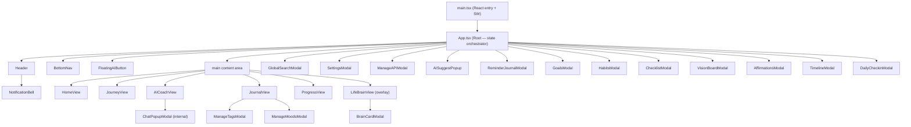
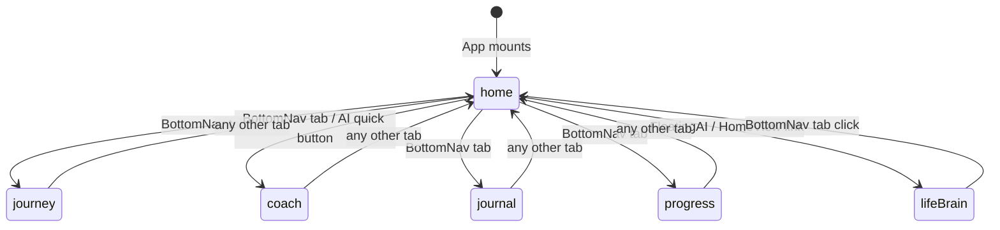
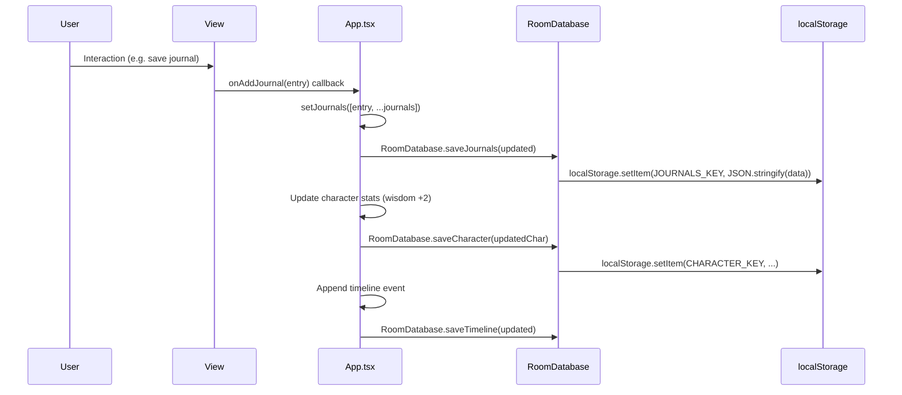
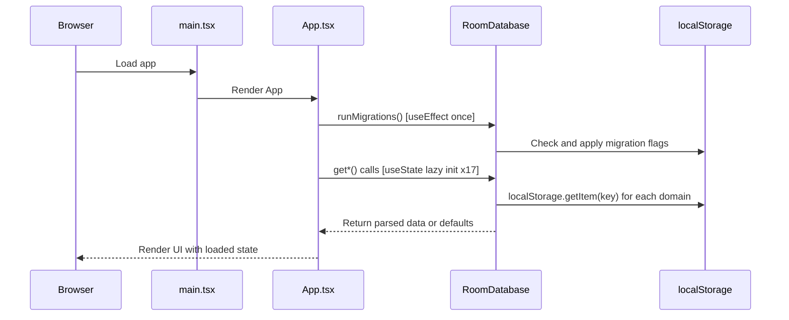
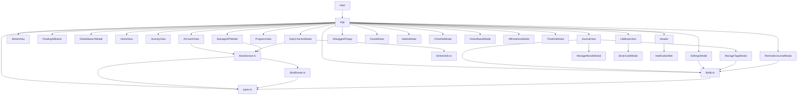
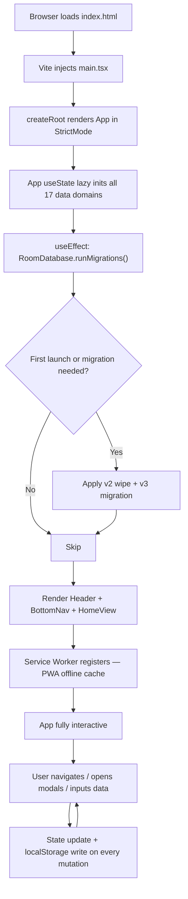

# PROJECT_ARCHITECTURE.md — My Life OS

> **Senior Architect Note:** This document describes the complete technical architecture of My Life OS, a Thai-language personal life management Progressive Web App (PWA) with an Android Capacitor wrapper and a multi-provider AI coaching system.

---

## 1. Project Overview

**My Life OS** is a full-stack personal life operating system combining:
- A **React SPA** (Single-Page Application) served as a PWA
- A **Capacitor-wrapped Android app** (native WebView shell)
- An **Express.js backend** (`server.ts`) for production serving
- A **multi-provider AI layer** supporting Gemini, Groq, and OpenRouter
- An **offline-first architecture** backed by `localStorage` (no remote database)

The application is bilingual (Thai primary, English secondary) and targets self-improvement users who want to track journals, habits, goals, daily check-ins, brain knowledge cards, and AI-powered life coaching in one unified system.

---

## 2. Technology Stack

| Layer | Technology | Version | Purpose |
|---|---|---|---|
| Frontend Framework | React | ^19.0.1 | UI rendering, hooks-based state |
| Language | TypeScript | ~5.8.2 | Type safety across the codebase |
| Build Tool | Vite | ^6.2.3 | Dev server, HMR, production bundling |
| Styling | TailwindCSS v4 | ^4.1.14 | Utility-first CSS with dark Olive glassmorphism theme |
| Animation | Motion (framer-motion v12) | ^12.23.24 | Micro-animations, page transitions |
| Icons | lucide-react | ^0.546.0 | 500+ SVG icon set |
| AI SDK Primary | @google/genai | ^2.4.0 | Gemini API access |
| AI Routing | Custom AIRouter class | — | Multi-provider failover logic |
| Backup/Restore | jszip | ^3.10.1 | ZIP-based local backup |
| Backend | Express.js | ^4.21.2 | Production static file server |
| Native Wrapper | Capacitor Android | ^6.0.0 | Android APK build |
| Package Manager | bun / npm | — | bun.lock present; npm scripts used |
| Type Check | tsc --noEmit | — | CI lint step |

---

## 3. Folder Tree and File Purpose

```
my-life-os/
+-- index.html                  # Vite entry HTML — mounts #root div, links PWA manifest
+-- vite.config.ts              # Vite config — React plugin, TailwindCSS plugin
+-- capacitor.config.ts         # Capacitor settings — appId, webDir, server URL
+-- tsconfig.json               # TypeScript compiler options
+-- package.json                # NPM scripts, dependency declarations
+-- server.ts                   # Express production server — serves /dist, SPA fallback
+-- .env.example                # Environment variable template
+-- metadata.json               # App metadata (name, version, description)
¦
+-- public/                     # Static assets (not processed by Vite)
¦   +-- sw.js                   # PWA Service Worker
¦
+-- assets/                     # Project assets (images, icons)
¦
+-- android/                    # Capacitor Android project (auto-generated)
¦
+-- src/
    +-- main.tsx                # React entry point — creates root, registers SW
    +-- App.tsx                 # Root component — global state, routing, modal orchestration
    +-- types.ts                # ALL TypeScript types and constants (single source of truth)
    +-- index.css               # Global CSS — Tailwind import, CSS variables
    ¦
    +-- lib/
    ¦   +-- db.ts               # RoomDatabase class — all localStorage CRUD + backup/restore
    ¦   +-- aiRouter.ts         # AIRouter class — provider call, failover, context building
    ¦   +-- aiService.ts        # AI function library — chat, reflection, guide, suggest card
    ¦   +-- textUtils.ts        # countWords() — Thai/English word segmentation
    ¦
    +-- components/             # Reusable UI (used across multiple views)
    ¦   +-- Header.tsx          # Fixed top bar — logo, search, Manage AI, bell, settings
    ¦   +-- BottomNav.tsx       # Bottom navigation — 5 tabs (mobile + desktop)
    ¦   +-- FloatingAIButton.tsx # FAB — AI Coach shortcut + quick action radial menu
    ¦   +-- NotificationBell.tsx # Bell dropdown — reminder list management
    ¦   +-- GlobalSearchModal.tsx # Full-screen search across Journal, Brain, Goals, Habits
    ¦   +-- BrainCardModal.tsx  # Create/Edit Brain Card form modal
    ¦   +-- ManageAPIModal.tsx  # AI provider config — add Gemini/Groq/OpenRouter
    ¦   +-- ManageTagsModal.tsx # Preset tag CRUD
    ¦   +-- ManageMoodsModal.tsx # Preset mood CRUD
    ¦   +-- AISuggestPopup.tsx  # Toast popup — AI suggests a Brain Card from chat
    ¦   +-- ReminderJournalModal.tsx # Convert completed reminder into journal entry
    ¦
    +-- views/                  # Full-screen views and modal overlays
        +-- HomeView.tsx         # Home tab — greeting, check-in card, reminders
        +-- JourneyView.tsx      # Journey tab — 5-phase life roadmap timeline
        +-- AICoachView.tsx      # Coach tab — AI mode grid, chat, reflection tools
        +-- JournalView.tsx      # Journal tab — entry form + feed
        +-- ProgressView.tsx     # Progress tab — RPG stats, habit/goal breakdowns
        +-- LifeBrainView.tsx    # Life Brain overlay — Brain Card grid + filters
        +-- GoalsModal.tsx       # Goals modal — CRUD, milestones, progress bars
        +-- HabitsModal.tsx      # Habits modal — CRUD, daily toggle, streak display
        +-- ChecklistModal.tsx   # Checklist modal — quick task CRUD
        +-- VisionBoardModal.tsx # Vision Board modal — image cards per life category
        +-- AffirmationsModal.tsx # Affirmations modal — audio player UI + AI generate
        +-- TimelineModal.tsx    # Timeline modal — chronological event stream
        +-- DailyCheckinModal.tsx # 5-step check-in wizard — mood + 5 questions + AI summary
        +-- SettingsModal.tsx    # Settings modal — profile, backup/restore, danger zone
```

---

## 4. Component Hierarchy



---

## 5. Routing and Navigation Architecture

My Life OS uses **no client-side router**. Navigation is pure **state-driven tab switching** in `App.tsx`.

### Tab State Machine



`currentTab` is `useState<NavTab>` where `NavTab = "home" | "journey" | "coach" | "journal" | "progress"`.

`isLifeBrainOpen` is a separate `boolean` state. When `true`, renders `<LifeBrainView>` instead of tab content. Tab changes always reset it to `false`.

### Modal Overlay Map

All modals are rendered at the App.tsx root level using fixed positioning (portal pattern without ReactDOM.createPortal):

| Boolean State | Component |
|---|---|
| `isSettingsOpen` | `<SettingsModal>` |
| `isManageAPIOpen` | `<ManageAPIModal>` |
| `isSearchOpen` | `<GlobalSearchModal>` |
| `isGoalsOpen` | `<GoalsModal>` |
| `isHabitsOpen` | `<HabitsModal>` |
| `isChecklistOpen` | `<ChecklistModal>` |
| `isVisionOpen` | `<VisionBoardModal>` |
| `isAffirmationOpen` | `<AffirmationsModal>` |
| `isTimelineOpen` | `<TimelineModal>` |
| `isCheckinOpen` | `<DailyCheckinModal>` |
| `popupReminder !== null` | `<ReminderJournalModal>` |
| `suggestedCard !== null` | `<AISuggestPopup>` |

### QuickAction Router

`handleQuickAction(action: string)` maps token strings to state changes:

| Token | Effect |
|---|---|
| `"journal"` | `setCurrentTab("journal")` |
| `"goal"` | `setIsGoalsOpen(true)` |
| `"habit"` | `setIsHabitsOpen(true)` |
| `"vision"` | `setIsVisionOpen(true)` |
| `"affirmation"` | `setIsAffirmationOpen(true)` |
| `"checklist"` | `setIsChecklistOpen(true)` |
| `"checkin"` | `setIsCheckinOpen(true)` |
| `"brain"` | `setIsLifeBrainOpen(true)` |

---

## 6. State Management Architecture

The app uses **React useState with prop drilling** — no Redux, no Zustand, no Context API.

### Global State in App.tsx (17 data domains)

| State Variable | Type | Initialized From |
|---|---|---|
| `settings` | `UserSettings` | `RoomDatabase.getSettings()` |
| `character` | `CharacterStatus` | `RoomDatabase.getCharacter()` |
| `journey` | `LifeJourneyPhase[]` | `RoomDatabase.getJourney()` |
| `missions` | `TodayMission[]` | `RoomDatabase.getMissions()` |
| `journals` | `JournalEntry[]` | `RoomDatabase.getJournals()` |
| `goals` | `GoalItem[]` | `RoomDatabase.getGoals()` |
| `habits` | `HabitItem[]` | `RoomDatabase.getHabits()` |
| `checklist` | `ChecklistItem[]` | `RoomDatabase.getChecklist()` |
| `vision` | `VisionCategoryItem[]` | `RoomDatabase.getVision()` |
| `affirmations` | `AffirmationItem[]` | `RoomDatabase.getAffirmations()` |
| `messages` | `AIChatMessage[]` | `RoomDatabase.getMessages()` |
| `timeline` | `TimelineEvent[]` | `RoomDatabase.getTimeline()` |
| `checkins` | `DailyCheckin[]` | `RoomDatabase.getCheckins()` |
| `presetTags` | `string[]` | `RoomDatabase.getPresetTags()` |
| `presetMoods` | `PresetMood[]` | `RoomDatabase.getPresetMoods()` |
| `brainCards` | `BrainCard[]` | `RoomDatabase.getBrainCards()` |
| `reminders` | `ReminderItem[]` | `RoomDatabase.getReminders()` |

**Lazy initialization:** Every `useState` uses a function initializer `() => RoomDatabase.get*()` that runs once at mount, not on every render.

**Write-through:** Every mutation immediately calls both `setState(newValue)` AND `RoomDatabase.save*(newValue)`. No debounce or batching.

---

## 7. Data Flow Architecture

### Write Flow



### Read Flow (App Load)



---

## 8. localStorage Key Schema

All keys follow pattern `mylifeos_<entity>_<version>`:

| Key | Type | Default |
|---|---|---|
| `mylifeos_settings_v2` | `UserSettings` | `DEFAULT_SETTINGS` |
| `mylifeos_character_v2` | `CharacterStatus` | All stats at 0% |
| `mylifeos_journey_v2` | `LifeJourneyPhase[]` | 5 phases (Start ? Freedom) |
| `mylifeos_missions_v2` | `TodayMission[]` | `[]` |
| `mylifeos_journals_v2` | `JournalEntry[]` | `[]` |
| `mylifeos_goals_v2` | `GoalItem[]` | `[]` |
| `mylifeos_habits_v2` | `HabitItem[]` | `[]` |
| `mylifeos_checklist_v2` | `ChecklistItem[]` | `[]` |
| `mylifeos_vision_v2` | `VisionCategoryItem[]` | `[]` |
| `mylifeos_affirmations_v2` | `AffirmationItem[]` | `[]` |
| `mylifeos_messages_v2` | `AIChatMessage[]` | `[]` |
| `mylifeos_timeline_v2` | `TimelineEvent[]` | `[]` |
| `mylifeos_checkins_v2` | `DailyCheckin[]` | `[]` |
| `mylifeos_preset_tags_v2` | `string[]` | 9 Thai default tags |
| `mylifeos_preset_moods_v2` | `PresetMood[]` | 8 emoji moods |
| `mylifeos_brain_cards_v1` | `BrainCard[]` | `[]` |
| `mylifeos_reminders_v1` | `ReminderItem[]` | `[]` |
| `mylifeos_pending_tasks_v1` | `PendingAITask[]` | `[]` |

### Migration Flags

| Key | Purpose |
|---|---|
| `mylifeos_migrated_v2` | Wipes all v1 keys on first v2 load |
| `mylifeos_migrated_v3` | Migrates aiApiKey ? apiProviders[0]; migrates string[] reminders |

Storage size is displayed in SettingsModal via `RoomDatabase.getStorageSize()` which sums `(key.length + value.length) * 2` bytes. No compression. 5MB browser limit applies.

---

## 9. Build Pipeline

### Development
```bash
npm run dev          # Vite dev server with HMR on localhost:5173
npm run server       # Express backend via tsx watch mode
```

### Production
```bash
npm run build        # vite build to /dist + esbuild server.ts to dist/server.cjs
npm run start        # node dist/server.cjs (Express serves /dist with SPA fallback)
```

### Android
```bash
npm run build:android  # vite build then npx cap sync android
npm run cap:open       # Opens Android project in Android Studio
```

---

## 10. Import Dependency Graph



---

## 11. Application Lifecycle



---

## 12. Capacitor Native Integration

`capacitor.config.ts` defines:
- `appId: "com.mylifeos.app"`
- `appName: "My Life OS"`
- `webDir: "dist"`
- `server.url` for dev live-reload from physical device
- `server.cleartext: true` allows HTTP in Android dev mode

The React SPA runs inside a WebView. No Capacitor plugins (Camera, Filesystem, Notifications) are used in source. App is functionally identical on web and Android.

---

## 13. Architecture Decision Log

| Decision | Choice | Rationale |
|---|---|---|
| State Management | useState + prop drilling | ~20 state slices; avoids Redux boilerplate |
| Routing | State machine in App.tsx | Single-screen SPA; no URL changes needed |
| Storage | localStorage only | Offline-first; no account required; ZIP backup |
| AI calls | Client-side direct | No backend hop; avoids server costs |
| Styling | TailwindCSS v4 | Design tokens via CSS vars; tree-shaken output |
| PWA | Service Worker + manifest | Installable; offline capable |
| Mobile | Capacitor Android | Play Store distribution without native dev |
| AI Provider | Multi-provider failover | No vendor lock-in; free tier via OpenRouter |
| Language | Thai primary | Target market is Thai-speaking users |
| DB engine | localStorage (no IndexedDB) | Simplicity; personal data fits within 5MB |
