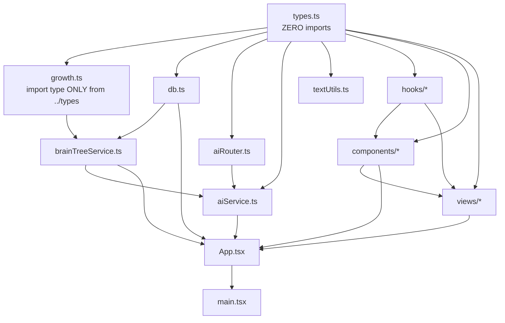
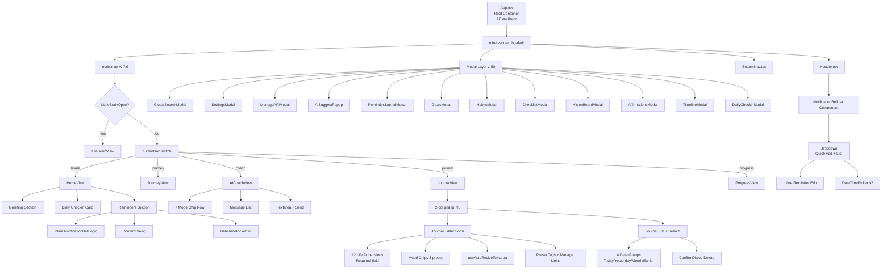
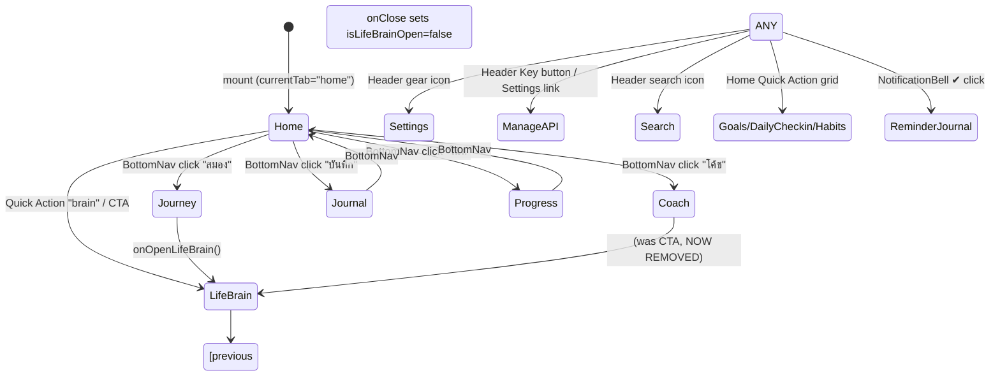
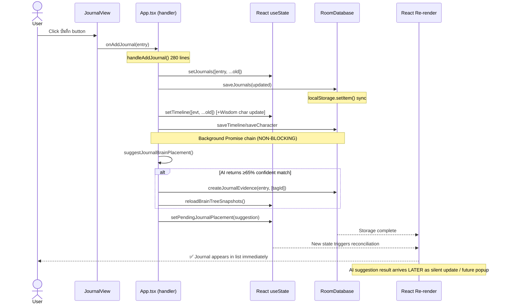
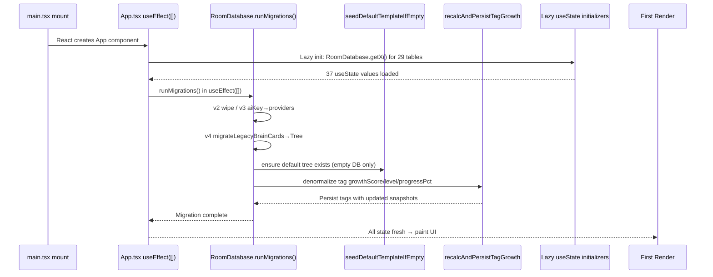
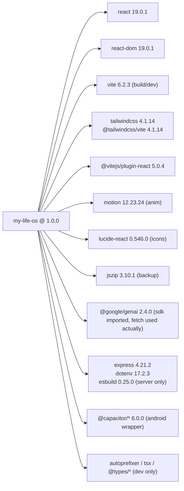
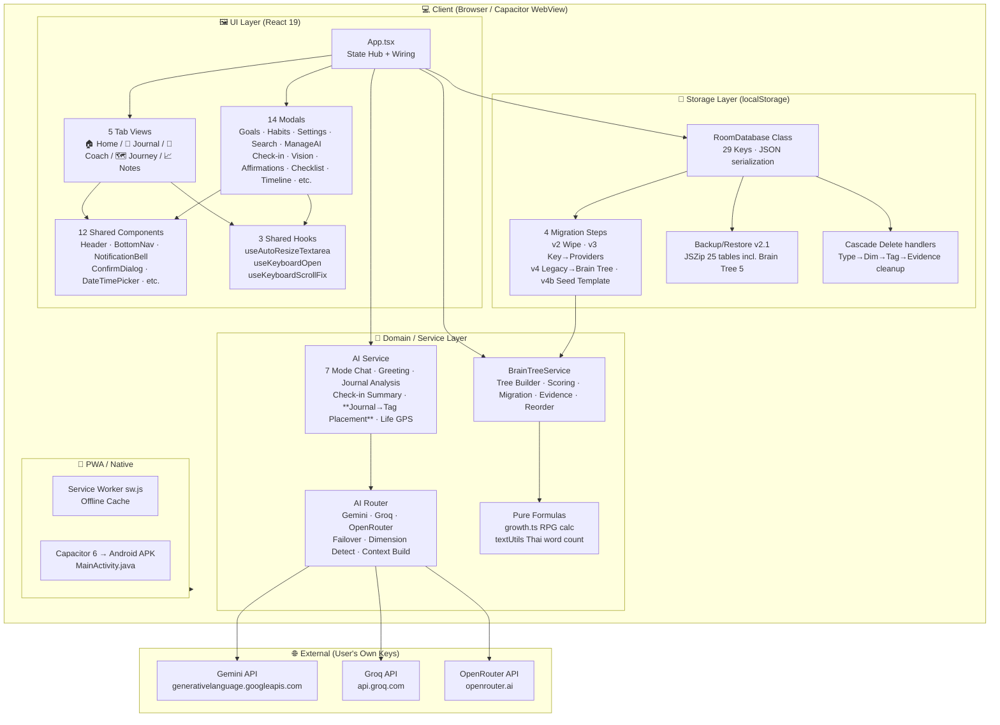

# PROJECT_ARCHITECTURE.md — My Life OS

## 1. Project Overview

**My Life OS** เป็น Personal Life Management Platform แบบ All-in-One ที่ออกแบบมาเพื่อจัดการทุกด้านของชีวิตผู้ใช้ในที่เดียว รวมถึง Journal, Goal, Habit, Character Growth, AI Coach, และ **Brain Tree Engine** (Knowledge Index แบบลำดับชั้น 4 ชั้น) ระบบนี้เน้นความเป็นส่วนตัว (Privacy-first — ทุกข้อมูลเก็บ Local เท่านั้น), Offline-first, และ AI as Assistant (ไม่ใช้ AI เป็นคนตัดสินใจหลัก)

**Core Philosophy:**
- **Save-first, Analyze-later:** ผู้ใช้บันทึกข้อมูลได้ทันที ไม่ขัดขวาง AI จะวิเคราะห์ Background
- **Evidence-based Progress:** ความก้าวหน้าไม่ได้วัดจากจำนวนข้อมูล แต่จาก **Evidence Weight** ของการลงมือทำจริง
- **Central Knowledge Index:** Brain Tree เป็นแกนกลางของระบบ — ทุก Module อนาคตจะ Integrate เข้าหา ไม่สร้างโครงสร้างข้อมูลแยก
- **User is Sovereign:** AI เสนอแนะเท่านั้น การตัดสินใจสุดท้ายเป็นของผู้ใช้เสมอ

---

## 2. Technology Stack

| Layer | Technology | Version | Purpose |
|-------|-----------|---------|---------|
| **Frontend Framework** | React | 19.0.1 | UI Component Library |
| **Language** | TypeScript | 5.8.2 | Type Safety |
| **Build Tool** | Vite | 6.2.3 | Dev Server + Bundler |
| **CSS Framework** | Tailwind CSS | 4.1.14 | Utility-first CSS |
| **Vite Plugin (Tailwind)** | @tailwindcss/vite | 4.1.14 | Tailwind v4 Vite Integration |
| **Animation** | Motion (Framer Motion) | 12.23.24 | UI Animations |
| **Icons** | Lucide React | 0.546.0 | SVG Icon Set |
| **ZIP (Backup/Restore)** | JSZip | 3.10.1 | ZIP Compression |
| **AI SDK (Gemini)** | @google/genai | 2.4.0 | Gemini Native SDK (imported, direct fetch preferred) |
| **Mobile Wrapper** | Capacitor | 6.0.0 | Android Native Build |
| **Backend (Dev)** | Express | 4.21.2 | Local Dev Server (optional) |
| **Environment** | dotenv | 17.2.3 | Environment Variables |
| **Bundler (Server)** | esbuild | 0.25.0 | Server-side Bundle |
| **Runtime (TS Node)** | tsx | 4.21.0 | TypeScript execution for server.ts |
| **Package Manager** | npm / bun | — | Dependency Management |
| **CI/CD** | GitHub Actions (.github/workflows/deploy.yml) | — | Auto Deploy |

### Build Targets

```
Production Build Output:
├── Web SPA (dist/) — Vite build, 1713 modules, ~148 kB gzip JS
├── Android APK (android/) — Capacitor wrapping dist/
└── Server (dist/server.cjs) — Express for self-hosted deployment
```

---

## 3. Folder Tree & Purpose

```
my-life-os/
├── .github/workflows/          CI/CD — GitHub Pages auto-deploy
├── .vscode/                    VS Code launch config
├── android/                    Capacitor Android wrapper
│   ├── app/src/main/
│   │   ├── java/com/mylifeos/app/MainActivity.java    Android Entry
│   │   ├── res/values/         Native strings/styles
│   │   └── AndroidManifest.xml Permissions & Activity
│   ├── build.gradle            Gradle config
│   └── settings.gradle
├── docs/                       ✅ THIS DOCUMENTATION FOLDER
├── public/                     Static assets served as-is
│   ├── manifest.json           PWA manifest (icons, theme)
│   ├── sw.js                   PWA Service Worker (offline cache)
│   ├── icon-192.png / 512.png  PWA icons
│   ├── icon.svg                Vector logo
│   └── apple-touch-icon.png    iOS home screen
├── src/                        ✅ ALL APPLICATION SOURCE CODE
│   ├── components/             Reusable UI Components (Presentational)
│   │   ├── AISuggestPopup.tsx          AI Brain Card suggestion popup
│   │   ├── BottomNav.tsx              5-Tab Bottom Navigation (mobile+desktop)
│   │   ├── BottomSheet.tsx            Generic slide-up bottom sheet container
│   │   ├── BrainCardModal.tsx         Legacy Brain Card editor modal
│   │   ├── ConfirmDialog.tsx          Generic Yes/No confirmation dialog
│   │   ├── DateTimePicker.tsx         Native datetime picker modal
│   │   ├── GlobalSearchModal.tsx      Cross-module full-text search
│   │   ├── Header.tsx                 Top bar (logo + search + bell + settings)
│   │   ├── ManageAPIModal.tsx         AI Providers CRUD + Drag & Drop priority
│   │   ├── ManageMoodsModal.tsx       Custom Mood preset CRUD
│   │   ├── ManageTagsModal.tsx        Custom Tag preset CRUD
│   │   ├── NotificationBell.tsx       Reminder dropdown + quick add
│   │   └── ReminderJournalModal.tsx   "Mark reminder done → write Journal" flow
│   │
│   ├── hooks/                    React Hooks (Shared Behavior)
│   │   ├── useAutoResizeTextarea.ts   Shared: auto-expand textarea 2-10 rows
│   │   ├── useKeyboardOpen.ts         Detect mobile on-screen keyboard
│   │   └── useKeyboardScrollFix.ts    Auto-scroll focused input above keyboard
│   │
│   ├── lib/                      Business Logic Layer (Service + Storage + AI)
│   │   ├── brainTree/               🌳 BRAIN TREE ENGINE V1
│   │   │   ├── brainTreeService.ts  Core service: tree builder, scoring, evidence, migration
│   │   │   └── growth.ts            Pure formula: RPG level calc + status band
│   │   ├── aiRouter.ts              AI Router: provider failover, dimension detect, context build
│   │   ├── aiService.ts             AI Facade: greet, analyze, checkin summary, brain placement
│   │   ├── db.ts                    RoomDatabase: localStorage ORM + migrations + backup
│   │   └── textUtils.ts             Thai-aware word counter (Intl.Segmenter)
│   │
│   ├── views/                    Page-level Components (Routes/Modal Containers)
│   │   ├── AICoachView.tsx          AI Chat 7 Modes + Chat UI
│   │   ├── AffirmationsModal.tsx    Daily Affirmations manager
│   │   ├── ChecklistModal.tsx       Daily Checklist / To-Do
│   │   ├── DailyCheckinModal.tsx    End-of-day 5-Question Check-in
│   │   ├── GoalsModal.tsx           Goal setting + milestones + progress
│   │   ├── HabitsModal.tsx          Habit streak + calendar tracking
│   │   ├── HomeView.tsx             🏠 Dashboard Landing Page
│   │   ├── JournalView.tsx          📔 Journal Editor + List + Search
│   │   ├── JourneyView.tsx          Life Journey 5-Phase Progress (Legacy Brain Tree link)
│   │   ├── LifeBrainView.tsx        🧠 Legacy Brain Card List viewer
│   │   ├── ProgressView.tsx         📈 Notes / Quick Note scratch
│   │   ├── SettingsModal.tsx        App settings, profile, backup/restore
│   │   ├── TimelineModal.tsx        Event timeline viewer
│   │   └── VisionBoardModal.tsx     Vision Board — 10 life categories images
│   │
│   ├── App.tsx                    ✅ ROOT COMPONENT — State hub, routing, wiring
│   ├── main.tsx                   React entry point + PWA Service Worker register
│   ├── index.css                  Tailwind directives + global styles + theme tokens
│   └── types.ts                   ✅ ALL TYPE DEFINITIONS — Single source of truth
│
├── index.html                    Vite HTML entry
├── vite.config.ts                Vite config (base path, alias @/, HMR disable for agents)
├── tsconfig.json                 TypeScript config (target ES2022, paths alias, noEmit)
├── capacitor.config.ts           Capacitor config (app ID, app name)
├── package.json                  Dependencies + scripts (dev/build/lint/build:android)
├── server.ts                     Optional Express server for self-hosted deployment
├── metadata.json                 App metadata (version, branding)
├── .env.example                  API keys template
└── README.md                     Project README
```

---

## 4. Every File Purpose — Detailed Table

### 4.1 Entry Points

| File | Purpose |
|------|---------|
| [main.tsx](file:///C:/Users/store/Documents/my-life-os/src/main.tsx) | React DOM root render (`createRoot`) + StrictMode + PWA Service Worker registration. `App` is the only child. |
| [index.html](file:///C:/Users/store/Documents/my-life-os/index.html) | Vite HTML template. Single div `#root`. Meta tags for mobile viewport + theme color. |

### 4.2 Types

| File | Purpose |
|------|---------|
| [types.ts](file:///C:/Users/store/Documents/my-life-os/src/types.ts) | **Single source of truth** — exports 40+ interfaces/types: LifeDimension (12), BrainType (11), **Brain Tree Engine** (Type/Dimension/Tag/Evidence/Config/Status), JournalMode (6), MoodType, 16 CharacterStatus stats, GuideResult, AI 7 Modes, 7 EvidenceKind weights. **No runtime code**, pure type declarations + const arrays. |

### 4.3 Storage Layer (lib/db.ts)

| File | Purpose |
|------|---------|
| [db.ts](file:///C:/Users/store/Documents/my-life-os/src/lib/db.ts) | **RoomDatabase** — Singleton class wrapping `localStorage` with 29 storage keys. 90+ static methods. Features: JSON get/set with defaults, **4 migrations** (v2 wipe / v3 aiKey→providers / v4 BrainCard→Tree / v4b seed template), **Cascade delete** (Brain Tree Type→Dim→Tag→Evidence clean), **Smart Migration** legacy BrainCard→4-level Tree, Backup/Restore ZIP v2.1 (25 tables incl Brain Tree 5). |

### 4.4 Brain Tree Engine

| File | Purpose |
|------|---------|
| [brainTreeService.ts](file:///C:/Users/store/Documents/my-life-os/src/lib/brainTree/brainTreeService.ts) | **786 lines**, Service Layer Core. Exports `FullTree/TypeNode/DimensionNode/TagNode` hierarchy types. `DEFAULT_TEMPLATE[]` (9 Type → 20+ Dim → 100+ Tag seeded). Key functions: `seedDefaultTemplateIfEmpty`, `aggregateTagScores` (weighted + decay), `buildFullTree` (read-time hierarchy + score propagation), `recalcAndPersistTagGrowth` (denormalized snapshots on Tags), `moveDimensionToType`/`moveTagToDimension` (FK propagation), **3 reorder** functions (per-parent priority), **5 evidence creators** for Journal/Habit/Reminder/Goal/Checkin, `findPlacementCandidatesByKeyword` AI-offline fallback, 4 lookup helpers by Tag/Dim/Type. |
| [growth.ts](file:///C:/Users/store/Documents/my-life-os/src/lib/brainTree/growth.ts) | **Pure calculation module** — Zero dependencies on DB. `computeGrowth(score, constant)` implements RPG level formula: `S_n = constant × n²` — returns `GrowthSnapshot` (level, progressPct, requiredForNext). `progressToStatus(pct, thresholds)` maps 0-100% → 4 Status Band (🌱seedling 0-20 / 🌿growing 21-50 / 🌳strong 51-80 / 🌟mastery 81-100). `STATUS_META` record with emoji + colors. |

### 4.5 AI Layer

| File | Purpose |
|------|---------|
| [aiRouter.ts](file:///C:/Users/store/Documents/my-life-os/src/lib/aiRouter.ts) | **AIRouter class** — 3 private call implementations (`callGemini`, `callGroq`, `callOpenRouter` with internal free-model 4-model fallback chain). Static `call()` = main entry: sort providers by priority → try each on fail → mark status ok/quota/error → throw last. Static helpers: `detectDimensions` (12 Life Dimensions keyword map), `filterBrainCards` (dim+type filter, recent limit), `buildContextBlock` (compact one-line `Type|Dim: Title — Desc #tag1 #tag2`), `buildContextualPrompt` (auto dim detect → filter cards → build prompt). |
| [aiService.ts](file:///C:/Users/store/Documents/my-life-os/src/lib/aiService.ts) | **AI Facade** — High-level AI features with graceful offline fallback. 7 AI Mode system prompts (Thai). Functions: `getProviders` (settings→providers, legacy single-key wrap), `sendAIChatRequest` (mode+context→string), `generateGreeting` (personalized morning hello), `summarizeDailyCheckin` (5 answers→insight), `analyzeTodayJournals` (4 section highlight/pattern/reflection/tomorrow), `suggestBrainCard` (legacy: text→partial BrainCard JSON), `generateGuide` (Life GPS: currentState/gap/nextMission/recommendedHabits), `testProviderConnection`, **NEW `suggestJournalBrainPlacement`** (compact tree JSON → AI returns existing candidates + missing node proposals, 55% min confidence, keyword fallback on error). |
| [textUtils.ts](file:///C:/Users/store/Documents/my-life-os/src/lib/textUtils.ts) | `countWords(text)` — Thai-aware word counter using `Intl.Segmenter('th', {granularity:'word'})` when available, filters `isWordLike` segments. Falls back to whitespace split. |

### 4.6 Hooks

| File | Purpose |
|------|---------|
| [useAutoResizeTextarea.ts](file:///C:/Users/store/Documents/my-life-os/src/hooks/useAutoResizeTextarea.ts) | **Shared hook** used by every textarea. `useLayoutEffect` + computed `lineHeight` once. Min rows default 3, max 9. Auto height from `scrollHeight`, capping at `maxH = lineHeight * maxRows`, toggles `overflowY:auto` when exceeds. Returns stable ref + spread props. |
| [useKeyboardOpen.ts](file:///C:/Users/store/Documents/my-life-os/src/hooks/useKeyboardOpen.ts) | Uses `window.visualViewport.resize` event. Returns `true` if `vv.height < innerHeight - 150` (keyboard shrank visual viewport). Used to hide BottomNav on mobile during text input. |
| [useKeyboardScrollFix.ts](file:///C:/Users/store/Documents/my-life-os/src/hooks/useKeyboardScrollFix.ts) | **Global fix**: on `visualViewport.resize/scroll` + `window.focusin` → find active `<input>/<textarea>/contenteditable` → if element bottom/top outside visual viewport, smooth `window.scrollTo` to center. Double-rAF debounce for resize, 150ms timeout for focus-in. |

### 4.7 Components

| File | Purpose |
|------|---------|
| [Header.tsx](file:///C:/Users/store/Documents/my-life-os/src/components/Header.tsx) | Fixed top `z-30`. Left: logo gradient chip. Right: Search icon + **ManageAI Key button** (conditional) + NotificationBell (reminder dropdown) + Settings gear. Backdrop blur, border bottom. |
| [BottomNav.tsx](file:///C:/Users/store/Documents/my-life-os/src/components/BottomNav.tsx) | **2 render variants:** (1) Mobile `fixed bottom-3 left-3 right-3` rounded pill — translates Y 150% when keyboard open; (2) Desktop `md:flex fixed bottom-6 left-1/2 -translate-x-1/2` floating. 5 tabs: home(หน้าแรก) / journey(สมอง) / coach(โค้ช) / journal(บันทึก) / progress(โน้ต). Active tab = bg-[#3E5C3A] + scale 105. |
| [NotificationBell.tsx](file:///C:/Users/store/Documents/my-life-os/src/components/NotificationBell.tsx) | Badge count + click-to-open dropdown. Quick add input (text + optional date via Clock button). Per-row: ✔ circle (complete→opens ReminderJournalModal flow), click-text to inline-edit, Edit2 + Trash2 actions. Inline save/cancel with Enter/Esc. Click-outside close via mousedown listener. 2 DateTimePicker instances (add + edit). |
| [ManageAPIModal.tsx](file:///C:/Users/store/Documents/my-life-os/src/components/ManageAPIModal.tsx) | **Native HTML5 Drag & Drop** for priority reordering (handle via GripVertical icon). Per-provider card: #priority badge, enable toggle, show/hide API key Eye button, Groq/Gemini model text input, **OpenRouter model select** (auto-free + 3 specific free), Test Connection with spinner + success/error inline badge, Chevron Up/Down as accessible reorder fallback, Add Provider 3-col grid (Gemini/Groq/OpenRouter). Save/close footer. |
| [AISuggestPopup.tsx](file:///C:/Users/store/Documents/my-life-os/src/components/AISuggestPopup.tsx) | Legacy feature: shows AI-suggested Brain Card with Confirm/Dismiss. |
| [BrainCardModal.tsx](file:///C:/Users/store/Documents/my-life-os/src/components/BrainCardModal.tsx) | Legacy Brain Card editor modal. |
| [BottomSheet.tsx](file:///C:/Users/store/Documents/my-life-os/src/components/BottomSheet.tsx) | Generic reusable slide-up container. |
| [ConfirmDialog.tsx](file:///C:/Users/store/Documents/my-life-os/src/components/ConfirmDialog.tsx) | Reusable Yes/No confirmation modal with variants (default/danger). |
| [DateTimePicker.tsx](file:///C:/Users/store/Documents/my-life-os/src/components/DateTimePicker.tsx) | Native `<input type="datetime-local">` wrapped in modal overlay with confirm/close. |
| [GlobalSearchModal.tsx](file:///C:/Users/store/Documents/my-life-os/src/components/GlobalSearchModal.tsx) | Cross-module search: Journal/Goal/Habit/Affirmation/Timeline/BrainCard. On select → navigate to matching tab/modal. |
| [ManageMoodsModal.tsx](file:///C:/Users/store/Documents/my-life-os/src/components/ManageMoodsModal.tsx) | CRUD custom moods (emoji+label). |
| [ManageTagsModal.tsx](file:///C:/Users/store/Documents/my-life-os/src/components/ManageTagsModal.tsx) | CRUD custom tag presets (string array). |
| [ReminderJournalModal.tsx](file:///C:/Users/store/Documents/my-life-os/src/components/ReminderJournalModal.tsx) | Bridge flow: user marks reminder "done" → prompt to optionally write a short Journal entry about the completed reminder → confirm saves journal + deletes reminder. |

### 4.8 Views (Pages)

| File | Purpose |
|------|---------|
| [App.tsx](file:///C:/Users/store/Documents/my-life-os/src/App.tsx) | **755 lines — Root State Container & Event Wiring Hub**. 37 `useState` declarations (all core data + 14 modal open flags). Effect: `runMigrations` on mount. 2 `useRef` priorHabits/priorGoals for **delta detection** (avoid duplicate evidence). 40+ handler functions. Routes via conditional render (`currentTab` string + `isLifeBrainOpen` flag for full-page overlay). All modal wiring at bottom JSX. |
| [HomeView.tsx](file:///C:/Users/store/Documents/my-life-os/src/views/HomeView.tsx) | 🏠 Dashboard. 3 sections: (1) Greeting by time-of-day, (2) Today's Reflection card (show checkin summary or CTA button → DailyCheckinModal), (3) Reminders section (independent duplicate of NotificationBell logic: add+date+list+inlineEdit+delete+ConfirmDialog). |
| [JournalView.tsx](file:///C:/Users/store/Documents/my-life-os/src/views/JournalView.tsx) | 📔 2-column layout (lg: editor left 7/12 + list right 5/12). Editor: Title input, **12 Life Dimension picker (required, red-error if missing)**, 8 Mood presets, emotion fine-detail text, **useAutoResizeTextarea content**, preset tag toggle chips + manage tag modal link, favorite/pinned mode future fields. Submit → `onAdd/EditJournal`. List side: top search bar, 4 date-group buckets (Today/Yesterday/This Month/Earlier) with per-card Edit2/Trash2. |
| [AICoachView.tsx](file:///C:/Users/store/Documents/my-life-os/src/views/AICoachView.tsx) | 🤖 7 Mode tabs (Coach/Therapist/Decision/Future Self/Secretary/Reflection/Chat). Mode selector chip row. Chat message list: user→right green bubble, AI→left dark bubble, timestamps. Textarea input + send. Session clear button. On message save fires auto `suggestBrainCard` AI call → AISuggestPopup. **Header simplified (per Brain Tree 1.1.2): no Life Brain / Manage AI CTA buttons.** |
| [JourneyView.tsx](file:///C:/Users/store/Documents/my-life-os/src/views/JourneyView.tsx) | Life Journey 5-phase: Start → Habits → Identity → Momentum → Freedom. Each phase card with progress bar, lock status, next milestone CTA. Link → LifeBrain overlay for knowledge context. |
| [LifeBrainView.tsx](file:///C:/Users/store/Documents/my-life-os/src/views/LifeBrainView.tsx) | 🧠 Legacy Brain Card viewer. Grid of Brain Cards by dimension/brainType filter. Linked journal cross-reference. Full-page view triggered by journey tab or header/coach CTA buttons via `isLifeBrainOpen` state. |
| [ProgressView.tsx](file:///C:/Users/store/Documents/my-life-os/src/views/ProgressView.tsx) | 📈 Notes / Quick Note scratchpad. Minimal CRUD cards. Future placeholder for analytics/charts. |
| [DailyCheckinModal.tsx](file:///C:/Users/store/Documents/my-life-os/src/views/DailyCheckinModal.tsx) | End-of-day 5-question form: wentWell / challenge / learned / grateful / tomorrow. Mood emoji picker. On save: AI summarizes → aiSummary field persisted. |
| [GoalsModal.tsx](file:///C:/Users/store/Documents/my-life-os/src/views/GoalsModal.tsx) | Goal CRUD. Category, priority (H/M/L), deadline, milestones sublist array, progress% slider, vision description. AI suggestion field array. OnSave → `handleSaveGoalsWithEvidence` in App runs delta-detect `progressPercent` change → `createGoalProgressEvidence` + keyword placement. |
| [HabitsModal.tsx](file:///C:/Users/store/Documents/my-life-os/src/views/HabitsModal.tsx) | Habit CRUD: title, category, repeat schedule string, reminder time, currentStreak/bestStreak (auto-calc from completedDates string array), completion rate %. On save → App delta-detects **each new date** in `completedDates` vs prior snapshot → per-date `createHabitCompletedEvidence` + keyword placement. |
| [ChecklistModal.tsx](file:///C:/Users/store/Documents/my-life-os/src/views/ChecklistModal.tsx) | Simple To-Do: title, priority H/M/L, deadline, category, completed toggle, notes, aiSuggestion. Basic save without evidence wire. |
| [VisionBoardModal.tsx](file:///C:/Users/store/Documents/my-life-os/src/views/VisionBoardModal.tsx) | 10 life categories (Health/Career/Business/Finance/Languages/Family/Travel/Trading/Dream House/Dream Life). Per-card: image URL + title + progress% + notes. |
| [AffirmationsModal.tsx](file:///C:/Users/store/Documents/my-life-os/src/views/AffirmationsModal.tsx) | Affirmation CRUD. Category Morning/Night/Custom. Favorite toggle. Optional audioUrl future field. |
| [TimelineModal.tsx](file:///C:/Users/store/Documents/my-life-os/src/views/TimelineModal.tsx) | Read-only vertical timeline. Event types: journal/photo/voice/goal/achievement/checkin. Auto-created from Journal add + Checkin save. Per-row title/description/badge/imageUrl. |
| [SettingsModal.tsx](file:///C:/Users/store/Documents/my-life-os/src/views/SettingsModal.tsx) | Profile (name/email/avatar), theme, language, security pin, notification toggle. AI legacy temperature/maxTokens fields. Backup download (`exportBackupZip` → Blob → `<a download>`), Restore upload (File → `importBackupZip`), Clear all data CTA with confirm. |

---

## 5. Import Relationships



### Dependency Rule (Topological Order — No Cycles)

```
types.ts (0 imports)
   ↓
growth.ts → db.ts → aiRouter.ts → textUtils.ts → hooks/*
   ↓        ↓          ↓
brainTreeService.ts    aiService.ts
          ↓                ↓
       components/* → views/*
                ↓
              App.tsx
                ↓
             main.tsx
```

**Critical Architecture Decisions preventing circular imports:**
1. `growth.ts` uses **type-only imports** from types — no runtime dependency
2. `brainTreeService` imports `RoomDatabase` (from db.ts) + `growth` + types — no aiService
3. `aiService` imports both `AIRouter` AND `brainTreeService` helpers (for `findPlacementCandidatesByKeyword`) but db imports only types
4. `App.tsx` is the **only file that imports EVERYTHING** — it's the composition root
5. No view or component ever imports directly from db.ts — all data flows via props from App

---

## 6. Component Hierarchy



### Prop Drilling Architecture (NO Context API)

This project intentionally **avoids React Context/Redux/Zustand**. All state lives in `App.tsx` top-level `useState` hooks and is passed down via **explicit props**:

| Data | Passed from App → via Props to | # of consumer views |
|------|--------------------------------|---------------------|
| `settings` | Header, HomeView, JourneyView, AICoachView, JournalView, SettingsModal, ManageAPIModal, DailyCheckinModal | 8 |
| `journals` | HomeView (recent), JourneyView, AICoachView, JournalView, LifeBrainView, GlobalSearchModal | 6 |
| `goals`/`habits` | GoalsModal, HabitsModal, AICoachView (context), GlobalSearchModal | 4 |
| `brainCards` | JourneyView, AICoachView, LifeBrainView, GlobalSearchModal, AISuggestPopup | 5 |
| `reminders` | Header→NotificationBell, HomeView (inline copy) | 2 |
| `presetTags`/`presetMoods` | JournalView, HomeView→ReminderJournalModal | 3+ |
| `brainTree*` 5 states | **Used only inside App handlers** — no view component renders Brain Tree yet (V1 backend only) | 0 |

---

## 7. Module Relationships

```mermaid
flowchart LR
    subgraph Knowledge["🌳 KNOWLEDGE INDEX LAYER (Core)"]
        direction LR
        BrainTypes["BrainTreeType<br/>🌳 9 types default"]
        BrainDims["BrainTreeDimension<br/>🌿 20+ dims"]
        BrainTags["BrainTreeTag<br/>🍃 100+ tags"]
        Evidence["BrainEvidence<br/>🍎 7 kinds"]
        Config["BrainConfiguration<br/>weights/thresholds"]
        Evidence -->|"multi-label<br/>brainTreeTagIds[]"| BrainTags
        BrainTags -->|"FK brainTreeDimensionId"| BrainDims
        BrainDims -->|"FK brainTreeTypeId"| BrainTypes
        Config -->|"weights"| Evidence
        Config -->|"constant"| BrainTags
        Config -->|"thresholds"| BrainTags
    end

    subgraph Content["📝 CONTENT MODULES (Activity Sources)"]
        direction TB
        Journal[Journal System]
        Habits2[Habit System]
        Goals2[Goal System]
        Checkins2[Daily Check-in]
        Reminders2[Reminder System]
    end

    subgraph AI_Layer["🤖 AI LAYER"]
        direction TB
        AI1[AI Router<br/>3 providers]
        AI2[Placement<br/>Suggestion]
        AI3[BrainCard<br/>Scout (legacy)]
        AI4[Check-in<br/>Summary]
        AI5[Journal<br/>Analysis]
        AI6[Greeting &<br/>Life Guide]
        AI1 --> AI2 & AI3 & AI4 & AI5 & AI6
    end

    subgraph CharacterSys["📊 CHARACTER & GROWTH"]
        Character[CharacterStatus<br/>16 stats 0-100]
        Journey[LifeJourney 5 Phases]
        Missions[TodayMission]
    end

    subgraph UI["🖼️ UI SHELL"]
        Header2[Header]
        BottomNav2[BottomNav]
        Views2[5 Tab Views + 10 Modals]
    end

    %% Evidence creators wire content → knowledge
    Journal --> Evidence
    Habits2 --> Evidence
    Goals2 --> Evidence
    Checkins2 --> Evidence
    Reminders2 --> Evidence

    %% AI reads knowledge, writes to content
    Knowledge --> AI2
    Content --> AI3 & AI4 & AI5
    AI2 -->|"suggest journal→tag"| Journal
    AI3 -->|"suggest card"| BrainCards_Legacy
    AI4 -->|"aiSummary"| Checkins2

    %% Character updates from activity
    Journal --> Character
    Checkins2 --> Character
    Missions --> Character

    %% UI reads everything
    Knowledge --> Views2
    Content --> Views2
    CharacterSys --> Views2
    Header2 & BottomNav2 --> Views2
```

---

## 8. Routing Architecture

### 8.1 Custom Routing (NO React Router)

My Life OS uses **conditional render routing** instead of `react-router-dom`. Routing state is 100% in `App.tsx`:

```typescript
// Primary route state — 5 tabs
const [currentTab, setCurrentTab] = useState<NavTab>("home");

// Overlay routes (full-page view replaces tabs content)
const [isLifeBrainOpen, setIsLifeBrainOpen] = useState(false);

// Modal routes (z-50 overlays, 14 total)
const [isSettingsOpen, setIsSettingsOpen] = useState(false);
const [isManageAPIOpen, setIsManageAPIOpen] = useState(false);
const [isSearchOpen, setIsSearchOpen] = useState(false);
const [isGoalsOpen, ...] = useState(false);  // + 11 more modal flags
```

### 8.2 Navigation Resolution Order (JSX in App)

```
Render Priority:
1. Top-level overlay flag: isLifeBrainOpen → renders LifeBrainView FULL SCREEN
   (replaces main content, but keeps Header + BottomNav)
2. Else: switch on currentTab string:
   "home"    → HomeView
   "journey" → JourneyView
   "coach"   → AICoachView
   "journal" → JournalView
   "progress"→ ProgressView
3. On top of both: 14 Modal components conditionally rendered at bottom
   (always mounted after main, z-50 fixed inset-0)
```

### 8.3 Navigation Architecture Diagram



### 8.4 URL Strategy

**NO client-side URL routing.** This is intentional for:
- Native app feel (Capacitor Android) — no back-button modal-close confusion
- No `useEffect` routing sync bugs with storage
- Simpler Deep Link → Capacitor handles via Intent instead

The base path is configurable via vite.config:
- **Dev/local:** `./` (relative)
- **GitHub Actions CI:** `/My-Life-OS/` (absolute project sub-path)

---

## 9. State Management

### 9.1 Architecture: Lifted State + Prop Drilling (NO Store Library)

All application state is declared in **a single file — [App.tsx](file:///C:/Users/store/Documents/my-life-os/src/App.tsx#L66-L139)** using React `useState`:

```typescript
// Category 1: Core Data (synced to localStorage via RoomDatabase)
const [settings, setSettings]               // UserSettings
const [character, setCharacter]             // CharacterStatus 16 stats
const [journey, setJourney]                 // LifeJourneyPhase[]
const [missions, setMissions]               // TodayMission[]
const [journals, setJournals]               // JournalEntry[]
const [goals, setGoals]                     // GoalItem[]
const [habits, setHabits]                   // HabitItem[]
const [checklist, setChecklist]             // ChecklistItem[]
const [vision, setVision]                   // VisionCategoryItem[]
const [affirmations, setAffirmations]       // AffirmationItem[]
const [messages, setMessages]               // AIChatMessage[]
const [timeline, setTimeline]               // TimelineEvent[]
const [checkins, setCheckins]               // DailyCheckin[]
const [presetTags, setPresetTags]           // string[]
const [presetMoods, setPresetMoods]         // PresetMood[]
const [brainCards, setBrainCards]           // BrainCard[] (legacy)
const [reminders, setReminders]             // ReminderItem[]
const [notes, setNotes]                     // NoteItem[]

// Category 2: Brain Tree Engine V1 (5 new tables)
const [brainTreeTypes, setBrainTreeTypes]   // 🌳
const [brainTreeDims, setBrainTreeDims]     // 🌿
const [brainTreeTags, setBrainTreeTags]     // 🍃
const [brainEvidence, setBrainEvidence]     // 🍎
const [brainConfig, setBrainConfig]         // ⚙️

// Category 3: Ephemeral UI State (NOT persisted)
const [currentTab, setCurrentTab]           // NavTab = home|journey|coach|journal|progress
const [suggestedCard, setSuggestedCard]     // AI popup
const [popupReminder, setPopupReminder]     // Reminder→Journal bridge
const [pendingJournalPlacement, ...]        // AI placement for confirmation UI
const [isSettingsOpen, ...]                 // 14 modal flags
```

### 9.2 State Initialization Pattern (Lazy Initializer)

```typescript
// Every state uses lazy initializer (function form of useState)
// to read from storage ONLY ONCE on mount, not on every render:
const [settings, setSettings] = useState<UserSettings>(
  () => RoomDatabase.getSettings()  // <-- function form
);
```

This is a critical performance pattern — avoids re-parsing localStorage JSON on every App re-render cycle.

### 9.3 State Update Pattern — Dual Write

Every handler follows:
```
handler(X):
  1. Compute updated state value (filter/map/append new item)
  2. React setState(updated)  ← triggers re-render
  3. RoomDatabase.saveX(updated)  ← persists to localStorage
```

No useEffect sync pattern — updates happen **atomically in the same tick**. Prevents race conditions between storage and UI.

### 9.4 Refs for Delta Detection (Avoid Duplicate Evidence)

```typescript
const priorHabitsRef = useRef<HabitItem[]>([]);
const priorGoalsRef = useRef<GoalItem[]>([]);
useEffect(() => { priorHabitsRef.current = habits; }, [habits]);
useEffect(() => { priorGoalsRef.current = goals; }, [goals]);
```

Used in `handleSaveHabitsWithEvidence` and `handleSaveGoalsWithEvidence` — compares new `completedDates` or `progressPercent` against previous tick's snapshot. Only creates Evidence for actual deltas.

---

## 10. Data Flow

### 10.1 Save → Store → Re-render (Synchronous)



### 10.2 Read Flow — Startup Normalization



### 10.3 Event Flow — Habit Completed → Evidence → Progress

```mermaid
flowchart LR
    U[User clicks Habit calendar date<br/>HabitsModal.tsx] --> H[HabitsModal onSave callback]
    H --> A[App.handleSaveHabitsWithEvidence updated]
    A --> D1[Delta Detect: Map prior→current completedDates]
    D1 -->|each new date| KW[findPlacementCandidatesByKeyword<br/>habit.title + category]
    KW -->|1-2 matches| CE[createHabitCompletedEvidence<br/>per date × per tag]
    CE --> RP[recalcAndPersistTagGrowth<br/>ALL tags score → level → status]
    RP --> BS[RoomDatabase.saveBrainTreeTags denormalized snapshots]
    BS --> RS[reloadBrainTreeSnapshots: setState x4 Brain Tree]
    RS --> UI[Future Brain Viewer: tag shows LVL up + 🌿 status band change]
```



---

## 11. Dependency Graph (npm packages)



**No state management library**: Intentional. App has ~40 state slices. Zustand was considered but rejected because (a) every state slice already maps 1:1 to RoomDatabase save method, (b) <10 levels of prop drilling max (App→View), (c) no multi-editor concurrent-write scenario.

**No router library**: Intentional for native app feel + simplicity of 5 tabs + modals.

---

## 12. Application Lifecycle

### 12.1 Startup Flow — Complete

```mermaid
flowchart TD
    Browser[Browser loads index.html] --> Vite[Vite loads main.tsx module]
    Vite --> CSS[index.css: Tailwind + theme tokens]
    Vite --> Render[createRoot render App]
    Render --> Strict[React StrictMode wraps App]
    Strict --> InitLazy[App 37 useState lazy initializers fire]
    InitLazy --> ReadDB[RoomDatabase.getX() → JSON.parse localStorage for each key → defaults fallback if empty]
    ReadDB --> HooksInit[Hook registration: useKeyboardOpen visualViewport listener → RESIZE event binds<br/>useKeyboardScrollFix → RESIZE/SCROLL/FOCUSIN binds]
    HooksInit --> MigrateEffect[useEffect([]) fires]
    MigrateEffect --> Mig[runMigrations 4 steps]
    Mig --> M1[v2: Wipe old v1 mock keys IF migration flag absent]
    Mig --> M2[v3: aiApiKey → apiProviders[] array IF old key exists]
    Mig --> M3[v4: Smart Migration legacy BrainCard → 4-level Tree + Evidence]
    Mig --> M4[v4b: seedDefaultTemplateIfEmpty IF empty tree]
    Mig --> M5[recalcAndPersistTagGrowth normalize denormalized]
    MigrateEffect --> PWARegister[main.tsx registers sw.js Service Worker]
    PWARegister --> FirstPaint[Browser paints: Header + HomeView + BottomNav]
    FirstPaint --> UserReady[🙂 User ready to interact]
```

### 12.2 Runtime Lifecycle — Per Interaction

```
User Action (click/type)
  ↓
onChange / onClick handler in View
  ↓
Calls callback prop from App (e.g., onAddJournal, onToggleMission)
  ↓
App handler (e.g., handleAddJournal):
  1. Immediate validation (trim content, required field check)
  2. Compute updated state array (prepend/filter/map)
  3. BOTH: React setState() + RoomDatabase.saveX() in same tick
  4. Side effects fire: character stat XP gain, timeline event add,
     background AI analysis Promise chain (no await)
  ↓
React reconciles → view receives new props
  ↓
Re-render affected components only (shouldComponentUpdate via props diff)
  ↓
Animation via motion/transition (150–200ms)
  ↓
User sees result + optional background toast later (AI suggestion arrives)
```

### 12.3 Shutdown / Tab Close

No `beforeunload` handler is registered. **Every write is synchronous, in-event-handler, immediate `localStorage.setItem`**. No queued writes, no batching. Data loss risk: **zero** for normal use.

(Edge case: AI background `Promise.then()` still pending when tab closes → loses that one AI suggestion result only, not user data.)

---

## 13. Build Architecture

### 13.1 Scripts (package.json)

| Script | Command | Purpose |
|--------|---------|---------|
| `npm run dev` | `vite` | Local dev server, HMR enabled unless DISABLE_HMR=true |
| `npm run server` | `tsx server.ts` | Optional Express server host dist/ via Node |
| `npm run build` | `vite build && esbuild server.ts --bundle --platform=node ...` | Production: Web dist + Node server bundle |
| `npm run build:android` | `vite build && npx cap sync android` | Sync dist/ → Capacitor android folder |
| `npm run cap:sync` | `npx cap sync` | Sync only (after web build exists) |
| `npm run cap:open` | `npx cap open android` | Open Android Studio project |
| `npm run start` | `node dist/server.cjs` | Run self-hosted Express server |
| `npm run lint` | `tsc --noEmit` | Type check whole project, no output files |

### 13.2 Vite Config Details

[`vite.config.ts`](file:///C:/Users/store/Documents/my-life-os/vite.config.ts):
- **Plugins:** [react(), tailwindcss()] — Tailwind v4 plugin replaces PostCSS chain
- **Path alias:** `@/*` → `./*` for absolute imports
- **Base path conditional:** CI (`GITHUB_ACTIONS=true`) → `/My-Life-OS/`, else `./` (relative)
- **HMR disable flag:** `DISABLE_HMR=true` turns off Hot Module Replacement AND file watching (for agent edit sessions to prevent flicker)

### 13.3 tsconfig

Target: `ES2022`. JSX: `react-jsx` (no need to import React). Module resolution: `bundler`. `noEmit: true` — Vite handles the actual emit. `allowImportingTsExtensions: true`.

---

## 14. Native Integration (Capacitor Android)

### Files

- [capacitor.config.ts](file:///C:/Users/store/Documents/my-life-os/capacitor.config.ts) — appId, appName, webDir: dist
- [android/app/src/main/java/com/mylifeos/app/MainActivity.java](file:///C:/Users/store/Documents/my-life-os/android/app/src/main/java/com/mylifeos/app/MainActivity.java) — Extends `BridgeActivity` (Capacitor base). No custom native code.
- [AndroidManifest.xml](file:///C:/Users/store/Documents/my-life-os/android/app/src/main/AndroidManifest.xml) — Launcher intent, network access (for AI API calls)

### Native ↔ Web Bridge

Uses Capacitor's standard `WebView` bridge:
- **Storage:** Currently localStorage only (scoped per app on Android, ~5MB quota, persisted). Future: Capacitor Preferences plugin for larger quota / encrypted storage.
- **AI API Calls:** WebView has full network access — all fetch() requests to Gemini/Groq/OpenRouter go directly. No native proxy.
- **Build chain:** `npm run build:android` = Vite build web → `cap sync` copies dist/ into `android/app/src/main/assets/public/`

---

## 15. Utility Layer

### Location: `src/lib/*` files without state

| Function | File | Pure? | Notes |
|----------|------|-------|-------|
| `countWords` (Thai-aware) | [textUtils.ts](file:///C:/Users/store/Documents/my-life-os/src/lib/textUtils.ts) | ✅ Pure | Intl.Segmenter preferred |
| `computeGrowth` RPG formula | [growth.ts](file:///C:/Users/store/Documents/my-life-os/src/lib/brainTree/growth.ts) | ✅ Pure | No DB read |
| `progressToStatus` band map | [growth.ts](file:///C:/Users/store/Documents/my-life-os/src/lib/brainTree/growth.ts) | ✅ Pure | Thresholds from caller |
| `aggregateTagScores` weight+decay | [brainTreeService.ts](file:///C:/Users/store/Documents/my-life-os/src/lib/brainTree/brainTreeService.ts#L260) | ✅ Pure (param) | Receives evidence array, doesn't read DB |
| `sumScores` (children → parent) | [brainTreeService.ts](#L306) | ✅ Pure | |
| `AIRouter.detectDimensions` (keyword) | [aiRouter.ts](#L206) | ✅ Pure | Keyword matching only |
| `AIRouter.buildContextBlock` | [aiRouter.ts](#L250) | ✅ Pure | Compact `[BRAIN]` text block |
| `AIRouter.buildContextualPrompt` | [aiRouter.ts](#L267) | Pure-ish | Calls two pure helpers |

### Location: `src/hooks/*` (Behavior utilities)

| Hook | Purpose | Shared? |
|------|---------|---------|
| `useAutoResizeTextarea` | 3→9 row auto-expand | ✅ Used in JournalView + AICoachView (and mandated by spec for **every textarea in system**) |
| `useKeyboardOpen` | detect keyboard | Used in App → pass to BottomNav |
| `useKeyboardScrollFix` | scroll input up | Global, App mounts once |

---

## 16. Service Layer

Service Layer = `src/lib/aiRouter.ts` + `src/lib/aiService.ts` + `src/lib/brainTree/brainTreeService.ts`.

All services are **module-level functions/static class methods** (no instance, no DI container).

### Service Boundaries (Clean Architecture)

```
┌───────────────────────────────────────────────┐
│         UI / Views / Components               │  React + user events
│  (never directly read RoomDatabase)           │
└──────────────────────────┬────────────────────┘
                           │ props / callbacks
┌──────────────────────────▼────────────────────┐
│              App.tsx (Composition Root)       │  State hub + Wiring
└──────────────────────────┬────────────────────┘
                           │ handler calls
┌──────────────────────────▼────────────────────┐
│            brainTreeService.ts                │  Domain logic
│            aiService.ts (Facade)              │  AI features
│            db.ts (RoomDatabase)               │  Storage CRUD
└──────────────────────────┬────────────────────┘
                           │ function calls
┌──────────────────────────▼────────────────────┐
│   aiRouter.ts (fetch calls)                   │  Network layer
│   growth.ts / textUtils.ts (pure formulas)    │
└───────────────────────────────────────────────┘
```

### Dependency Direction Rule
- **Outer → Inner only**: Views call App handlers. App calls Services/Database. Services call Database/AI Router/Formulas.
- **Inner never imports Outer**: Database does NOT import aiService, growth does NOT import db, aiRouter does NOT import views.

---

## 17. Storage Layer

See [CORE_LOGIC_SYSTEM.md](./CORE_LOGIC_SYSTEM.md) Section 1 for complete schema. Quick summary:

### Storage Medium
- **Primary (all features)**: `window.localStorage` (synchronous, string key/value, JSON serialization per key)
- **Not used**: IndexedDB, WebSQL, SessionStorage, Cookies (except CI cookie for deployment auth)

### Storage Keys (29 total)
`KEYS` object in [db.ts](file:///C:/Users/store/Documents/my-life-os/src/lib/db.ts#L31-L60) defines every key with version suffix (v2, v1):
- v2 (16 keys): settings, character, journey, missions, journals, goals, habits, checklist, vision, affirmations, messages, timeline, checkins, preset_tags, preset_moods
- v2.0 NEW (6 legacy keys): brain_cards, reminders, pending_tasks, notes + PRESET tags/moods separate
- V1 BRAIN TREE ENGINE (5 + 1 flag): brainTreeTypes, brainTreeDims, brainTreeTags, brainEvidence, brainConfig + migration_done_flag

### Storage Pattern — RoomDatabase
Static class, 2 accessor methods:
```typescript
private static get<T>(key, defaultValue): T  // JSON.parse w/ try/catch
private static set<T>(key, value): void      // JSON.stringify w/ try/catch
// Per-entity public methods (get/save/add/update/delete × 25 tables)
```

No IndexedDB wrapper, no query planner — full table scans for search (acceptable for N<10k personal journal entries).

### Backup v2.1 Format
`RoomDatabase.exportBackupZip()` → JSZip → `backup.json` (single file inside ZIP):
```json
{
  "version": "2.1",
  "exportedAt": ISO-8601,
  "settings": {...}, "character": {...},
  "journals": [...], "goals": [...], "habits": [...],
  "brainTreeTypes": [...], "brainTreeDimensions": [...],
  "brainTreeTags": [...], "brainEvidence": [...], "brainConfig": {...},
  + 15 more tables
}
```

---

## 18. Architecture Decisions

| # | Decision | Rationale | Trade-off |
|---|----------|-----------|-----------|
| A1 | **No Router Library** | 5 tabs + modal overlay is the entire navigation surface. Capacitor native Android back button works more predictably without URL stack. | Deep links require Intent native code. Bookmarkable internal views not possible. |
| A2 | **No State Store (Context/Zustand)** | 40 state slices × each maps 1:1 to RoomDatabase save. Drilling depth ≤ 3. Top-level App is already a "store" with setSettings/saveSettings pair. | Adding new state = modify App.tsx + N view props. File gets large (755 lines). |
| A3 | **localStorage vs IndexedDB** | Simple synchronous API, no need for async DB transactions in handlers. Data volume per user is small (journals ≤ 10,000 rows × 1KB each = 10MB, close to localStorage 5MB limit — borderline). | Will need IndexedDB migration at ~5000+ journals with images. Currently no images/audio persisted locally. |
| A4 | **Save-first-then-AI** (Journal) | User's typing flow must never wait on network. AI is background. | AI analysis may arrive 2-10s later. Confidence-based auto-apply only if ≥65%. |
| A5 | **Dual Write = setState + saveX in same tick** | Prevents useEffect race conditions. Atomic. | If setState errors mid-way (unlikely React-level), saveX already called. Could theoretically leave UI-stale. In practice React setState never throws if args are valid. |
| A6 | **Denormalized Growth Snapshots on Tags** | Reading growth per tag in future Brain Viewer list must not require re-aggregating evidence table on every list render (O(N²)). | Recalc cost on evidence change = O(tags). Startup always recalc pass to normalize. |
| A7 | **RPG Level formula: S_n = C·n²** (quadratic) | Matches real game systems (RuneScape, many RPGs). Level 1→2=100XP, 9→10=1900XP — early progress feel fast, later levels demand sustained work. | Users who plateau see "Level 4 80%" for weeks — could demotivate without additional band feedback. |
| A8 | **3 AI Providers + Priority Failover** | Gemini free quota is 15 RPM — easy to hit. Groq is fast but sometimes throttles. OpenRouter has free fallbacks. Priority-based user configurable with Drag & Drop. | No batching or rate limiting — if user sends many messages, all providers can burn through. |
| A9 | **No API Key server-side proxy** | App is local-first, user's key stays on device. Zero server cost architecture. | Key visible in memory/APK (mitigation: app-level PIN optional). Quota abuse by user = their own quota. |
| A10 | **Evidence = Reference only, NEVER duplicate content** | 1 Journal should live ONCE. BrainTree links via sourceId + kind. preview=140chars for UI. | Need to handle orphan evidence if Journal gets deleted (future: cleanup sweep — V1 tags stay referenced to deleted IDs, but UI won't render). |
| A11 | **Multi-label Evidence via `tagIds: string[]` array not junction table** | localStorage row-per-evidence is simpler than junction-table scan. 1-to-many = array field. | No reverse "show all evidences with tag X" index — full scan filter(). Acceptable for <10k evidence rows. |
| A12 | **Spec-mandated: All textarea → useAutoResizeTextarea min3 max9** | Mobile UX: fixed rows = wasted space. Native app-like feel. | Ref required on every textarea. Easy to forget → bug. |
| A13 | **Spec-mandated: visualViewport keyboard avoidance** | Chrome Android's resize events + window.scroll don't account for on-screen KB reliably. | Desktop browsers with small windows may trigger false keyboard-detect (handled via -150px margin). |
| A14 | **Legacy BrainCard system preserved** (NOT deleted) | Users invested time in old BrainCards — Smart Migration auto-creates Brain Tree + Evidence from them. | Dual code paths (BrainCardModal still exists). Will add to maintenance burden. Plan to fully remove in V2 after 6 months stable. |

---

## 19. Startup Flow — Expanded with Component Mount

```mermaid
flowchart TD
    classDef disk fill:#1a1a2e,stroke:#0f3460
    classDef react fill:#16213e,stroke:#0f3460
    classDef storage fill:#0f3460,stroke:#e94560
    classDef network fill:#533483,stroke:#e94560

    SW[public/sw.js Service Worker register<br/>post-load]:::network

    subgraph Browser
      I[index.html parse]:::disk --> C[Create root div#root]
    end
    subgraph React_Init
      M[main.tsx import App]:::react --> Strict[StrictMode mount]
      Strict --> App[App.tsx function body runs]:::react
    end

    App --> Lazy[37 × useState lazy init]:::react
    Lazy --> RS[RoomDatabase.getX called 29×<br/>JSON.parse per localStorage key]:::storage
    RS --> Fallback[DEFAULT_*_ARRAY used if null/malformed JSON]:::react
    Fallback --> Hooks[3 hooks register]:::react
    Hooks --> KB[visualViewport onResize = detect keyboard]
    Hooks --> KS[visualViewport onResize/SCROLL + focusin = keyboard scroll fix]
    Hooks --> TA[useAutoResizeTextarea instances mount later inside Views]
    Hooks --> Effect[useEffect([]) fires ONCE]:::react
    Effect --> Mig[runMigrations 5 steps]:::storage
    Mig -->|Brain Tree changed?| Recalc[recalcAndPersistTagGrowth]:::storage
    Recalc -->|persist new snapshots| L2[localStorage writes tags]:::storage

    Strict --> Paint[First Paint: Header + Home Greeting + BottomNav]:::react
    Strict --> SW

    Paint --> Idle[🙂 Idle — waiting for user]
```

---

## 20. Architecture Diagram — Full System



---

*End of PROJECT_ARCHITECTURE.md. Continue to: [UI_UX_SYSTEM.md](./UI_UX_SYSTEM.md) · [CORE_LOGIC_SYSTEM.md](./CORE_LOGIC_SYSTEM.md) · [AI_INTELLIGENCE_SYSTEM.md](./AI_INTELLIGENCE_SYSTEM.md) · [COMPLETE_SYSTEM_AUDIT.md](./COMPLETE_SYSTEM_AUDIT.md)*
