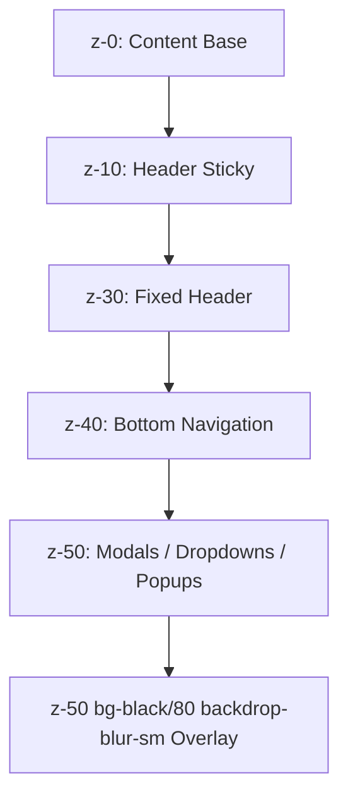
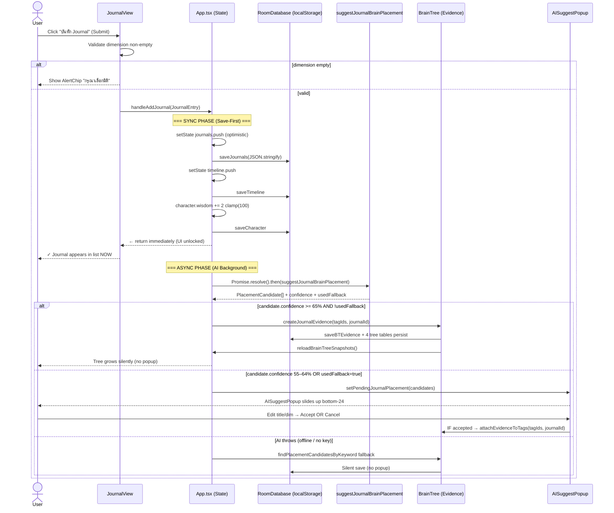
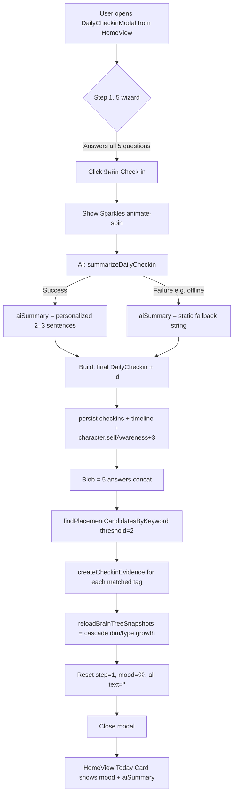
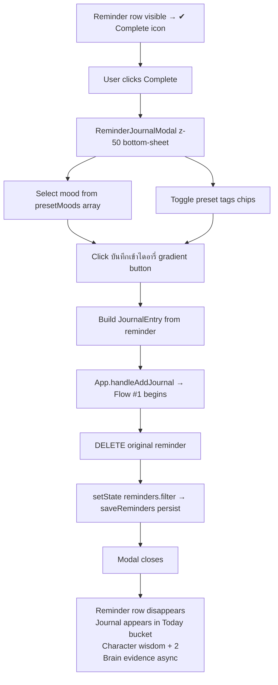

# UI/UX System — Complete Technical Documentation

> **My Life OS** — Tactical Dark Olive Glassmorphism Design System  
> Document Version: 1.0  
> Last Updated: 2026-07-29

---

## Table of Contents

1. [Design System Foundation](#1-design-system-foundation)
2. [Global Layout Architecture](#2-global-layout-architecture)
3. [Screen #1: HomeView (หน้าแรก / Dashboard)](#3-screen-1-homeview)
4. [Screen #2: JourneyView (Brain Dashboard)](#4-screen-2-journeyview)
5. [Screen #3: AICoachView (AI Coach)](#5-screen-3-aicoachview)
6. [Screen #4: JournalView (Journal)](#6-screen-4-journalview)
7. [Screen #5: ProgressView (Notes / Quick Notes)](#7-screen-5-progressview)
8. [Screen #6: LifeBrainView (Overlay Mode)](#8-screen-6-lifebrainview)
9. [Modal Screens — Content Management System](#9-modal-screens--content-management-system)
10. [Shared Component System](#10-shared-component-system)
11. [Keyboard Behaviour](#11-keyboard-behaviour)
12. [Loading / Empty / Error / Success States](#12-loading--empty--error--success-states)
13. [Responsive Behaviour](#13-responsive-behaviour)
14. [Accessibility](#14-accessibility)
15. [Dark Mode System](#15-dark-mode-system)
16. [User Interaction Flow Complete Inventory](#16-user-interaction-flow-complete-inventory)
17. [User Flow Diagrams](#17-user-flow-diagrams)

---

## 1. Design System Foundation

### 1.1 Color Palette — Tactical Dark Olive

| Token | Hex Value | Usage |
|-------|-----------|-------|
| `--color-bg-app` | `#0A0E0A` | Application root background (near-black with olive tint) |
| `--color-text-main` | `#EBF1EA` | Primary text, headings, high-emphasis content |
| `--color-text-muted` | `#869883` | Secondary text, subtitles, labels, metadata |
| `--color-text-subtle` | `#697A66` | Tertiary text, placeholders, disabled states |
| `--color-accent` | `#4E7345` | Primary accent (mid olive) — buttons, active states |
| `--color-accent-light` | `#6B9361` | Light accent (bright olive) — links, chips, icons |
| `--color-accent-dark` | `#3F5C3A` | Dark accent (deep olive) — pressed button states |
| `--color-accent-tint` | `#182218` | Accent tint — subtle highlight backgrounds |
| `--color-border-subtle` | `#1F2B1F` | Default borders — cards, dividers, inputs |
| `--color-border-accent` | `#273727` | Hover/active borders — interactive elements |
| Gradient Primary | `linear-gradient(135deg, #4E7345, #6B9361)` | CTAs, header logo, key action buttons |

### 1.2 Typography

```
Font Stack: system-ui, -apple-system, BlinkMacSystemFont, 'SF Pro Text', 'Segoe UI', Roboto, Helvetica, Arial, sans-serif
Anti-aliasing: -webkit-font-smoothing: antialiased
```

| Type Scale | Size | Weight | Usage |
|------------|------|--------|-------|
| `text-3xl / font-bold` | 30px | 700 | Page hero titles (H1) |
| `text-2xl / font-bold` | 24px | 700 | Section titles (H2) |
| `text-xl / font-bold` | 20px | 700 | Modal titles, card headers (H3) |
| `text-lg / font-bold` | 18px | 700 | Sub-section headings |
| `text-base / font-semibold` | 16px | 600 | Card titles, inline labels |
| `text-sm` | 14px | Varies | Body text inside cards |
| `text-xs` | 12px | Varies | Metadata, timestamps, chip content — **most ubiquitous** |
| `text-[11px]` | 11px | Varies | Tiny badges, inline meta |
| `text-[10px]` | 10px | Varies | Uppercase tracking labels, counter microcopy |

### 1.3 Radius Scale (Rounded System)

| Class | Value | Usage |
|-------|-------|-------|
| `rounded-full` | 9999px | Pills, avatars, floating chips |
| `rounded-3xl` | 24px | Modals, major section containers |
| `rounded-2xl` | 16px | Cards, forms, inputs, primary UI blocks |
| `rounded-xl` | 12px | Buttons, sub-cards, chips, tags |
| `rounded-lg` | 8px | Small buttons, badges, inline controls |
| `rounded-md` | 6px | Micro elements, tag pills |

### 1.4 Shadow & Depth Layer Model



| Layer | z-index | Composition |
|-------|---------|-------------|
| Base content | auto | Cards, lists, scrollable areas |
| Sticky section headers | z-10 | `position: sticky` inside scroll views |
| Fixed Header | z-30 | [Header.tsx](file:///C:/Users/store/Documents/my-life-os/src/components/Header.tsx) — always-visible top bar |
| Bottom Navigation | z-40 | [BottomNav.tsx](file:///C:/Users/store/Documents/my-life-os/src/components/BottomNav.tsx) — `md:hidden fixed bottom-3` |
| AI Suggest Popup | bottom-24 z-50 | [AISuggestPopup.tsx](file:///C:/Users/store/Documents/my-life-os/src/components/AISuggestPopup.tsx) — slides in above BottomNav |
| Modals / Dialogs | fixed inset-0 z-50 | ALL modals share z-50 with `bg-black/80 backdrop-blur-sm` overlay |
| NotificationBell Dropdown | (inside header z-30 context) | Relative dropdown, limited by header z-index |

### 1.5 Motion / Animation System

**Motion Library Used:** `motion/react` (Framer Motion v12.23)

| Pattern | Implementation | Used In |
|---------|---------------|---------|
| `animate-in fade-in duration-300` | CSS utility / inline | Page transitions, modal entries |
| `slide-in-from-bottom-4` | Tailwind animate-in | AISuggestPopup, ReminderJournalModal |
| `zoom-in-95 duration-200` | Tailwind animate-in | ManageTags, ManageMoods modals |
| Spring drag-to-dismiss | `drag="y"` + spring damping 30 | [BottomSheet.tsx](file:///C:/Users/store/Documents/my-life-os/src/components/BottomSheet.tsx) |
| `hover:scale-[1.02]` + `active:scale-95` | Inline Tailwind | Cards, CTA buttons, mode grid tiles |
| `animate-pulse` | Tailwind default | AI "thinking" indicator, Volume2 pulse |
| `transition-all duration-200` | Ubiquitous | Every interactive element: color, border, bg, transform |

---

## 2. Global Layout Architecture

### 2.1 Application Shell — Component Hierarchy

```mermaid
flowchart TB
    AppRoot["App.tsx<br/>State Container (37 useState)"]
    
    AppRoot --> Shell["min-h-screen bg-[#0A0E0A]"]
    
    Shell --> HeaderArea["<Header/> Fixed Top z-30<br/>pt-[safe-area-inset-top]"]
    Shell --> MainArea["main max-w-7xl mx-auto px-4<br/>pt-[header_height] pb-[bottomnav+safearea]"]
    Shell --> BottomNavArea["<BottomNav/> z-40"]
    Shell --> OverlayLayer["Overlay z-50 Layer"]
    Shell --> PopupLayer["Floating Popups (z-50 fixed bottom-24)"]
    
    MainArea --> ConditionalRender{Conditional Render Router}
    ConditionalRender -->|"isLifeBrainOpen=true"| LifeBrain["LifeBrainView (Full-screen overlay)"]
    ConditionalRender -->|"tab=Home"| HV["HomeView"]
    ConditionalRender -->|"tab=Journey"| JV["JourneyView"]
    ConditionalRender -->|"tab=Coach"| AICV["AICoachView"]
    ConditionalRender -->|"tab=Journal"| JVw["JournalView"]
    ConditionalRender -->|"tab=Progress"| PV["ProgressView"]
    
    OverlayLayer --> ModalFlags[14 Modal Flags]
    ModalFlags --> SM[SettingsModal]
    ModalFlags --> MAM[ManageAPIModal]
    ModalFlags --> GSM[GlobalSearchModal]
    ModalFlags --> DCM[DailyCheckinModal]
    ModalFlags --> GM[GoalsModal]
    ModalFlags --> HM[HabitsModal]
    ModalFlags --> CM[ChecklistModal]
    ModalFlags --> VBM[VisionBoardModal]
    ModalFlags --> AM[AffirmationsModal]
    ModalFlags --> TM[TimelineModal]
    ModalFlags --> MT[ManageTagsModal]
    ModalFlags --> MM[ManageMoodsModal]
    ModalFlags --> AISP[AISuggestPopup *]
    ModalFlags --> BCM[BrainCardModal *]
    ModalFlags --> RJM[ReminderJournalModal *]
    ModalFlags --> CD[ConfirmDialog *]
    ModalFlags --> DTP[DateTimePicker *]
    
    PopupLayer --> AISuggest[AISuggestPopup]
```



### 2.2 Header Architecture ([Header.tsx](file:///C:/Users/store/Documents/my-life-os/src/components/Header.tsx))

**Layout:** `fixed top-0 z-30 w-full backdrop-blur` — Tactical sticky header

| Left Section | Right Section |
|--------------|---------------|
| **OS Gradient Chip Logo** — W10×H10 rounded-xl, gradient `#4E7345→#6B9361` + white OS icon; `text-xs tracking-[0.2em] text-[#6B9361] uppercase` My Life OS subtitle | **4 Icon Buttons (ordered right):** |
| | ① `Search` (magnifier) → `onOpenSearch` → opens GlobalSearchModal |
| | ② Conditional `Key` (ManageAI) — shown only if AI enabled → `onOpenManageAPI` |
| | ③ `NotificationBell` component — embedded inline (292 lines) |
| | ④ `Settings` (gear) → `onOpenSettings` → SettingsModal |

**Header Sizing:** Consumes approximately 60–72px vertical height; main content uses implicit padding via inline layout flow.

### 2.3 Bottom Navigation Architecture ([BottomNav.tsx](file:///C:/Users/store/Documents/my-life-os/src/components/BottomNav.tsx))

**Two Adaptive Layouts:**

```mermaid
graph LR
    A[BottomNav Component] --> B{Screen Width}
    B -->|< md Mobile| C[Fixed bottom-3 left/right-3<br/>rounded pill shape<br/>translate-y-[150%] when keyboard open]
    B -->|>= md Desktop| D[Fixed bottom-6 left-1/2 -translate-x-1/2<br/>Centered floating pill<br/>desktop scale-105 shadow-md active]
```

**5 Nav Tabs — Icon ↔ Label Mapping:**

| Index | Tab Value | Icon (Lucide) | Label | Color Active |
|-------|-----------|---------------|-------|--------------|
| 0 | `Home` | `LayoutDashboard` | หน้าแรก | bg-[#3E5C3A] white |
| 1 | `Journey` | `Map` | Journey | bg-[#3E5C3A] white |
| 2 | `Coach` | `Bot` | AI Coach | bg-[#3E5C3A] white |
| 3 | `Journal` | `BookOpen` | Journal | bg-[#3E5C3A] white |
| 4 | `Progress` | `TrendingUp` | โน้ต / Progress | bg-[#3E5C3A] white |

**Active State Detection:** `activeTab === tabValue`

### 2.4 Conditional Routing Resolution (Priority Order)

```
1. If isLifeBrainOpen === true → Render LifeBrainView full-screen (hides tab content + modals behind)
2. Else if ANY modalFlag === true → Render that Modal ON TOP of current tab view
3. Else → Render tab view: switch(activeTab) → HomeView | JourneyView | AICoachView | JournalView | ProgressView
```

---

## 3. Screen #1: HomeView

**File:** [HomeView.tsx](file:///C:/Users/store/Documents/my-life-os/src/views/HomeView.tsx)  
**Lines:** 393  
**Active Tab:** `Home` (index 0)

### 3.1 Purpose
The landing dashboard. Surface today's most important information at a glance: time-aware greeting, today's reflection check-in status, reminder quick-add + management list, and quick-action 8-tile shortcut grid (implied from `handleQuickAction` in App.tsx).

### 3.2 User Goal
In ≤3 seconds, answer:
1. "What greeting/energy am I starting with?"
2. "Have I done my Daily Check-in today?"
3. "What reminders/action items are due?"
4. "One-tap access to any content module."

### 3.3 Screen Layout (Vertical Stack)

```
┌───────────────────────────────────────────────┐
│ HEADER [OS Chip]             [Search][🔔][⚙️] │ 60px
├───────────────────────────────────────────────┤
│  SPACER pt-4                                 │
│  ┌─ Section 1: Greeting ───────────────────┐ │
│  │  👋 {h<12?"เช้า":h<17?"บ่าย":"เย็น"},   │ │
│  │  {userName}!    (text-2xl font-extrabold)│ │
│  └──────────────────────────────────────────┘ │
│                                               │
│  ┌─ Section 2: Today's Reflection Card ─────┐ │
│  │  🟢 IF todayCheckin exists:              │ │
│  │  ├─ Mood Emoji Large                     │ │
│  │  ├─ aiSummary paragraph (AI insight)     │ │
│  │  🔴 ELSE:                                │ │
│  │  ├─ 🌙 Moon amber CTA                    │ │
│  │  └─ Button "เริ่ม Check-in"              │ │
│  │     → onOpenCheckinModal()               │ │
│  └──────────────────────────────────────────┘ │
│                                               │
│  ┌─ Section 3: Reminders Section ───────────┐ │ ≈190 lines duplicate
│  │  [Quick Add Input + DatePicker]          │ │
│  │  [Reminders List per-row inline edit]    │ │
│  │  [ConfirmDialog (deletingId)]            │ │
│  │  [2× DateTimePicker modals]              │ │
│  └──────────────────────────────────────────┘ │
│  pb-28 (bottom nav clearance)                 │
└───────────────────────────────────────────────┘
```

### 3.4 Section 1: Greeting — Logic Details

**Function:** `greeting()` — anonymous IIFE inside JSX  
**Trigger:** Render time (not state; derived from Date object)

```
IF new Date().getHours() < 12  → "สวัสดีตอนเช้า"  (Thai: Good morning)
IF < 17                        → "สวัสดีตอนบ่าย"   (Good afternoon)
ELSE                           → "สวัสดีตอนเย็น"   (Good evening)
Then concat: "{greetText}, {settings.userName}! 👋"
```

### 3.5 Section 2: Today's Reflection Card

**Two States:**

#### State A: Checked-in Today (todayCheckin found)
- **Mood Emoji:** Large `text-4xl` inline left
- **Dimension Badge:** `CalendarDays` icon + uppercase tracking label `[check-in date]`
- **AI Summary:** `{todayCheckin.aiSummary}` paragraph — 2-3 sentence personalized reflection from `summarizeDailyCheckin()`

#### State B: No Check-in Today (empty)
- **Moon Amber Illustration:** `Moon` icon amber color ~36px
- **Headline CTA:** `"ยังไม่ได้ Check-in วันนี้"`
- **Primary CTA Button:** `onClick → onOpenCheckinModal` → opens [DailyCheckinModal.tsx](file:///C:/Users/store/Documents/my-life-os/src/views/DailyCheckinModal.tsx)

### 3.6 Section 3: Reminders (Duplicate of NotificationBell logic — 190 lines)

**Quick Add Row:**
- Text input `placeholder="เพิ่มเตือนความจำ..."`
- `Clock` icon button → toggles `DateTimePicker` (add mode)
- `Plus` button OR `Enter` key → `handleAddReminder()`

**Reminder List Row Pattern (per-item):**
```
┌───────────────────────────────────────────────────────┐
│ [✔ Complete]  [Text — Inline Edit on click]  [Edit2] [Trash2] │
└───────────────────────────────────────────────────────┘
```

- **Complete (checkmark):** Calls `onCompleteReminder(item)` → opens `ReminderJournalModal` to "upgrade" reminder into Journal entry
- **Inline Edit Mode:** `autoFocus` textarea, `Enter` save, `Esc` cancel, `DateTimePicker` for due date edit
- **Trash:** Opens `ConfirmDialog` danger variant → `onDeleteReminder(deletingId)`

### 3.7 Cards, Buttons, Forms Summary

| Element | Count | Styling |
|---------|-------|---------|
| Glass Cards (rounded-2xl, bg-[#131913], border-[#1F2B1F]) | 3 | `shadow-lg` variant |
| Primary gradient buttons | 2+ | `linear-gradient(135deg, #4E7345, #6B9361)` |
| Ghost icon buttons | ~12 | `p-1.5 rounded-lg hover:bg-white/10` |
| Text inputs | 2 (add reminder, inline edit) | `bg-[#182018] rounded-xl` |
| ConfirmDialog instances | 1 | Danger variant for delete |
| DateTimePicker instances | 2 (add-mode, edit-mode) | Separate instances, separate state variables |

---

## 4. Screen #2: JourneyView

**File:** [JourneyView.tsx](file:///C:/Users/store/Documents/my-life-os/src/views/JourneyView.tsx)  
**Lines:** 202  
**Active Tab:** `Journey` (index 1)

### 4.1 Purpose
Dynamic Topic Tracking Dashboard. Aggregate distribution of knowledge across 12 Life Dimensions + custom tags from BrainCard legacy system. Visualizes relative "investment density" per life topic with proportional progress bars.

### 4.2 User Goal
Understand where Life Brain cognitive mass is concentrated. Identify under-served dimensions. Navigate to LifeBrain detail view.

### 4.3 Screen Layout

```
┌──────────────────────────────────────────────────────────┐
│  TOP HEADER (flex-col sm:flex-row justify-between)      │
│  Left:                                                   │
│    [Brain]  Brain Topic Status (xs uppercase tracking)  │
│    h2: Brain Dashboard (text-2xl sm:text-3xl bold)      │
│    p: แสดงสถานะและจำนวนสะสมของหัวข้อ...                 │
│  Right (2 items):                                        │
│    [Total Badge: 29 storage keys pattern]               │
│      "ข้อมูลสะสมทั้งหมด {N} รายการ"                    │
│    [Life Brain CTA Button]                              │
│      → onOpenLifeBrain → sets isLifeBrainOpen=true      │
├──────────────────────────────────────────────────────────┤
│  CONTROL BAR (p-3.5 rounded-2xl bg-[#131913])           │
│  Left: Search input (relative w-full sm:w-72)           │
│  Right: Sort Controls group (3 segmented buttons)       │
│    [สะสมสูงสุด]  [ก-ฮ / A-Z]  [ทั่วไป]                  │
├──────────────────────────────────────────────────────────┤
│  DYNAMIC TOPIC GRID (grid-cols-1 md:grid-cols-2 gap-4) │
│  ┌─Per Topic Card───────────────────────────────────┐   │
│  │  [Emoji] {name}      [count badge rounded-xl]    │   │
│  │  ───────── Progress Bar gradient #4E7345→#6B9361 │   │
│  │  [Brain N Cards]           [{pct}%]              │   │
│  └──────────────────────────────────────────────────┘   │
│  * Card Count = 12 LIFE_DIMENSIONS + N custom tags      │
└──────────────────────────────────────────────────────────┘
```

### 4.4 Data Aggregation Logic (`topicMap` accumulator)

```typescript
// Step 1: Seed 12 LIFE_DIMENSIONS into topicMap (guaranteed keys)
LIFE_DIMENSIONS.forEach(dim => topicMap[dim.id] = { name, emoji, count:0, cardCount:0, journalCount:0 })

// Step 2: Iterate all brainCards
brainCards.forEach(card => {
  topicMap[card.dimension].count++
  topicMap[card.dimension].cardCount++
  card.tags.forEach(tag => {
    // Dynamically create tag-keyed pseudo-topics
    if (!topicMap[cleanTag]) topicMap[cleanTag] = { emoji:"🏷️", count:0, cardCount:0, ... }
    topicMap[cleanTag].count++
    topicMap[cleanTag].cardCount++
  })
})

// Step 3: Derived display
maxCount = Math.max(1, ...all counts)
percent per topic = Math.min(100, Math.round(topic.count / maxCount * 100))
```

### 4.5 Sort Options

| Option Button | Algorithm |
|---------------|-----------|
| `สะสมสูงสุด` (most-used, default) | `.sort((a, b) => b.count - a.count)` |
| `ก-ฮ / A-Z` (a-z) | `.sort((a, b) => a.name.localeCompare(b.name, "th"))` — Thai locale aware |
| `ทั่วไป` (manual) | No sort — object insertion order |

---

## 5. Screen #3: AICoachView

**File:** [AICoachView.tsx](file:///C:/Users/store/Documents/my-life-os/src/views/AICoachView.tsx)  
**Lines:** 322 (main + ChatPopupModal inner component)  
**Active Tab:** `Coach` (index 2)

### 5.1 Purpose
AI Coach mode selector + modal-isolated chat experience per AI persona. 6 predefined conversational personas with different instruction sets.

### 5.2 User Goal
Select appropriate persona for their immediate need, then engage in a bounded, context-aware chat (auto-clears sessions per send to avoid token ballooning).

### 5.3 Header Section

```
h1: "AI Coach" text-2xl font-extrabold tracking-tight #EBF1EA
p:  "AI Assistant ส่วนตัว อ่าน Life Brain เพื่อให้คำแนะนำเฉพาะตัว"
Sub-header: "เลือกโหมด AI Assistant" + "แตะโหมดเพื่อเริ่มคุยกับ AI"
```

### 5.4 Mode Grid (6 tiles — responsive grid 1→2→3 columns)

```
Layout: grid-cols-1 sm:grid-cols-2 md:grid-cols-3 gap-3
```

| Mode `AIMode` | Label (th) | Subtitle | Icon | Color HEX |
|----------------|------------|----------|------|-----------|
| `Coach` | Life Coach | วางแผนชีวิต & ทิศทาง | `Brain` | `#4E7345` |
| `Therapist` | AI Therapist | จิตวิทยา CBT & ทบทวนอารมณ์ | `HeartHandshake` | `#7A9B61` |
| `Decision` | Decision Helper | วิเคราะห์ทางเลือก & ผลกระทบ | `Compass` | `#869883` |
| `Future Self` | Future Self | มุมมองตัวตนในอนาคต 5 ปี | `Hourglass` | `#B07A60` |
| `Secretary` | Secretary | จัดการ Task, Planning & Priority | `Calendar` | `#6B9361` |
| `Reflection` | Reflection | ทบทวนบทเรียนสรุป Insight | `Layers` | `#4E7345` |

**Tile Click Action:** `setActivePopupMode(m.mode)` → mounts inner `<ChatPopupModal>` as z-50 overlay.

### 5.5 ChatPopupModal (Inner Component, 160 lines)

**Positioning:** `fixed inset-0 z-50 flex items-center justify-center p-2 sm:p-4 bg-black/80 backdrop-blur-sm`

**3 Zones (h-[85vh] flex-col):**
```
┌─ HEADER: px-5 py-3.5 ─────────────────────────────────┐
│  [Bot] {mode} Mode          [X Close]                 │
│  "Read-Only Life Brain Context Enabled"               │
├─ MESSAGE CONTAINER: flex-1 overflow-y-auto p-4 ──────┤
│  EMPTY: Bot 36px icon opacity-30 + prompt            │
│  LIST: user=RIGHT emerald-700 rounded-br-none         │
│        ai  =LEFT  emerald-950/40 rounded-bl-none      │
│  BUBBLE: max-w-[80%] whitespace-pre-wrap              │
│  THINKING: Bot icon pulse "AI กำลังคิดคำตอบ..."       │
│  AUTO-SCROLL: messagesEndRef scrollIntoView smooth    │
├─ INPUT BAR: p-3 border-t ────────────────────────────┤
│  textarea: useAutoResizeTextarea (min2 max8 rows)     │
│  onKeyDown Enter=send Shift+Enter=newline             │
│  [Send] gradient disabled opacity-40 when !input     │
└───────────────────────────────────────────────────────┘
```

**Auto-Session Clear Policy (Anti Token-Ballooning):**
```typescript
// Line 174-176 — Called BEFORE each send
if (onClearSession) {
  onClearSession();
}
```
Intentional: each turn is a fresh "short memory" turn to avoid accumulating 32k context. Only current-mode messages filtered via `messages.filter(m => m.mode === mode)` are shown.

### 5.6 Background BrainCard Suggestion Chain

After successful AI response (line 213–217):
```
Promise chain: suggestBrainCard(userMsgText, brainCards, settings)
  → if (suggested) → onSuggestCard(suggested)
  → mounts AISuggestPopup at z-50 bottom-24
```

---

## 6. Screen #4: JournalView

**File:** [JournalView.tsx](file:///C:/Users/store/Documents/my-life-os/src/views/JournalView.tsx)  
**Lines:** 457  
**Active Tab:** `Journal` (index 3)

### 6.1 Purpose
Primary journal writing interface. Two-pane desktop (7/5 split), single column on mobile.

### 6.2 User Goal
Write a journal entry FAST (save-first), then optionally edit old entries. Dimension + mood + tags are required meta.

### 6.3 2-Column Layout (lg:grid lg:grid-cols-12 gap-6)

```
┌───────── LEFT: EDITOR FORM (lg:col-span-7) ─────────┐  ┌── RIGHT: LIST (lg:col-span-5) ──┐
│  FORM onSubmit=handleSave                            │  │  Top: Search Input               │
│  ┌ Title Input ───────────────────────────────────┐  │  │  4 Date Buckets computed:       │
│  └────────────────────────────────────────────────┘  │  │  • วันนี้    (sv-SE === today)  │
│  ┌ LIFE_DIMENSIONS ×12 Chip Picker (REQUIRED) ─────┐ │  │  • เมื่อวาน (yesterday)        │
│  │ Red AlertCircle "กรุณาเลือกมิติ" if empty submit│ │  │  • เดือนนี้ (this month)       │
│  └────────────────────────────────────────────────┘  │  │  • เดือนก่อนหน้า (earlier)     │
│  ┌ MOOD + EMOTION (2-col grid) ────────────────────┐ │  │                                  │
│  │ L: 8 Preset Moods horizontal-scroll chip bank   │ │  │  Per Journal Card:              │
│  │    scale-110 border when selected               │ │  │  [mood][title] [Edit2][Trash2] │
│  │ R: Emotion text input (free-form single word)   │ │  │  p line-clamp-3 #869883         │
│  └────────────────────────────────────────────────┘  │  │  [dim badge]•[emotion]  [time]  │
│  ┌ useAutoResizeTextarea min3 max10 content ───────┐ │  │                                  │
│  │ bg-[#182018] rounded-xl p-4                      │ │  │  ConfirmDialog delete           │
│  └────────────────────────────────────────────────┘  │  │  ManageTagsModal (manage btn)   │
│  ┌ Preset Tags chips + "จัดการแท็ก" link ─────────┐ │  │  ManageMoodsModal (manage btn)  │
│  │ Chip toggle: bg-[#3F5C3A] white when active     │ │  │                                  │
│  └────────────────────────────────────────────────┘  │  │  editingId / deletingId state   │
│  [Submit Button: gradient #4E7345→#6B9361]           │  │                                  │
└──────────────────────────────────────────────────────┘  └──────────────────────────────────┘
```

### 6.4 Dimension Required Validation (Hard Fail)

```typescript
IF selectedDimension.length === 0:
  → Show red AlertCircle chip message
  → preventDefault() on form submit
  → return early
ELSE:
  → Build JournalEntry object
  → Call onAddJournal / onEditJournal
```

### 6.5 Mood Selection System

**Horizontal Scroll Bank** — 8 preset moods from `presetMoods: PresetMood[]` prop (from settings, DEFAULT_PRESET_MOODS in db.ts):
- Selected mood: `scale-110 border-2 border-[#6B9361] shadow-md`
- Scroll container: `overflow-x-auto pb-1 scrollbar-hide`
- "จัดการอารมณ์" link → `setIsManageMoodsOpen(true)` → ManageMoodsModal

### 6.6 Date Bucket Grouping Algorithm

Using `Intl.DateTimeFormat('sv-SE', { timeZone })` for YYYY-MM-DD normalization (critical for Thai users with +07 offset):

```typescript
const fmt = new Intl.DateTimeFormat('sv-SE', { timeZone })
const todayStr = fmt.format(new Date())
const yesterdayStr = fmt.format(yesterdayDate)
const thisMonthPrefix = todayStr.slice(0, 7) // "2026-07"
const lastMonthPrefix  = prevMonth7digit

groups = [
  { label: "วันนี้",     items: journals.filter(j => j.date === todayStr) },
  { label: "เมื่อวาน",   items: journals.filter(j => j.date === yesterdayStr) },
  { label: "เดือนนี้",   items: journals.filter(j => starts_with_07 && !prev_groups) },
  { label: "เดือนก่อนหน้า", items: remaining }
].sort(groupItemsBy(timestamp desc))
```

---

## 7. Screen #5: ProgressView (Notes)

**File:** [ProgressView.tsx](file:///C:/Users/store/Documents/my-life-os/src/views/ProgressView.tsx)  
**Lines:** 240  
**Active Tab:** `Progress` (index 4)

### 7.1 Purpose
Quick Notes / Sticky Notes module. Captured separately from Journal entry formal workflow — ideation, fleeting thoughts, instant capture.

### 7.2 Screen Layout

```
┌─ HEADER ────────────────────────────────────────────┐
│  h2: [StickyNote] โน้ตด่วน (Quick Notes) text-2xl+  │
│  p:  บันทึกความทรงจำ ไอเดีย ข้อคิด แยกจาก Journal   │
│  Badge: {notes.length} โน้ต                        │
├─ NOTE CREATION FORM ───────────────────────────────┤
│  Title input (optional placeholder: "หัวข้อโน้ต...")│
│  Content textarea — useAutoResizeTextarea min3/max9 │
│  Footer: Right-aligned [Plus เพิ่มโน้ต] button      │
├─ SEARCH BAR ───────────────────────────────────────┤
│  [Search icon] ค้นหาในโน้ต... (title OR content)    │
├─ NOTES GRID: cols-1 sm:cols-2 gap-4 ──────────────┤
│  Per-note (two states):                            │
│                                                     │
│  READ:  [title]  [Edit2 White][Trash2 Red]         │
│         p content xs #869883 whitespace-pre-wrap   │
│         border-t meta date/time locale th-TH        │
│                                                     │
│  EDIT:  [input title border #4E7345 focus]          │
│         [textarea content border #4E7345]           │
│         [Cancel][Save emerald gradient]             │
└─────────────────────────────────────────────────────┘
```

### 7.3 Default Title Fallback

If user writes content but no title:
```typescript
title: title.trim() || "โน้ตด่วน " + new Date(now).toLocaleDateString("th-TH")
```

---

## 8. Screen #6: LifeBrainView (Full-Screen Overlay)

**File:** [LifeBrainView.tsx](file:///C:/Users/store/Documents/my-life-os/src/views/LifeBrainView.tsx)  
**Lines:** 519  
**Activation:** `isLifeBrainOpen = true` (from anywhere via `onOpenLifeBrain`)

### 8.1 Purpose
Legacy BrainCard list knowledge viewer. Two-tier filter system (Dimension + BrainType) + search. Click card → expand detail with linked journals.

### 8.2 Screen Layout

```
┌─ STICKY HEADER (top-0 z-10 px-4 pt-4 pb-3, blur12) ─┐
│  [Brain gradient chip] Life Brain  {N} Brain Cards  │
│  [+ เพิ่มการ์ด CTA gradient]          [X Close btn] │
│                                                      │
│  ┌─ Search Input ─────────────────────────────┐     │
│  │ (pl-9 pr-4 py-2.5)  ค้นหา Brain Cards...   │     │
│  └────────────────────────────────────────────┘     │
│                                                      │
│  ┌─ Dimension Filter scroll-x chip bank ─────────┐  │
│  │  [ทั้งหมด (N)] [work N] [finance N] ...       │  │
│  │  * Hide 0-count dimensions (return null)      │  │
│  └────────────────────────────────────────────────┘  │
│                                                      │
│  ┌─ Brain Type DROPDOWN (ChevronDown) ───────────┐  │
│  │  Custom absolute positioned panel z-20         │  │
│  │  ทั้งหมด | Goal | Habit | Knowledge | Belief...│  │
│  └────────────────────────────────────────────────┘  │
├─ MAIN: max-w-4xl mx-auto px-4 py-4 ─────────────────┤
│                                                      │
│  EMPTY STATE (filteredCards.length === 0):           │
│  ┌ Brain 48px opacity-20 center                       │
│  └ [+ สร้าง Brain Card แรก] CTA if cards empty      │
│                                                      │
│  GRID: cols-1 sm:cols-2 gap-3                        │
│  Per card (two states: collapsed / expanded):        │
│                                                      │
│  COLLAPSED:                                          │
│  [emoji][title]  [Edit2 White][Trash2 Red]           │
│  p description line-clamp-2                          │
│  [TypeBadge color] [#tag #tag +N] [Link N journals]  │
│                                                      │
│  EXPANDED (onClick selectedCard === card.id):        │
│  + border-top pt-4 mt-4                              │
│  + [emoji dim label]•[type color]•[Calendar date]    │
│  + Linked Journals list with [Unlink] action        │
│  + All tags TagIcon + list                           │
└──────────────────────────────────────────────────────┘
```

### 8.3 Two-Way Journal ↔ BrainCard Link Sync

When `handleSaveCard()` fires (BrainCardModal save):
```typescript
const prevIds = editingCard?.linkedJournalIds ?? []
const nextIds = card.linkedJournalIds ?? []
const added   = nextIds.filter(id => !prevIds.includes(id))
const removed = prevIds.filter(id => !nextIds.includes(id))
journals.forEach(j => {
  const has       = j.linkedBrainCardIds?.includes(card.id) ?? false
  const shouldHave = nextIds.includes(j.id)
  if (added.includes(j.id) && !has)     → add card.id to j.linkedBrainCardIds
  if ((removed || !shouldHave) && has)  → remove card.id
})
```

### 8.4 Color Maps (DIM_COLORS / TYPE_COLORS)

**DIM_COLORS:** 12 Life Dimensions → unique hex per dimension (pill border + background)
**TYPE_COLORS:** 11 BRAIN_TYPES → unique hex per brain type badge

---

## 9. Modal Screens — Content Management System

**Total: 14 modal / popup components** — all use `fixed inset-0 z-50 bg-black/80 backdrop-blur-sm` pattern

### 9.1 DailyCheckinModal ([DailyCheckinModal.tsx](file:///C:/Users/store/Documents/my-life-os/src/views/DailyCheckinModal.tsx)) 308 lines

**Purpose:** 5-question daily reflection. Stepped wizard with progress bar. Final submit triggers AI summary generation **before** write.

**Stepper Flow:**
```
Step 1 (20%): Mood Selector 5-emoji grid + "What went well?" textarea
Step 2 (40%): "Challenges / Obstacles today?"
Step 3 (60%): "Lessons learned?"
Step 4 (80%): "Gratitude / Appreciation?"
Step 5 (100%): "Tomorrow focus / improvement?"

Footer Nav:
  [ย้อนกลับ (step>1)]   [ถัดไป / บันทึก Check-in (step=5)]
```

**Word Counter Banner:** Live aggregates all 5 answers into combined text, calls `countWords()` Intl.Segmenter th-TH, shows badge:
- Green `≥100 words` → bg-[#233523] border-[#4E7345]
- Gray `<100 words` → neutral
- Helper `(ยิ่งตอบมาก AI ยิ่งเรียนรู้ได้ลึกซึ้ง)`

**Submit Sequence (handleSubmit):**
```
1. Build Omit<DailyCheckin, "id"|"aiSummary"> = {...}
2. TRY summarizeDailyCheckin(data, settings) → AI call
   CATCH → fallback aiSummary = "วันนี้คุณได้ใช้เวลาทบทวนตนเองอย่างมีคุณค่า"
3. Add id: "chk-" + Date.now()
4. onSaveCheckin(finalCheckin)
5. Reset ALL form state + setStep(1) + onClose()
```

### 9.2 GoalsModal ([GoalsModal.tsx](file:///C:/Users/store/Documents/my-life-os/src/views/GoalsModal.tsx)) 171 lines

**Purpose:** Goal Tracker with milestone-driven auto-progress calculation.

**New Goal Pattern (handleAddGoal):**
```
id: "g-" + now
progressPercent: 0
deadline: "2026-12-31" (hardcoded default)
milestones: 2 default (วางแผนขั้นตอนแรก, ลงมือทำสัปดาห์แรก)
vision: "ความสำเร็จในเป้าหมายนี้จะยกระดับชีวิตขึ้นอีกขั้น"
aiSuggestions: ["ซอยย่อยเป้าหมายเป็นงาน 15 นาทีทำทุกวัน"]
completed: false, archived: false
```

**Milestone → Progress% Auto-Calc (handleToggleMilestone):**
```
completedCount = milestones.filter(m => m.completed).length
progressPercent = Math.round(completedCount / totalMilestones * 100)
completed = (percent === 100)
```

### 9.3 HabitsModal ([HabitsModal.tsx](file:///C:/Users/store/Documents/my-life-os/src/views/HabitsModal.tsx)) 154 lines

**Purpose:** Habit creation + today's checkmark toggle. Streak counter (visual Flame + number).

**New Habit Defaults:**
```
repeatSchedule: "ทุกวัน"  (hardcoded)
reminderTime: "08:00"     (hardcoded)
currentStreak: 0, bestStreak: 0
completedDates: []
completionRate: 0
```

**Today Toggle (handleToggleHabitToday):**
```
todayStr = YYYY-MM-DD (toISO split)
IF todayStr in completedDates
  → remove from array, currentStreak-1 (clamp ≥0)
ELSE
  → push, currentStreak+1, bestStreak = Math.max(best, new)
completionRate = Math.min(100, Math.round(len/30 * 100))  # assumes 30-day window
```

### 9.4 ChecklistModal ([ChecklistModal.tsx](file:///C:/Users/store/Documents/my-life-os/src/views/ChecklistModal.tsx)) 145 lines

**Purpose:** Task / checklist manager. Priority categorization. Simplest modal pattern.

**New Item Defaults:**
```
deadline: "วันนี้"  (string literal, not parsed date)
category: "Work"    (hardcoded select in state)
priority: "High" / "Medium" / "Low"
completed: false
```

**List Render:** Completed items → `bg-[#101610] opacity-70 line-through title + description`. Visual grey-out.

### 9.5 VisionBoardModal ([VisionBoardModal.tsx](file:///C:/Users/store/Documents/my-life-os/src/views/VisionBoardModal.tsx)) 125 lines

**Purpose:** Vision board grid. Image URL from Unsplash (default photo if empty).

**Grid: cols-1 sm:cols-2 gap-4**

**New Vision Card Defaults:**
```
imageUrl: newImageUrl OR Unsplash hardcoded fallback (house photo)
notes: "วิสัยทัศน์ที่ชัดเจนนำมาซึ่งแรงขับเคลื่อนในการลงมือทำ"
progressPercent: 10
```

### 9.6 AffirmationsModal ([AffirmationsModal.tsx](file:///C:/Users/store/Documents/my-life-os/src/views/AffirmationsModal.tsx)) 110 lines

**Purpose:** Affirmation player UI (simulated loop audio). Click list to change current affirmation.

**Simulated Audio Player Card:**
```
Volume2 icon pulse (animate-pulse) + border
Italic quote display
[Play/Pause] rounded-full gradient button
```

**AI Generate CTA (handleGenerateAI):** Currently HARDCODED output — no real AI call:
```typescript
aiText = "ฉันเลือกที่จะตอบสนองด้วยความตระหนักรู้ ปัญญา และความสงบในจิตใจเสมอ"
newItem = { id:"a-"+now, text: aiText, category:"Morning", favorite:true }
```

### 9.7 TimelineModal ([TimelineModal.tsx](file:///C:/Users/store/Documents/my-life-os/src/views/TimelineModal.tsx)) 66 lines

**Purpose:** Read-only Life Timeline viewer. Vertical timeline bar.

**Layout:**
```
relative pl-6 border-l [border-color #1F2B1F]
  Each: relative
    absolute -left-[31px] top-1 w-4 h-4 rounded-full ring-4
      inner white dot w-1.5 h-1.5 rounded-full
    Padded card content:
      [dateStr mono]  [badge rounded-full]
      h4 title font-bold
      p description leading-relaxed
      optional imageUrl: h-32 object-cover
```

### 9.8 SettingsModal ([SettingsModal.tsx](file:///C:/Users/store/Documents/my-life-os/src/views/SettingsModal.tsx)) 190 lines

**4 Sections (borders between):**

| Section | Fields / Actions |
|---------|------------------|
| **โปรไฟล์ผู้ใช้งาน** | userName text input → `formData.userName` |
| **การตั้งค่า AI Providers** | [🔑 เปิด Manage API] button → closes Settings, opens ManageAPIModal |
| **สำรองข้อมูล & กู้คืน** | [ส่งออก Backup ZIP] JSZip blob → `<a download>` click ; [นำเข้า Backup] hidden `<input type=file accept=.zip>` → `importBackupZip` confirm overwrite dialog; Footer: `ขนาดข้อมูลปัจจุบัน: {RoomDatabase.getStorageSize()}` |
| **Danger Zone** | [ล้างข้อมูลทั้งหมดในเครื่อง] → `confirm` → `RoomDatabase.clearAllData()` → `onReloadApp()` → `onClose()` |

### 9.9 ManageAPIModal ([ManageAPIModal.tsx](file:///C:/Users/store/Documents/my-life-os/src/components/ManageAPIModal.tsx)) 482 lines

**Purpose:** Full AI provider priority manager. Drag & drop reorder, key visibility toggle, per-provider test connection, 3-button add provider.

**PROVIDER_DEFAULTS (3 providers):**
```
Gemini:     defaultModel="gemini-3.6-flash", docUrl=https://aistudio.google.com/apikey
Groq:       defaultModel="llama-3.3-70b-versatile", docUrl=https://console.groq.com/keys
OpenRouter: defaultModel="" (select auto-free), docUrl=https://openrouter.ai/keys
```

**Per-Provider Card:**
- Drag handle `GripVertical` + `#priority` badge (computed from index + 1)
- Enable checkbox top-left
- ChevronUp / ChevronDown reorder buttons (keyboard fallback for DnD)
- Trash delete button
- **Inputs:** 
  - API Key: type=password ↔ text toggle via Eye / EyeOff, `placeholder per provider`, link "รับฟรี API Key" with ExternalLink
  - Model: OpenRouter = `<select>` (auto-free + gemma 4 31b / GPT-OSS 20b / Gemma 2 9b), else = text input
- **Test Connection** button: loading spinner, inline result badge (CheckCircle2 emerald / AlertCircle red), truncatable message

**Bottom 3-col Add Provider Grid:**
```
[+ Gemini (green)]   [+ Groq (orange)]   [+ OpenRouter (purple)]
Each → create new provider object with empty id-"prov-"+now enabled:true priority:len+1
```

**Native HTML5 DnD Implementation:**
- `draggedId` state + `dragOverId` state
- `onDragStart onDragOver onDragEnd` handlers on cards
- Swap provider positions via splice onDragEnd

---

## 10. Shared Component System

### 10.1 BottomSheet ([BottomSheet.tsx](file:///C:/Users/store/Documents/my-life-os/src/components/BottomSheet.tsx)) 118 lines

**Reusable motion-enabled sheet container.**

**Props:**
```typescript
isOpen, onClose, title? (string), headerIcon?: LucideIcon, children (ReactNode),
footer?: ReactNode, maxHeight = "92vh"
```

**Drag-to-Dismiss Logic:**
```typescript
handleDragEnd = (_, { offset: { y }, velocity: { y: vy } }) => {
  if (y > 100 /* 100px down */ OR vy > 300 /* fast flick down */):
    onClose()
}
```

**Composition:** Motion spring `damping: 30, stiffness: 400` for slide-up. Mobile only drag indicator (w-10 h-1 rounded-full bg-white/20). Desktop uses standard centered rounded-2xl sheet.

### 10.2 ConfirmDialog ([ConfirmDialog.tsx](file:///C:/Users/store/Documents/my-life-os/src/components/ConfirmDialog.tsx)) 74 lines

**Props:** isOpen, title, message, confirmText, cancelText, variant="danger|warning|info", onConfirm, onCancel

**3 Variant Bg Colors:**
```
danger  → bg-red-500    hover:bg-red-600     (Delete operations)
warning → bg-amber-500  hover:bg-amber-600   (Caution operations)
info    → bg-blue-600   hover:bg-blue-700    (Confirm prompts)
```

### 10.3 DateTimePicker ([DateTimePicker.tsx](file:///C:/Users/store/Documents/my-life-os/src/components/DateTimePicker.tsx)) 329 lines

**Full Thai-localized calendar + 15-min step time picker.**

**Internal State:**
```
tempDate:  Date    (selected date + time combined)
viewMonth: Date    (calendar month being viewed)
```

**Calendar Grid Build (6 weeks):**
```
startWeekday = firstDay.getDay()  (0=Sun)
daysInMonth  = new Date(y, m+1, 0).getDate()
cells = [null * startWeekday] + [Date(1..daysInMonth)]
while cells.length % 7 !== 0: push(null)  → pad to 42 cells
```

**Quick Buttons:** `วันนี้` (now.getHours, now.getMinutes), `พรุ่งนี้` (09:00 next day).

**Time Selectors:**
- Hours: `<select>` 00–23 → `setHour(Number(val))`
- Minutes: `<select>` 00 / 15 / 30 / 45 → round to nearest on initial render via reduce

**Summary Bar:** Thai locale formatting: `ศ. 29 ก.ค. 2569 • 14:30`

**Clear Button:** Only rendered if `hasInitialValue` (value prop was truthy).

### 10.4 GlobalSearchModal ([GlobalSearchModal.tsx](file:///C:/Users/store/Documents/my-life-os/src/components/GlobalSearchModal.tsx)) 262 lines

**Unified federated search across 4 content types.**

**2 Top Filters (xs select elements):**
- Dimension Filter: ทุก Dimension + 12 LIFE_DIMENSIONS
- Brain Type Filter: ทุก Brain Type + 11 BRAIN_TYPES

**4 Parallel Result Sections (if filtered items >0):**
```
1. 🧠 Life Brain ({N}) — brainCards[].title/description/tags
2. 📖 Journal ({N}) — journals[].title/content/tags
3. 🎯 Goals ({N}) — goals[].title/category
4. 🔥 Habits ({N}) — habits[].title/category
```

**Click Behaviors:** Each card → callback `onSelectX(item)` → closes modal → outer logic handles navigation/edit.

### 10.5 ManageTagsModal ([ManageTagsModal.tsx](file:///C:/Users/store/Documents/my-life-os/src/components/ManageTagsModal.tsx)) 229 lines

**CRUD preset tag library.**

- **Add:** `Enter` key OR Plus button. Auto-strips `#` prefix, dedup against existing.
- **Edit:** Click Edit2 → switch row to input mode, Enter saves, Esc cancels. Empty save → deletes tag.
- **Delete:** Trash2 (no confirm — inline destructive).
- **Reset:** `RotateCcw` → restores `DEFAULT_PRESET_TAGS` from db.ts.

### 10.6 ManageMoodsModal ([ManageMoodsModal.tsx](file:///C:/Users/store/Documents/my-life-os/src/components/ManageMoodsModal.tsx)) 299 lines

**Preset Mood CRUD with emoji picker.**

**EMOJI_OPTIONS: 50 emojis 10-column grid (both Add + Edit modes):**
```
😊 😄 😁 🥰 😍 🤩 😎 😌 😇 🤗 ... 5 rows × 10 cols
```

**Add Flow:** Toggle form with dashed-bordered button. Emoji picker dropdown + label input + Enter submit.

**Edit Flow:** Click Edit2 → reveal inline editor with emoji + label. Edit emoji picker separate showEditEmojiPicker state.

### 10.7 AISuggestPopup ([AISuggestPopup.tsx](file:///C:/Users/store/Documents/my-life-os/src/components/AISuggestPopup.tsx)) 139 lines

**Floating suggestion card that rises from above BottomNav.**

**Position:** `fixed bottom-24 left-4 right-4 max-w-440px mx-auto z-50`  
**Animation:** Tailwind `animate-in slide-in-from-bottom-4 fade-in duration-300`

**Editable Preview Form (before save):**
```
1. Title input
2. Description textarea (useAutoResizeTextarea min3 / max9)
3. Dimension <select> 12 options
(Tag editing omitted from preview for simplicity — inherit AI suggestion)
```

**2 Buttons:**
```
[Cancel (Gray)] — calls onDismiss() — discard suggestion
[✓ บันทึกลง Life Brain (Emerald Gradient)] — handleConfirmSave()
  → merges editedTitle/editedDesc/editedDim/editedTags onto original card
  → calls onConfirm(mergedCard)
```

### 10.8 BrainCardModal ([BrainCardModal.tsx](file:///C:/Users/store/Documents/my-life-os/src/components/BrainCardModal.tsx)) 381 lines

**BrainCard CRUD — full form with dimension + brain type dropdowns, tags, journal links.**

**Form Reset Effect (whenever isOpen changes):** resets title, description, dimension, brainType, tags, linkedJournalIds.

**Escape Key Handler:**
```typescript
window.addEventListener("keydown", e => if (e.key==="Escape") onClose())
```

**Validation:** title (required), dimension (required), brainType (required) → inline error messages with red borders.

**Tag Input:** Enter or comma triggers addTag. `#` prefix auto-stripped. Dedup.

**Journal Link Section (collapsible):**
- [+ ค้นหา journal... input] Search filter → 20 latest matched
- `<select>` style checkbox row (custom w-4 h-4 rounded w border)
- Green fill + white ✓ if linked

### 10.9 NotificationBell ([NotificationBell.tsx](file:///C:/Users/store/Documents/my-life-os/src/components/NotificationBell.tsx)) 292 lines

**Embedded dropdown bell in Header (not modal / own z-context).**

**3 Zones:**
1. **Header:** Bell icon + `{N} items` label + [ลบทั้งหมด] trash clear
2. **Quick Add:** Input + Clock (date picker) + Plus add / Enter submit
3. **List:** max-h-72 overflow-y divide-y — same row pattern as HomeView reminders (Complete → opens ReminderJournalModal, inline edit, Delete)

**Close-on-outside:** `dropdownRef` mousedown listener on window.

**2 DateTimePicker instances:** `isAddDatePickerOpen` + `isEditDatePickerOpen` with separate state variables.

### 10.10 ReminderJournalModal ([ReminderJournalModal.tsx](file:///C:/Users/store/Documents/my-life-os/src/components/ReminderJournalModal.tsx)) 154 lines

**"Upgrade reminder → Journal" bridge modal.**

**Flow (when user clicks ✔ Complete on reminder):**
```
1. Preview reminder text in rounded card
2. Mood picker (presetMoods array, horizontal chip bank)
3. Tag selector (presetTags array, chip toggle grid)
4. [Cancel][บันทึกเข้าไดอารี่ gradient]
5. Confirm → build JournalEntry:
   id: "j-" + now, date: localeDateString th-TH weekday/month/year
   title = item.text.slice(0, 60)
   content = item.text
   mood = selectedMood, dimension = item.dimension || "mindset"
   tags = selectedTags
6. onConfirm(newEntry) callback
```

---

## 11. Keyboard Behaviour

### 11.1 Global Keybindings

| Key | Context | Handler | Effect |
|-----|---------|---------|--------|
| `Escape` | BrainCardModal open | `window.addEventListener` | Close modal |
| `Escape` | DateTimePicker open | Same pattern | Close modal |
| `Enter` | Forms / inputs (journal title, tags, moods) | `onKeyDown` check | Submit |
| `Shift+Enter` | Textareas (AI chat, journal) | Manual check | Insert newline, DO NOT submit |
| `Esc` | Inline row editors (reminders, tags) | onKeyDown | Cancel edit mode |

### 11.2 Textarea Submit Pattern (Standardized Across App)

```typescript
onKeyDown={(e) => {
  if (e.key === "Enter" && !e.shiftKey) {
    e.preventDefault();
    submitHandler();
  }
}}
```

**Used in:**
- AICoachView ChatPopupModal textarea (line 301-306)
- ManageTagsModal addTag + edit save
- ManageMoodsModal addMood + edit save
- NotificationBell reminder input
- HomeView reminder quick-add

### 11.3 Mobile Keyboard Avoidance (3 Custom Hooks)

#### useAutoResizeTextarea ([useAutoResizeTextarea.ts](file:///C:/Users/store/Documents/my-life-os/src/hooks/useAutoResizeTextarea.ts)) 61 lines

**Purpose:** Auto-expand/collapse textarea height to fit content without scrollbars.

```
useLayoutEffect execution:
  1) height = "auto" (reset to measure correctly)
  2) read computedStyle.lineHeight → lineHeightRef.current cache (only once)
  3) maxHeight = lineHeight * maxRows (px)
  4) final height = Math.min(scrollHeight, maxHeight) + "px"
  5) IF scrollHeight > maxHeight → overflowY: "auto" (user scrolls beyond cap)
     ELSE → overflowY: "hidden" (smooth flush)
```

**Typical bounds across app:** minRows=2..3, maxRows=8..10 (80–400px range)

#### useKeyboardOpen ([useKeyboardOpen.ts](file:///C:/Users/store/Documents/my-life-os/src/hooks/useKeyboardOpen.ts)) 24 lines

**Purpose:** Boolean signal of virtual keyboard state.

```
visualViewport.resize listener fires:
  isOpen = (visualViewport.height < window.innerHeight - 150px)
  Margin 150px prevents desktop devtools / zoom from false-positives
```

**Consumer (BottomNav):** When `isOpen === true` → `translate-y-[150%] opacity-0 pointer-events-none` — slide nav out of view so it doesn't overlap with the currently focused input.

#### useKeyboardScrollFix ([useKeyboardScrollFix.ts](file:///C:/Users/store/Documents/my-life-os/src/hooks/useKeyboardScrollFix.ts)) 70 lines

**3 Listeners Bound:**
```
1. visualViewport.resize  → double requestAnimationFrame debounce
2. visualViewport.scroll  → single requestAnimationFrame
3. window.focusin         → 150ms timeout (waits for keyboard to pop)
                             tag filter: input / textarea / contenteditable
```

**scrollFocusedIntoView Algorithm:**
```
Read:
  vvRect = visualViewport.getBoundingClientRect()
  elRect = document.activeElement.getBoundingClientRect()

IF elRect.top < vvRect.offsetTop + vvRect.height AND elRect.bottom > vvRect.offsetTop:
  → element already visible, EXIT

ELSE:
  targetY = window.scrollY + (elRect.top + elementHeight/2) - (vvRect.offsetTop + vvHeight/2)
  window.scrollTo({ top: targetY, behavior: "smooth" })
```

---

## 12. Loading / Empty / Error / Success States

### 12.1 Loading States

| Location | Indicator Pattern | Trigger |
|----------|-------------------|---------|
| AI Coach Chat | `<Bot animate-pulse> + "AI กำลังคิดคำตอบ..."` | `isSending = true` during `sendAIChatRequest` |
| Daily Checkin Submit | `<Sparkles className=animate-spin> + "AI กำลังวิเคราะห์..."` | `isSubmitting = true` during `summarizeDailyCheckin` |
| Manage API Test Connection | Loading spinner icon + inline result after | Click test button |
| Export Backup | [disabled state] + isExporting flag in button | Click `handleExportBackup` |
| Settings Import → Reload | Blocking confirm dialogs, page reload after | Import success → `onReloadApp` (hard refresh) |

### 12.2 Empty States (Inventory)

| View | Empty Trigger | Visual | CTA |
|------|---------------|--------|-----|
| HomeView Today Checkin | `!todayCheckin` | Moon icon amber | "เริ่ม Check-in" button |
| JourneyView Topics | ALL topics count=0 | Empty grid (renders 12 dims with 0 count always) | 12 default dims always exist |
| LifeBrainView | `brainCards.length === 0` | Brain 48px opacity-20 | "+ สร้าง Brain Card แรก" |
| LifeBrainView Filtered | `filteredCards.length === 0` | Generic "ไม่พบ Brain Card" text | "ลองเปลี่ยน Filter หรือคำค้นหา" |
| JournalView Filtered | All 4 groups empty | Centered "ไม่พบบันทึกที่ตรงกัน" | None — search clear |
| ProgressView Notes | `notes.length === 0` | Centered "ยังไม่มีโน้ต / พิมพ์ในช่องด้านบน" | None — use creation form |
| ProgressView Search Filtered | `filteredNotes.length === 0` | (merged with above path) | None |
| GlobalSearchModal | No query + no filters | "พิมพ์คำค้นหา หรือเลือกตัวกรองด้านบน" | None |
| GlobalSearchModal Filtered 0 | query + filters active | "ไม่พบผลลัพธ์ที่ตรงกับคำค้นหา" | None |
| AICoach Mode Chat Empty | No messages for mode | Bot 36px icon + prompt text | Type question |
| AI Coach 6 Empty Modes Grid | Always renders 6 tiles (fixed) | Hover state visual feedback | Click mode card |

### 12.3 Error States

| Location | Error Type | UI Rendering | Recovery |
|----------|-----------|--------------|----------|
| AI Chat send | API failure | New message from AI sender: `เกิดข้อผิดพลาด: {err.message}` | Manual retry (next user send) |
| Daily Checkin AI Summary | API failure | Silent catch → hardcoded fallback string | Never blocks submit |
| Manage API Test Conn | 429 / QUOTA / Network | `AlertCircle` red icon + truncate message | N/A (informational) |
| Backup Export | JSZip failure | `alert("เกิดข้อผิดพลาดในการส่งออกข้อมูลสำรอง")` | N/A — blocking alert |
| Backup Import | Bad file format / JSON parse | `alert("ไฟล์สำรองข้อมูลไม่ถูกต้อง")` + no reload | N/A |
| Backup Import Confirm | User must confirm overwrite | `confirm("การนำเข้าจะเขียนทับ...")` | Cancel available |
| Reset Data Danger | Must confirm | Double confirm with ⚠️ warning emoji | Cancel available |
| BrainCardModal Validation | Empty title / dim / type | Inline red AlertCircle text + border color | Fix field, re-submit |
| JournalView Submit | Dimension empty | Red AlertIcon chip "กรุณาเลือกมิติ" | Select dimension chip |

### 12.4 Success States

| Location | Indicator |
|----------|-----------|
| Manage API Test Success | CheckCircle2 emerald icon + "CONNECTED" message (inline) |
| Settings Import Success | alert("นำเข้าข้อมูลสำรองสำเร็จ!") |
| Journal / Note / Goal / Habit / Reminder / Check-list / Vision / Affirmation / Timeline Save | No toast — optimistic UI setState → item appears in list immediately |
| Brain Card Create | Optimistic UI → card rendered in grid instantly |
| Tag / Mood Add | Preset list re-renders with new item (bottom for tags, insertion order for moods) |

---

## 13. Responsive Behaviour

### 13.1 Breakpoints Used

| Tailwind `md:` | Threshold 768px | Behaviour Change |
|-----------------|-----------------|------------------|
| **BottomNav** | Mobile: `md:hidden fixed bottom-3 left/right-3` pill / Desktop: `md:flex fixed bottom-6 left-1/2 -translate-x-1/2` centered | Position + animation |
| **Main layout** | max-w-7xl margin-auto symmetric px-4 padding always | Container width expand |
| **JournalView** | `lg:grid-cols-12` → editor col-span-7, list col-span-5 | Single-column < 1024px |
| **Mode Grid** | `grid-cols-1 sm:grid-cols-2 md:grid-cols-3` AI Coach | 1 / 2 / 3 columns |
| **BrainCard / Topics / Notes / Visions** | `sm:grid-cols-2` | Single → double column |
| **Quick Action Grid HomeView** | `grid-cols-2 sm:grid-cols-4` | 2 → 4 columns |
| **DateTimePicker** | `items-end` → bottom sheet < md / `items-center` → centered ≥ md | Sheet ↔ Centered |
| **BrainCardModal** | `items-end sm:items-center p-0 sm:p-4 rounded-t-3xl sm:rounded-2xl` | Sheet ↔ Centered Modal |
| **ReminderJournalModal** | `items-end sm:items-center` slide-from-bottom | Sheet ↔ Centered |

### 13.2 Mobile-only Features

```
1. safe-area-inset-top + safe-area-inset-bottom env() paddings in index.css
2. 100dvh CSS variable for body min-height (visual viewport, NOT layout viewport)
3. BottomNav translate-y-hide when keyboard open (useKeyboardOpen hook)
4. visualViewport API driven keyboard scroll fix (useKeyboardScrollFix hook)
5. Drag indicator in BottomSheet (sm:hidden)
6. BrainCardModal + DateTimePicker bottom-sheet appearance on mobile
7. overscroll-behavior-y: none in body (prevent iOS pull-to-refresh / glow)
```

---

## 14. Accessibility

### 14.1 Semantic HTML Inventory

| Pattern | Usage Count | Notes |
|---------|-------------|-------|
| `<form onSubmit>` | JournalView form, ProgressView note form | Enter submits natively |
| `<label for=` / wrapped `<label>` | DateTimePicker, SettingsModal fields, ManageAPI labels | Explicit label ↔ input association |
| `<button type=button>` on destructive non-submit actions | ~20+ buttons (delete, cancel, edit toggles) | Prevent accidental form submission |
| `aria-label="..."` | Close button X in LifeBrainView overlay, some icon-only buttons | Explicit purpose for screen readers |
| `title="Tooltip"` | Trash2, Edit2, Close (icon-only buttons) | Tooltip + screen-reader name fallback |
| `autoFocus` on edit inputs | Inline reminder edit, tags inline edit input, GlobalSearch query | Keyboard user flow preserved |
| `disabled={...}` state on buttons with opacity-40/50 + pointer events none | Submit buttons, next-step buttons during loading | ARIA-implied disabled |
| `aria-hidden` implicit for decorative icons | Lucide icons inside labelled buttons | Acceptable — purpose obvious from context |

### 14.2 Color Contrast Check

| Pairing | Ratio (approx) | WCAG Pass |
|---------|---------------|-----------|
| `#EBF1EA` text on `#0A0E0A` bg | **15.3:1** | AAA ✓ |
| `#869883` muted on `#0A0E0A` | **6.8:1** | AA ✓ (AAA if <18pt) |
| White on `#4E7345` emerald button | **4.8:1** | AA ✓ |
| `#6B9361` links on `#0A0E0A` | **5.7:1** | AA ✓ |
| Red-400 on `#0A0E0A` danger labels | **4.2:1** | AA normal ✓ |
| `#869883` on `#131913` muted inside card | **4.9:1** | AA ✓ |

### 14.3 Keyboard Reachability (Tab Order)

All modals use natural DOM tab order:
1. Close X button (top-right)
2. First focusable input element
3. Primary controls top-to-bottom, left-to-right
4. Cancel / Confirm footer buttons

Exception: NotificationBell dropdown — because it's a non-modal popup within z-30 header. `dropdownRef` outside-click handles dismissal.

---

## 15. Dark Mode System

### 15.1 Design Decision: Permanent Dark Mode (No Light Toggle)

**100% Dark Olive Theme — No light mode.** Background `#0A0E0A` as root, all colors are dark-variant tokens. No toggle button in Settings.

**Rationale from Architectural Decisions:**
- Life OS journaling / reflection → low-light usage pattern
- Reduces blue-light emission for nighttime use
- Simplifies theming system (zero conditional class switching)
- Brand identity: "Tactical Dark Olive" aesthetic

### 15.2 CSS Variable Token System

All component colors use ONLY semantic token classes + inline HEX values within design palette. **No hardcoded #FFFFFF / #000000** anywhere except:
- `#FFFFFF` — Check ✓ marks inside selected checkboxes (inside green pill, contrast ok)
- `#000000` — not present; black always represented by bg-[#0A0E0A] tinted variants

### 15.3 3 Glass Card Utility Classes

From [index.css](file:///C:/Users/store/Documents/my-life-os/src/index.css):

```css
.glass-card       { bg: #131913; border: 1px #1F2B1F; radius: 1.5rem; shadow: 0 4px 20px rgba(0,0,0,0.6) }   // Standard
.glass-card-dark  { bg: #0E140E; border: 1px #243224; radius: 1.5rem; shadow: 0 10px 30px rgba(0,0,0,0.7) } // Deep
.glass-card-accent{ bg: #182218; border: 1px #273727; radius: 1.5rem }                                    // Highlight
.glass-card-warm  { bg: #1A211A; border: 1px #2A382A; radius: 1.5rem }                                    // Warm-tinted
```

---

## 16. User Interaction Flow Complete Inventory

> Format for every flow:  
> **User Action** → **Called Function** → **Input** → **Business Logic** → **State Changes** → **Storage Changes** → **UI Update** → **Navigation**

### Flow #1: Save Journal Entry (Most Complex → includes AI Background)

**User Action:** User types title + selects dimension + picks mood + writes content + selects tags → clicks gradient "บันทึก Journal" button (form submit).

**Called Function:** JournalView `handleSave(e)` → App `handleAddJournal(newEntry)`

**Input:** `JournalEntry` object constructed in form submit handler:
```typescript
id: journal-now
dimension: string (12 LIFE_DIMENSIONS) — REQUIRED, validated non-empty
title: string
mood: MoodType (8 preset emoji array picker)
content: string (useAutoResizeTextarea content)
tags: string[] (chip-toggle)
mode: "Normal Diary" (6 JournalMode union)
favorite/pinned: false
linkedBrainCardIds: []
timestamp: Date.now()
date: sv-SE format
emotion: custom emotion input value
```

**Business Logic:**
```
1. Validate dimension non-empty (RETURN + red chip if empty)
2. If editingId !== null → onEditJournal
   Else → onAddJournal (App)
3. INSIDE handleAddJournal (App.tsx):
   a. IMMEDIATE setState([journal, ...journals]) — optimistic render
   b. IMMEDIATE RoomDatabase.saveJournals(updated) — sync localStorage
   c. PUSH timeline event (onAddTimeline append)
   d. Character wisdom += 2 (Math.min(100, val))
   e. saveCharacter() persist

   --- BACKGROUND (Promise.resolve().then microtask chain): ---
   f. settings populated? YES
      → suggestJournalBrainPlacement(journal, brain tree data, settings)
   g. Response received → filter candidates where:
      confidence ≥ 65% AUTO_CONFIDENCE_THRESHOLD AND !usedFallback flag
   h. AUTO APPLY: createJournalEvidence(journal.id, candidates[0..3].tagIds, weights)
   i. reloadBrainTreeSnapshots() → buildFullTree + setState 5 brain-tree tables
   j. IF any candidates NOT auto-applied (confidence 55–64% or fallback):
      setPendingJournalPlacement(candidates) → mounts AISuggestPopup
   k. CATCH AI fails:
      fallback findPlacementCandidatesByKeyword(journal.content) →
      silent attachEvidenceToTags → no popup, no notify
```

**State Changes:** `journals[]`, `timeline[]`, `character.wisdom`, pendingJour..._popupFlag, `brainSnapshots[]` (after AI)

**Storage Changes:** `KEYS.JOURNALS`, `KEYS.TIMELINE`, `KEYS.CHARACTER`, `KEYS.BT_EVIDENCE` + 4 tree tables (after AI)

**UI Update:**
- New journal appears IMMEDIATELY in left-top of Today bucket list
- Character wisdom bar updates (+2) if on visible character widget
- After ~0.5–10s: AISuggestPopup slides from bottom-24 IF non-auto candidates exist
- After ~0.5–10s: Brain Tree snapshots change (dimension bars grow)

**Navigation:** None — same tab (Journal). EditId cleared; form reset to empty.

---

### Flow #2: Daily Check-in Save

**User Action:** Click "บันทึก Check-in" on step 5 after typing answers across 5 steps.

**Called Function:** DailyCheckinModal `handleSubmit()` → App `handleSaveCheckin(checkin)`

**Input:** DailyCheckin { date: "2026-07-29", timestamp, mood: "😊", answers: {wentWell, challenge, learned, grateful, tomorrow} }

**Business Logic:**
```
1. setIsSubmitting(true) — shows loading spinner
2. summarizeDailyCheckin(Omit checkin, settings) AWAITS
3. AI returns 2-3 sentence summary in Thai
   CATCH: fallback static string "วันนี้คุณได้ใช้เวลาทบทวนตนเองอย่างมีคุณค่า"
4. Construct final DailyCheckin: add id="chk-"+now, aiSummary
5. App handleSaveCheckin:
   a. setState(checkins) replace/append (key by today date unique)
   b. saveDailyCheckins() persist
   c. timeline: push event (badge: "Daily Check-in")
   d. character selfAwareness += 3 clamp 100
   e. saveCharacter()
   f. BLOB = 5 answers concatenated
   g. findPlacementCandidatesByKeyword(blob, allTags, threshold=2)
   h. FOR each candidate: createCheckinEvidence(checkin.id, tagIds)
   i. reloadBrainTreeSnapshots()
```

**State Changes:** `checkins[]`, `timeline[]`, `character.selfAwareness`, `brainSnapshots[]`

**Storage Changes:** `KEYS.DAILY_CHECKINS`, `KEYS.TIMELINE`, `KEYS.CHARACTER`, `KEYS.BT_EVIDENCE`

**UI Update:** Checkin modal closes (all reset). HomeView reflection card now shows mood+aiSummary. Character selfAwareness +3.

**Navigation:** Modal closes → back to originating tab (typically Home). Modal form state reset → step=1 again.

---

### Flow #3: Habit Today Checkmark → Brain Evidence Delta

**User Action:** Tap square habit-checkmark on HabitsModal row.

**Called Function:** HabitsModal `handleToggleHabitToday(id)` → setState locally + `onSaveHabits(updated[])` → App `handleSaveHabitsWithEvidence(updated)`

**Input:** HabitItem[] with modified completedDates + streak + rate for 1 habit

**Business Logic (handleSaveHabitsWithEvidence):**
```
1. Build priorMap: Map<string, HabitItem> = new Map(priorHabitsRef.current.map(h => [h.id, h]))
2. Initialize needsReload = false
3. FOR EACH habit in fresh habits[]:
   a. prior = priorMap.get(habit.id) — if skip (new habit)
   b. priorSet = new Set(prior.completedDates)
   c. newCompletedDates = habit.completedDates.filter(d => !priorSet.has(d))
   d. FOR EACH newDate:
      i.   findPlacementCandidatesByKeyword(habit.title+habit.category, threshold=2)
      ii.  createHabitCompletedEvidence(habit.id, newDate, candidates[0..N].tagIds)
           sourceId = `${habit.id}::${dateStr}` — prevents duplicate evidence on habit re-save
      iii. needsReload = true
4. setState(habits)
5. saveHabits() persist
6. IF needsReload: reloadBrainTreeSnapshots()
7. UPDATE priorHabitsRef.current = habits (critical for next delta baseline)
```

**State Changes:** `habits[]` (1 item streak/dates changed), `brainSnapshots[]` (if new dates), priorHabitsRef (useRef)

**Storage Changes:** `KEYS.HABITS`, `KEYS.BT_EVIDENCE`

**UI Update:** Checkbox w-10 h-10 fills green bg #3F5C3A + white check icon. Flame streak number increments/decrements inline. Brain viewer percentages grow (if new evidence).

**Navigation:** HabitsModal remains open. No navigation.

---

### Flow #4: Toggle Milestone → Goal Progress% + Evidence

**User Action:** Click milestone circle in GoalsModal card.

**Called Function:** `handleToggleMilestone(goalId, milestoneId)` → `onSaveGoals(updated[])` → App `handleSaveGoalsWithEvidence(updated[])`

**Input:** Goals array with 1 item having milestone toggled.

**Business Logic (handleSaveGoalsWithEvidence):**
```
1. Build priorMap: Map<string, GoalItem> from priorGoalsRef
2. FOR EACH goal g:
   prior = priorMap.get(g.id)
   priorProgress = prior?.progressPercent ?? 0
   IF g.progressPercent > 0 AND g.progressPercent !== priorProgress:
     a. findPlacementCandidatesByKeyword(g.title+g.category)
     b. createGoalProgressEvidence(g.id, g.progressPercent, candidate tagIds)
        → base weight 10 SCALED by progressPercent (10% = 1pt)
     c. needsReload = true
3. setState goals
4. saveGoals() persist
5. IF needsReload → reloadBrainTreeSnapshots()
6. UPDATE priorGoalsRef.current
```

**State Changes:** `goals[]` (milestones changed, progressPercent recomputed, completed flag if 100%), `brainSnapshots[]`, priorGoalsRef

**Storage Changes:** `KEYS.GOALS`, `KEYS.BT_EVIDENCE`

**UI Update:** Milestone circle filled + milestone title line-through opacity-60. Progress bar width animates (transition-all duration-500). % number in mono font updates.

**Navigation:** GoalsModal stays open.

---

### Flow #5: AI Chat → Save Messages → Background Brain Suggestion

**User Action:** Type text in ChatPopup textarea → press Enter (not shift).

**Called Function:** ChatPopupModal `handleSend()`

**Input:** `userMsgText` (trimmed string)

**Business Logic:**
```
1. setInput("")  // clear UI
2. if onClearSession defined → onClearSession()  // anti token-ballooning
3. blur textarea ref (close mobile keyboard)
4. build AIChatMessage userMsg:
   id: msg-now, sender: "user", text: userMsgText, timestamp: now, mode: activeMode
5. onSaveMessage(userMsg) → setState([...messages, userMsg]) + persist
6. setIsSending(true) → shows thinking indicator
7. AWAIT sendAIChatRequest({
     prompt: userMsgText, mode, brainCards, recentJournals slice(0,5), settings
   })
8. build AIChatMessage aiMsg: sender: "ai", text: response, mode
9. onSaveMessage(aiMsg)
10. (Background microtask) IF onSuggestCard:
    suggestBrainCard(userMsgText, brainCards, settings)
    → if extracted non-duplicate BrainCard found
    → onSuggestCard(card) → sets AISuggestPopup card partial state
11. CATCH any: build error sender="ai" message with err.message
12. FINALLY setIsSending(false)
```

**State Changes:** `messages[]` (2 items pushed: user, ai), `isSending` flag, `pendingAISuggestCard` partial state (background)

**Storage Changes:** `KEYS.AI_MESSAGES`

**UI Update:** Message list scrolls smooth to bottom → user bubble right → brief thinking... → ai bubble left (whitespace-pre-wrap). If suggestBrainCard extracted: AISuggestPopup appears bottom-24.

**Navigation:** ChatPopupModal remains open. User can type next message or X-close.

---

### Flow #6: Complete Reminder → "Upgrade" to Journal Entry

**User Action:** Click ✔ Complete (NotificationBell or HomeView reminder row).

**Called Function:** `onCompleteReminder(item)` → sets `isReminderJournalOpen = true, completingReminder = item`.

**Input:** ReminderItem clicked.

**Business Logic:**
```
1. Render ReminderJournalModal with item
2. User picks mood (default: presetMoods[0]) + clicks tags
3. User clicks "บันทึกเข้าไดอารี่" → handleSave in modal:
   a. Build JournalEntry:
      id: "j-"+now
      date: localeDateString th-TH weekday+day+month format
      title: item.text.slice(0, 60)
      content: item.text (full)
      mode: "Normal Diary"
      mood: selectedMood
      emotion: selectedMood string
      tags: selectedTags[]
      favorite: false, pinned: false
      dimension: item.dimension || "mindset"
      linkedBrainCardIds: []
4. onConfirm(entry) callback (App.tsx):
   a. addJournal via same handleAddJournal (Flow #1 triggers!)
   b. DELETE reminder: onDeleteReminder(item.id) — optimistic
   c. setState reminders filter
   d. saveReminders persist
5. Also: IF via HomeView reflection CTA check, add checkin
```

**State Changes:** `reminders[]` (remove 1), `journals[]` (add 1), `timeline[]`, character state, then brain evidence (from addJournal chain)

**Storage Changes:** `KEYS.REMINDERS`, `KEYS.JOURNALS`, `KEYS.TIMELINE`, `KEYS.CHARACTER`

**UI Update:** Reminder row vanishes IMMEDIATELY from list. New journal appears in Journal tab Today bucket. Character bar changes if visible.

**Navigation:** Back to same view, modal closed. User notified implicitly by disappearance of reminder row + appearance of new journal (if in Journal view).

---

## 17. User Flow Diagrams

### 17.1 Journal Creation Master Flow (Save-First, AI-Later)



### 17.2 Daily Check-in → Brain Evidence Flow



### 17.3 AI Coach → Chat Turn → Background BrainCard Suggest

```mermaid
flowchart LR
    S0(User taps 1 of 6 persona tiles) --> S1[ChatPopupModal mounts z-50]
    S1 --> S2(User types message Enter)
    S2 --> S3{Enter && !Shift?}
    S3 -- No --> S2
    S3 -- Yes --> S4[Clear input + blur textarea]
    S4 --> S5[onClearSession clear history → anti-token-bloat]
    S5 --> S6[onSaveMessage USER message]
    S6 --> S7[Show thinking indicator]
    S7 --> S8[sendAIChatRequest → AIRouter priority failover]
    S8 -->|success| S9[onSaveMessage AI message]
    S8 -->|error| S9B[onSaveMessage: เกิดข้อผิดพลาด + msg]
    S9 --> S10[Microtask: suggestBrainCard(userMsgText)]
    S10 -->|JSON extracted & dedup OK| S11[AISuggestPopup appears bottom-24]
    S10 -->|JSON failed or duplicate exists| S12[Silent discard]
    S11 --> S13{User decides}
    S13 -->|Accept| S14[onSuggestCard → create BrainCard + linked tags]
    S13 -->|Cancel| S15[Dismiss popup]
```

### 17.4 Goal Milestone → Progress % → Brain Evidence

```mermaid
flowchart TD
    GM[GoalsModal open] --> TC[User clicks Milestone circle]
    TC --> TGL[Toggle milestone completed]
    TGL --> CALC[Recalc progressPercent<br/>Math.round(completedCount/totalMilestones*100)]
    CALC --> HUN{percent === 100?}
    HUN -->|Yes| SETCMP[goal.completed = true]
    HUN -->|No| NOCMP[no change]
    SETCMP --> PER[onSaveGoals updated[]]
    NOCMP --> PER
    PER --> APP[handleSaveGoalsWithEvidence in App]
    APP --> CMPE[Compare priorGoalsRef.progressPercent ↔ new progressPercent]
    CMPE -->|Different + > 0| CAND[findPlacementCandidatesByKeyword]
    CMPE -->|Same | DONE[No evidence created]
    CAND --> EVID[createGoalProgressEvidence → scaled by progress% × 10 base]
    EVID --> SNAP[reloadBrainTreeSnapshots]
    SNAP --> REF[Update priorGoalsRef = fresh goals array]
    REF --> DONE
```

### 17.5 Reminder → Journal Upgrade Flow



---

**Next Documents:**  
→ [CORE_LOGIC_SYSTEM.md](./CORE_LOGIC_SYSTEM.md) — Storage, Database Schema, all function signatures & logic  
→ [AI_INTELLIGENCE_SYSTEM.md](./AI_INTELLIGENCE_SYSTEM.md) — AI Router, Providers, Full Prompt Inventory, all AI workflows  
→ [COMPLETE_SYSTEM_AUDIT.md](./COMPLETE_SYSTEM_AUDIT.md) — Engineering review, function index, audit & roadmap
